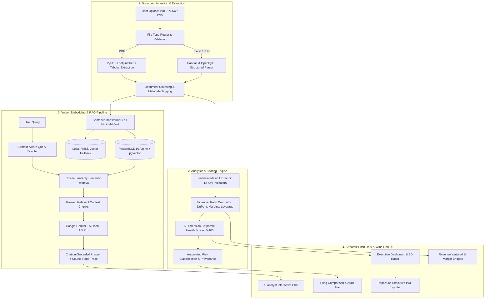

# 📊 FININTEL AI — Financial Document Intelligence & RAG Analytics Platform

<p align="center">
  <strong>Enterprise-grade AI platform combining Retrieval-Augmented Generation (RAG) with explainable corporate financial analytics, 5-dimension health scoring, interactive performance bridges, and citation-grounded intelligence from complex corporate filings.</strong>
</p>

<p align="center">
  
  
  
  
  
  
  
  
</p>

---

## 📑 Table of Contents

- [Overview](#-overview)
- [Key Capabilities & Differentiators](#-key-capabilities--differentiators)
- [System Architecture](#-system-architecture)
- [Platform Interface & Workflow](#-platform-interface--workflow)
- [Financial Analytics & Health Scoring](#-financial-analytics--health-scoring)
- [Technology Stack](#-technology-stack)
- [Docker Quickstart (Recommended)](#-docker-quickstart-recommended)
- [Local Development Setup](#-local-development-setup)
- [Environment Configuration](#-environment-configuration)
- [API Reference](#-api-reference)
- [Project Directory Structure](#-project-directory-structure)
- [Testing & Quality Assurance](#-testing--quality-assurance)
- [Enterprise Security & Auditing](#-enterprise-security--auditing)
- [Troubleshooting & FAQ](#-troubleshooting--faq)
- [License](#-license)

---

## 🔭 Overview

**FININTEL AI** transforms complex, unstructured corporate filings (Annual Reports, 10-K/10-Q SEC filings, quarterly earnings decks, financial statements) into structured, queryable, audit-provenance financial intelligence.

Traditional financial document review requires manual reading of 100–300+ page reports, manual ratio computation, and subjective risk interpretation. Generic LLM chatbots frequently hallucinate numbers and fail on nested balance-sheet disclosures. 

**FININTEL AI** bridges this gap by combining:
1. **Multi-Format Ingestion**: Hybrid OCR and table parsers supporting **PDF**, **Excel (.xlsx, .xls)**, and **CSV** datasets.
2. **Deterministic Extraction + LLM Synthesis**: Rule-based regex and structured entity recognition combined with Google Gemini LLM synthesis.
3. **Citation-Grounded RAG**: Vector-indexed semantic retrieval via PostgreSQL `pgvector` (with FAISS offline fallback) ensuring every claim cites specific pages and line items.
4. **5-Dimension Financial Health Model**: Automated 0–100 score analyzing Growth, Profitability, Liquidity, Leverage, and Cash Flow.
5. **Executive Visualizations**: Revenue waterfall bridge, DuPont margin analysis, balance sheet capital allocation, and side-by-side filing comparator.
6. **One-Click C-Suite Export**: Instant PDF briefing generation powered by ReportLab.

> **Disclaimer**: *FININTEL AI is engineered for financial research, analytical auditing, and educational intelligence. It does not provide certified financial advice, trading signals, or broker recommendations.*

---

## 💎 Key Capabilities & Differentiators

| Capability | Generic LLM Chatbots | Traditional BI Tools | FININTEL AI Platform |
|---|:---:|:---:|:---:|
| **Multi-Format Ingestion** | Text only | Structured databases only | **PDF, Excel (.xlsx/.xls), CSV** |
| **Citation Provenance** | None / Hallucinates | N/A | **Exact page & chunk line provenance** |
| **5D Health Assessment** | Subjective summary | Formula charts only | **Algorithmic 0–100 weighted score** |
| **Visual Financial Bridges** | None | Static charts | **Dynamic Waterfall, Margins & Balance Sheets** |
| **Document Comparison** | Generic diff | Manual SQL diff | **Automated variance & emerging risk flags** |
| **AI Analyst Chat** | Unbounded hallucination | Not available | **Context-bound RAG with prompt suggestion chips** |
| **Enterprise Audit Trail** | None | Database logs only | **Full vector retrieval trace & query latency audit** |
| **C-Suite Report Export** | None | Manual export | **Automated 1-Click Executive PDF Exporter** |

---

## 🏗️ System Architecture



---

## 🖥️ Platform Interface & Workflow

The platform provides a unified workspace built on a **Pitch Dark & Wine Red** luxury design system:

### 1. Landing Page (`frontend/app.py`)
- High-performance, edge-to-edge interactive Three.js Canvas **Laser Flow Hero**.
- Live workspace statistics, architectural pipeline walkthrough, feature overview, and quick-launch access to the intelligence portal.

### 2. Executive Financial Dashboard (`frontend/pages/1_Dashboard.py`)
- **Key Financial Indicators (KPIs)**: Revenue, EBITDA / EBIT, Net Income, Total Debt, Operating Cash Flow with automatic currency detection (USD `$`, INR `₹`).
- **5-Dimension Corporate Health Assessment**: Interactive 0–100 gauge coupled with a 5D Radar Chart (Growth, Profitability, Liquidity, Leverage, Cash Flow).
- **Financial Visualization Tabs**:
  - *Waterfall Bridge*: Revenue to Net Income bridge breakdown.
  - *Profitability Margins*: Gross, Operating, and Net margins.
  - *Asset & Capital Allocation*: Balance sheet asset/liability composition.
- **Risk Indicators & Audit Provenance**: Automated risk detection with severity classification (`[HIGH]`, `[MEDIUM]`, `[INFO]`).
- **One-Click Executive PDF Briefing**: Instantly downloads a formatted briefing report.

### 3. Document Ingestion (`frontend/pages/2_Upload.py`)
- Drag-and-drop uploader supporting **PDF**, **XLSX**, **XLS**, and **CSV**.
- Real-time extraction progress bar, automatic metadata detection (Company, Fiscal Period, Fiscal Year, Currency).
- Direct redirection to analytical dashboard upon completion.

### 4. Financial Statement Analysis (`frontend/pages/3_Analysis.py`)
- Deep-dive ratio diagnostics:
  - *Profitability*: Operating Margin, Net Profit Margin, Return on Equity (ROE), Return on Assets (ROA).
  - *Liquidity & Solvency*: Current Ratio, Quick Ratio, Debt-to-Equity, Interest Coverage Ratio.
  - *Cash Flow Health*: Cash Flow Coverage, Free Cash Flow conversion.

### 5. AI Analyst Assistant (`frontend/pages/4_AI_Analyst.py`)
- Full conversational financial assistant grounded exclusively in the active filing context.
- **Pre-engineered Quick Prompt Chips**: One-click prompt suggestions arranged in a clean two-row grid.
- **Response Telemetry**: Execution time in milliseconds, retrieved chunk count, and expandable citation cards with exact page and section references.

### 6. Filing Comparison (`frontend/pages/5_Comparison.py`)
- Side-by-side comparative analysis of two filings (e.g. FY2024 vs. FY2025 or Peer A vs. Peer B).
- Variance calculation for health score, revenue, profitability, and debt.
- **Newly Emerged Risks**: Automated set-difference engine highlighting new risk factors disclosed in the subsequent filing.

### 7. Audit & Provenance Logs (`frontend/pages/6_Audit_Logs.py`)
- Full transparency into vector indexing, ingestion timestamps, chunk counts, extraction accuracy, and backend query logs.

---

## 📐 Financial Analytics & Health Scoring

The **Composite Financial Health Score (0–100)** provides a standardized assessment across 5 core dimensions:

$$\text{Health Score} = 0.20(\text{Growth}) + 0.25(\text{Profitability}) + 0.20(\text{Liquidity}) + 0.20(\text{Leverage}) + 0.15(\text{Cash Flow})$$

| Dimension | Weight | Key Metrics Evaluated | Benchmark Thresholds |
|---|:---:|---|---|
| **Growth** | 20% | YoY Revenue Growth, Operating Income Growth | $> 15\%$ Strong, $5-15\%$ Moderate, $< 0\%$ Lagging |
| **Profitability** | 25% | Net Profit Margin, EBITDA Margin, ROE, ROA | NPM $> 15\%$ Strong, ROE $> 15\%$ Excellent |
| **Liquidity** | 20% | Current Ratio, Quick Ratio, Cash-to-Debt | Current Ratio $> 1.5\text{x}$ Healthy, $< 1.0\text{x}$ Liquidity Watch |
| **Leverage** | 20% | Debt-to-Equity (D/E), Interest Coverage Ratio | D/E $< 1.0\text{x}$ Conservative, Interest Coverage $> 3.0\text{x}$ Safe |
| **Cash Flow** | 15% | Operating Cash Flow / Net Income, Free Cash Flow | OCF / Net Income $> 1.0\text{x}$ High Quality Earnings |

---

## 🛠️ Technology Stack

- **Backend**: FastAPI, Uvicorn, SQLAlchemy 2.0, Pydantic V2, Alembic
- **Frontend**: Streamlit, Plotly, Altair, HTML5/CSS3 (Pitch Dark & Wine Red System), ReportLab
- **Database & Vectors**: PostgreSQL 16 Alpine, `pgvector` native extension, FAISS
- **AI & RAG**: Google Gemini API (`google-genai` & `google-generativeai`), SentenceTransformers (`all-MiniLM-L6-v2`)
- **Document Processing**: `pdfplumber`, `PyPDF2`, `pandas`, `openpyxl`
- **Orchestration**: Docker, Docker Compose, Linux Alpine

---

## 🐳 Docker Quickstart (Recommended)

Running FININTEL AI via Docker Compose is the fastest and most reliable way to deploy the complete multi-tier stack with PostgreSQL, pgvector, FastAPI, and Streamlit.

### Prerequisites
- [Docker Desktop](https://www.docker.com/products/docker-desktop/) (v24.0+) or Docker Engine on Linux
- [Docker Compose](https://docs.docker.com/compose/) (v2.0+)
- Google Gemini API Key ([Get a free key from Google AI Studio](https://aistudio.google.com/))

---

### Step 1: Clone the Repository
```bash
git clone https://github.com/Samar-365/Financial-Document-Intelligence-RAG-Analytics-Platform.git
cd Financial-Document-Intelligence-RAG-Analytics-Platform
```

### Step 2: Configure Environment Variables
Copy `.env.example` to `.env`:
```bash
cp .env.example .env
```
Open `.env` in your text editor and add your **Google Gemini API Key**:
```env
# Essential LLM Configuration
GEMINI_API_KEY=your_actual_gemini_api_key_here
GEMINI_MODEL=gemini-2.5-flash-lite

# Database Configuration (matches docker-compose.yml defaults)
POSTGRES_USER=postgres
POSTGRES_PASSWORD=postgres
POSTGRES_DB=financial_intelligence
DATABASE_URL=postgresql://postgres:postgres@db:5432/financial_intelligence

# Vector Store Engine
VECTOR_STORE_TYPE=pgvector
EMBEDDING_MODEL=all-MiniLM-L6-v2
```

### Step 3: Launch Multi-Container Stack
Run the following command to build and launch all containers in detached mode:

```bash
docker compose up --build -d
```
*(On older Docker installations without Docker Compose v2, use `docker-compose up --build -d`)*

### Step 4: Verify Container Health
Check that all 3 services are running and healthy:
```bash
docker compose ps
```
You should see:
```text
NAME           IMAGE                 COMMAND                  SERVICE    STATUS
fdi-postgres   fdi-postgres:alpine   "docker-entrypoint.s…"   db         Up (healthy)
fdi-backend    fdi-backend           "uvicorn app.main:ap…"   backend    Up (healthy)
fdi-frontend   fdi-frontend          "streamlit run front…"   frontend   Up
```

### Step 5: Access the Platform
Open your browser to:
- **Interactive Web Platform**: [http://localhost:8501](http://localhost:8501)
- **FastAPI Backend REST Docs**: [http://localhost:8000/docs](http://localhost:8000/docs)
- **Backend Health Check**: [http://localhost:8000/health](http://localhost:8000/health)

---

### Useful Docker Management Commands

| Action | Command |
|---|---|
| **View Live Frontend Logs** | `docker compose logs -f frontend` |
| **View Live Backend Logs** | `docker compose logs -f backend` |
| **Restart Frontend Container** | `docker compose restart frontend` |
| **Restart Backend Container** | `docker compose restart backend` |
| **Stop All Containers (Preserves Data)** | `docker compose down` |
| **Wipe Containers & Reset Volumes** | `docker compose down -v` |
| **Execute Bash inside Backend** | `docker compose exec backend bash` |
| **Access PostgreSQL CLI** | `docker compose exec db psql -U postgres -d financial_intelligence` |

---

## 💻 Local Development Setup

If you prefer to run the application natively on your host machine without Docker:

### 1. Create and Activate Virtual Environment
```bash
# Python 3.11 or 3.12 required
python -m venv .venv

# Windows (PowerShell)
.venv\Scripts\Activate.ps1

# Linux / macOS
source .venv/bin/activate
```

### 2. Install Project Dependencies
```bash
pip install --upgrade pip
pip install -r requirements.txt
```

### 3. Set Up Local PostgreSQL with pgvector
Ensure PostgreSQL 15+ is running locally with the `pgvector` extension installed:
```sql
CREATE DATABASE financial_intelligence;
\c financial_intelligence
CREATE EXTENSION IF NOT EXISTS vector;
```

### 4. Run Migrations & Start Servers
In Terminal 1 (Backend):
```bash
uvicorn app.main:app --host 0.0.0.0 --port 8000 --reload
```

In Terminal 2 (Frontend):
```bash
streamlit run frontend/app.py --server.port 8501
```

---

## ⚙️ Environment Configuration

| Variable | Default Value | Description |
|---|---|---|
| `GEMINI_API_KEY` | *(Required)* | Google Gemini API Key for AI Analyst and synthesis |
| `GEMINI_MODEL` | `gemini-2.5-flash-lite` | Primary LLM model identifier |
| `DATABASE_URL` | `postgresql://...` | Full PostgreSQL connection URL |
| `VECTOR_STORE_TYPE` | `pgvector` | Vector storage backend (`pgvector` or `faiss`) |
| `EMBEDDING_MODEL` | `all-MiniLM-L6-v2` | SentenceTransformer model for chunk embeddings |
| `API_BASE_URL` | `http://localhost:8000/api/v1` | URL used by Streamlit frontend to reach FastAPI backend |
| `MAX_FILE_SIZE_MB` | `50` | Maximum upload size per document |
| `RATE_LIMIT_PER_MINUTE` | `60` | API rate limiting threshold |
| `LOG_LEVEL` | `INFO` | Logging verbosity (`DEBUG`, `INFO`, `WARNING`, `ERROR`) |

---

## 🔌 API Reference

The FastAPI service exposes a versioned RESTful API under `/api/v1`:

### Document Endpoints
- `POST /api/v1/documents/upload` — Upload a new financial document (`.pdf`, `.xlsx`, `.xls`, `.csv`).
- `GET /api/v1/documents` — List all uploaded corporate filings with ingestion status and metadata.
- `GET /api/v1/documents/{id}` — Retrieve detailed metadata for a specific document.
- `DELETE /api/v1/documents/{id}` — Delete a document and its associated vector chunks.

### Analytics Endpoints
- `GET /api/v1/financial-metrics/{document_id}` — Retrieve 12 extracted financial indicators with page numbers.
- `GET /api/v1/financial-ratios/{document_id}` — Retrieve calculated margins, DuPont components, and solvency ratios.
- `GET /api/v1/health-score/{document_id}` — Get composite 0–100 health score, 5D breakdown, and qualitative risk flags.

### RAG & Intelligence Endpoints
- `POST /api/v1/query` — Execute a citation-grounded RAG query against an active filing.
- `POST /api/v1/compare` — Compare two filings side-by-side with variance calculations.
- `GET /health` — System health check (database ping and vector engine status).

Interactive Swagger documentation is available live at `http://localhost:8000/docs`.

---

## 📁 Project Directory Structure

```text
Financial-Document-Intelligence-RAG-Analytics-Platform/
├── app/                              # FastAPI Backend Application
│   ├── analytics/                    # Financial extraction, ratios, and health scorers
│   │   ├── health_scorer.py          # 5-Dimension composite health model
│   │   ├── health_growth_profit.py   # Growth and profitability scoring
│   │   ├── health_solvency_cash.py   # Liquidity, leverage, and cash flow scoring
│   │   ├── ratios_profitability.py   # Margin & DuPont ratio calculations
│   │   ├── ratios_liquidity.py       # Current and quick ratio logic
│   │   ├── ratios_leverage.py        # D/E and coverage calculations
│   │   ├── regex_extractor.py        # Rule-based financial indicator extractor
│   │   └── risk_classifier.py        # Automated risk classification engine
│   ├── api/                          # REST routing and endpoints
│   │   └── v1/endpoints/             # documents, financials, query, comparison
│   ├── core/                         # Config, database, security, and logging
│   ├── db/                           # Session management and base models
│   ├── document_processing/          # Chunking, text cleaning, table parsing
│   ├── models/                       # SQLAlchemy models (Document, Metric, AnalysisResult)
│   ├── rag/                          # Embeddings, vector stores, Gemini LLM client
│   │   ├── gemini_client.py          # Google Gemini client with dual SDK support
│   │   ├── pgvector_store.py         # Native PostgreSQL pgvector implementation
│   │   ├── faiss_store.py            # Local FAISS vector fallback
│   │   └── retriever.py              # Semantic chunk retrieval engine
│   ├── schemas/                      # Pydantic validation schemas
│   └── services/                     # Document processing and RAG orchestration
├── frontend/                         # Streamlit Analytical Dashboard
│   ├── app.py                        # Landing page with Three.js Laser Flow Hero
│   ├── pages/                        # Multipage workspace views
│   │   ├── 1_Dashboard.py            # Executive financial dashboard & bridges
│   │   ├── 2_Upload.py               # Multi-format document ingestion
│   │   ├── 3_Analysis.py             # Ratio analysis & financial statements
│   │   ├── 4_AI_Analyst.py           # Conversational RAG with prompt chips
│   │   ├── 5_Comparison.py           # Multi-document filing comparator
│   │   └── 6_Audit_Logs.py           # Enterprise vector and query audit trail
│   ├── components/                   # Theme, CSS injection, KPI cards, gauges, charts
│   │   ├── theme.py                  # Pitch Dark & Wine Red CSS with Lucide vector icons
│   │   ├── advanced_charts.py        # Waterfall, margin, and balance sheet bridges
│   │   └── kpi_card.py               # Metallic card indicators
│   └── utils/                        # API client, state synchronization, PDF generator
│       ├── api_client.py             # Resilient HTTP client for FastAPI backend
│       ├── workspace_state.py        # Synchronized multi-page active filing state
│       └── report_generator.py       # ReportLab C-suite executive PDF generator
├── docker/                           # Dockerfiles for API, Frontend, and PostgreSQL
│   ├── Dockerfile.api                # FastAPI backend container
│   ├── Dockerfile.frontend           # Streamlit frontend container
│   └── Dockerfile.postgres           # PostgreSQL 16 + pgvector container
├── tests/                            # Test suite (Unit, Integration, RAG evaluation)
├── docker-compose.yml                # Multi-service container orchestration
├── pyproject.toml                    # Pyright, formatting, and build configuration
└── requirements.txt                  # Production Python dependencies
```

---

## 🧪 Testing & Quality Assurance

The codebase includes an extensive automated test suite covering unit tests, analytics logic, RAG retrieval, API endpoints, and security validators.

To execute the test suite locally:
```bash
pytest -v
```

To run with coverage reporting:
```bash
pytest --cov=app --cov-report=term-missing
```

---

## 🛡️ Enterprise Security & Auditing

- **Input Sanitization**: Multi-layer validation on upload file headers, file extensions, and MIME signatures.
- **Data Isolation**: Unique document identifiers isolate extracted chunks and embeddings per filing.
- **SQL Injection Prevention**: Parameterized SQLAlchemy ORM queries across all endpoints.
- **Prompt Injection Defense**: Explicit delimiter isolation and system prompt boundary constraints on all LLM queries.
- **No Parametric Guessing**: Strict RAG instructions ensure the model declines to answer if factual evidence is not present in retrieved document context.

---

## ❓ Troubleshooting & FAQ

#### Q: The AI Analyst says "AI analysis is temporarily unavailable".
- **Fix**: Check that your `GEMINI_API_KEY` in `.env` is valid and has sufficient quota. You can inspect backend container logs via `docker compose logs -f backend`.

#### Q: Port 5432 or 8000 or 8501 is already in use on my machine.
- **Fix**: Stop any local PostgreSQL, Streamlit, or web servers running on those ports, or edit the exposed port mapping on the host side in `docker-compose.yml` (e.g. `"8502:8501"`).

#### Q: How do I reset all data and upload fresh filings?
- **Fix**: Run `docker compose down -v` to tear down the containers and delete the PostgreSQL and upload data volumes, then run `docker compose up --build -d`.

---

## 📄 License

This project is licensed under the **MIT License**. See the [LICENSE](LICENSE) file for complete details.
