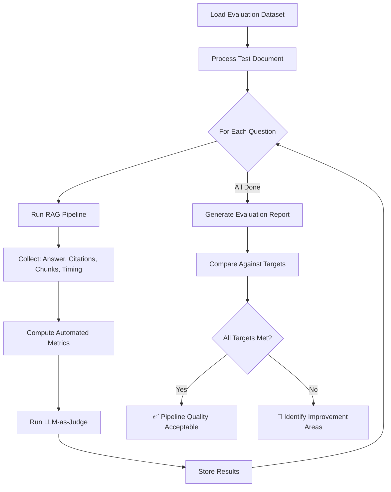

# AI/RAG Evaluation Framework

## Financial Document Intelligence & RAG Analytics Platform

---

## Table of Contents

- [1. Evaluation Objectives](#1-evaluation-objectives)
- [2. Evaluation Dataset](#2-evaluation-dataset)
- [3. Evaluation Metrics](#3-evaluation-metrics)
- [4. Measurement Methodology](#4-measurement-methodology)
- [5. Evaluation Workflow](#5-evaluation-workflow)
- [6. Reporting](#6-reporting)

---

## 1. Evaluation Objectives

The evaluation framework measures the quality, reliability, and accuracy of the RAG pipeline across three dimensions:

| Dimension | What It Measures | Why It Matters |
|---|---|---|
| **Retrieval Quality** | Does the system find the right document chunks? | Poor retrieval → irrelevant answers |
| **Generation Quality** | Are answers correct, relevant, and grounded? | Poor generation → misleading financial information |
| **Citation Quality** | Do citations accurately reference sources? | Poor citations → no verifiability |

---

## 2. Evaluation Dataset

### Dataset Design

The evaluation dataset consists of curated question-answer pairs with known ground truth. Each entry specifies:

- The question to ask
- The expected answer (or key facts the answer should contain)
- The source document and page numbers where the answer appears
- The question category (factual, analytical, comparative, risk)

### Example Evaluation Questions

> **Note**: These examples use placeholder data from a hypothetical "ABC Ltd. Annual Report 2025." During implementation, replace with actual questions derived from real test documents.

#### Category 1: Factual Extraction

| ID | Question | Expected Answer (Key Facts) | Source Page |
|---|---|---|---|
| E-001 | "What was ABC Ltd's revenue in FY2025?" | Revenue = ₹11,450 crore | Page 87 |
| E-002 | "What was the net income for FY2025?" | Net Income = ₹1,410 crore | Page 87 |
| E-003 | "What is the company's total debt?" | Total Debt = ₹3,900 crore | Page 93 |
| E-004 | "How many employees does ABC Ltd have?" | [Number from document] | Page [XX] |
| E-005 | "What was the EPS for FY2025?" | EPS = ₹28.20 | Page 88 |

#### Category 2: Analytical Questions

| ID | Question | Expected Answer (Key Facts) | Source Page |
|---|---|---|---|
| E-006 | "How did revenue change compared to FY2024?" | Increased by 12.25% (₹10,200 → ₹11,450 Cr) | Pages 42, 87 |
| E-007 | "What was the change in EBITDA from FY2024 to FY2025?" | Increased by 11.43% (₹2,100 → ₹2,340 Cr) | Page 87 |
| E-008 | "Is the company's debt increasing or decreasing?" | Decreased by 7.14% (₹4,200 → ₹3,900 Cr) | Page 93 |

#### Category 3: Risk Questions

| ID | Question | Expected Answer (Key Facts) | Source Page |
|---|---|---|---|
| E-009 | "What are the major risks mentioned in the report?" | Should list risks from Risk Factors section | Page 156+ |
| E-010 | "Does the company face any regulatory risks?" | [Regulatory risks from document] | Page [XX] |

#### Category 4: Comparative Questions

| ID | Question | Expected Answer (Key Facts) | Source Page |
|---|---|---|---|
| E-011 | "Compare the profitability between FY2024 and FY2025" | Margin improvement with specific numbers | Pages 87, 42 |

#### Category 5: Negative Tests (Information Not in Document)

| ID | Question | Expected Behavior | Notes |
|---|---|---|---|
| E-012 | "What is ABC Ltd's stock price?" | Should respond that information is not available | Stock price not in annual reports |
| E-013 | "What will revenue be in FY2026?" | Should not predict/fabricate | Future data not in document |
| E-014 | "Who is the CEO of XYZ Corp?" | Should indicate information not found | Different company |

### Dataset File Format

**File**: `tests/evaluation/eval_dataset.json`

```json
{
  "version": "1.0",
  "test_document": "ABC_Annual_Report_2025.pdf",
  "questions": [
    {
      "id": "E-001",
      "category": "factual",
      "question": "What was ABC Ltd's revenue in FY2025?",
      "expected_facts": ["revenue", "11450", "FY2025"],
      "expected_source_pages": [87],
      "expected_section": "Consolidated Statement of Profit & Loss",
      "difficulty": "easy",
      "should_answer": true
    },
    {
      "id": "E-012",
      "category": "negative",
      "question": "What is ABC Ltd's stock price?",
      "expected_facts": [],
      "expected_source_pages": [],
      "expected_section": null,
      "difficulty": "easy",
      "should_answer": false,
      "expected_behavior": "Indicate information not available in document"
    }
  ]
}
```

---

## 3. Evaluation Metrics

### 3.1 Retrieval Precision

**Definition**: The proportion of retrieved chunks that are actually relevant to the query.

```
Retrieval Precision = Relevant Retrieved Chunks / Total Retrieved Chunks
```

**Target**: ≥ 80%

**Interpretation**: A precision of 80% means that 4 out of 5 retrieved chunks contain information relevant to the question. Low precision means the system retrieves too much noise.

### 3.2 Retrieval Recall

**Definition**: The proportion of all relevant chunks that were successfully retrieved.

```
Retrieval Recall = Relevant Retrieved Chunks / Total Relevant Chunks in Index
```

**Target**: ≥ 75%

**Interpretation**: A recall of 75% means the system finds 3 out of 4 relevant chunks. Low recall means the system misses important information.

### 3.3 Answer Relevance

**Definition**: How well the generated answer addresses the user's question, measured by semantic similarity.

```
Answer Relevance = cosine_similarity(embed(question), embed(answer))
```

**Target**: ≥ 0.8

**Measurement**: Embed both the question and the answer using the same embedding model and compute cosine similarity. Higher similarity indicates the answer is topically aligned with the question.

### 3.4 Citation Accuracy

**Definition**: The proportion of citations that correctly point to the source of the claimed information.

```
Citation Accuracy = Correct Citations / Total Citations
```

**Target**: ≥ 90%

**Measurement**: For each citation, manually verify that the referenced page/section actually contains the information being cited.

### 3.5 Faithfulness

**Definition**: The proportion of claims in the generated answer that are supported by the retrieved context.

```
Faithfulness = Supported Claims / Total Claims in Answer
```

**Target**: ≥ 95%

**Measurement**: Decompose the answer into individual claims. For each claim, check whether it can be verified from the retrieved chunks. Claims not supported by the context are considered unfaithful (hallucinated).

### 3.6 Hallucination Rate

**Definition**: The inverse of faithfulness — the proportion of unsupported claims.

```
Hallucination Rate = 1 - Faithfulness = Unsupported Claims / Total Claims
```

**Target**: ≤ 5%

### 3.7 Response Latency

**Definition**: End-to-end time from question submission to answer delivery.

```
Response Latency = Query Embedding Time + Vector Search Time + LLM Generation Time + Post-processing Time
```

**Target**: < 5 seconds (95th percentile)

---

## 4. Measurement Methodology

### 4.1 Automated Metrics

| Metric | Method | Automation Level |
|---|---|---|
| Answer Relevance | Embedding similarity computation | Fully automated |
| Response Latency | Timing instrumentation in the pipeline | Fully automated |
| Retrieval chunk count | Count and log retrieved chunks | Fully automated |

### 4.2 Semi-Automated Metrics

| Metric | Method | Automation Level |
|---|---|---|
| Faithfulness | LLM-as-judge: use a separate LLM call to verify claims against context | Semi-automated (LLM-based) |
| Citation Accuracy | Compare cited page numbers against expected source pages from eval dataset | Semi-automated |

**LLM-as-Judge Prompt (for Faithfulness):**

```
Given the following context chunks and generated answer, evaluate faithfulness.

Context:
{retrieved_chunks}

Answer:
{generated_answer}

For each claim in the answer, determine if it is:
1. SUPPORTED - directly supported by the context
2. PARTIALLY SUPPORTED - related to context but with added interpretation
3. NOT SUPPORTED - not found in or contradicted by the context

Output a JSON list of claims with their support status.
```

### 4.3 Manual Metrics

| Metric | Method | Automation Level |
|---|---|---|
| Retrieval Precision | Human annotator marks each retrieved chunk as relevant/irrelevant | Manual |
| Retrieval Recall | Human identifies all relevant chunks, compares to retrieved set | Manual |
| Overall Quality | Human evaluator rates answer quality (1–5 scale) | Manual |

---

## 5. Evaluation Workflow



### Running Evaluation

```bash
# Run RAG evaluation suite
pytest tests/evaluation/ -v

# Run evaluation with detailed output
python scripts/run_evaluation.py --dataset tests/evaluation/eval_dataset.json --output data/evaluation/results.json

# Generate evaluation report
python scripts/run_evaluation.py --report
```

---

## 6. Reporting

### Evaluation Report Format

```
RAG Evaluation Report
=====================
Date: 2026-09-10
Test Document: ABC_Annual_Report_2025.pdf
Questions Evaluated: 14

METRIC SUMMARY
─────────────────────────────────────────────
Metric                  Score    Target  Status
─────────────────────────────────────────────
Retrieval Precision     82.0%    ≥ 80%   ✅ PASS
Retrieval Recall        76.5%    ≥ 75%   ✅ PASS
Answer Relevance        0.84     ≥ 0.8   ✅ PASS
Citation Accuracy       91.3%    ≥ 90%   ✅ PASS
Faithfulness            96.2%    ≥ 95%   ✅ PASS
Hallucination Rate      3.8%     ≤ 5%    ✅ PASS
Avg Response Latency    2.3s     < 5s    ✅ PASS
─────────────────────────────────────────────

CATEGORY BREAKDOWN
─────────────────────────────────────────────
Category          Count   Avg Relevance  Avg Faithful
─────────────────────────────────────────────
Factual            5       0.89           98%
Analytical         3       0.81           95%
Risk               2       0.80           94%
Comparative        1       0.78           93%
Negative           3       N/A            100%
─────────────────────────────────────────────

FAILED CASES
─────────────────────────────────────────────
E-008: Retrieved context missed key debt figure on page 93
  → Action: Review chunking around financial tables
─────────────────────────────────────────────
```
