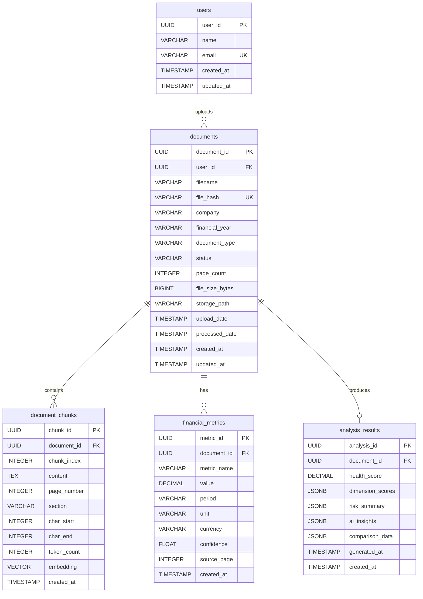

# Database Design Document

## Financial Document Intelligence & RAG Analytics Platform

| Field | Value |
|---|---|
| **Document Version** | 1.0 |
| **Database** | PostgreSQL 15+ |
| **ORM** | SQLAlchemy 2.0 |
| **Migrations** | Alembic |

---

## Table of Contents

- [1. Overview](#1-overview)
- [2. ER Diagram](#2-er-diagram)
- [3. Table Definitions](#3-table-definitions)
- [4. Relationships](#4-relationships)
- [5. Indexes](#5-indexes)
- [6. DDL Scripts](#6-ddl-scripts)
- [7. Query Patterns](#7-query-patterns)

---

## 1. Overview

The database stores all structured data for the platform:

| Table | Purpose | Estimated Rows (MVP) |
|---|---|---|
| `users` | User accounts and authentication | 1–10 |
| `documents` | Uploaded document metadata and status | 10–50 |
| `document_chunks` | Extracted text chunks with page/section metadata | 2K–50K |
| `financial_metrics` | Extracted financial metric values | 120–600 |
| `analysis_results` | Health scores, risk summaries, and analysis output | 10–50 |

> **Note**: Vector embeddings are stored in the FAISS index (MVP) or pgvector (production). The `document_chunks` table stores chunk text and metadata but not the embedding vectors themselves in the MVP configuration. The `embedding` column is reserved for pgvector migration.

---

## 2. ER Diagram



---

## 3. Table Definitions

### 3.1 `users`

Stores user account information.

| Column | Data Type | Constraints | Description |
|---|---|---|---|
| `user_id` | `UUID` | `PRIMARY KEY`, `DEFAULT gen_random_uuid()` | Unique user identifier |
| `name` | `VARCHAR(255)` | `NOT NULL` | User's display name |
| `email` | `VARCHAR(255)` | `NOT NULL`, `UNIQUE` | User's email address |
| `created_at` | `TIMESTAMP WITH TIME ZONE` | `NOT NULL`, `DEFAULT NOW()` | Account creation timestamp |
| `updated_at` | `TIMESTAMP WITH TIME ZONE` | `NOT NULL`, `DEFAULT NOW()` | Last update timestamp |

---

### 3.2 `documents`

Stores metadata for uploaded financial documents.

| Column | Data Type | Constraints | Description |
|---|---|---|---|
| `document_id` | `UUID` | `PRIMARY KEY`, `DEFAULT gen_random_uuid()` | Unique document identifier |
| `user_id` | `UUID` | `FOREIGN KEY → users(user_id)`, `ON DELETE CASCADE` | Uploading user |
| `filename` | `VARCHAR(500)` | `NOT NULL` | Original uploaded filename |
| `file_hash` | `VARCHAR(64)` | `UNIQUE` | SHA-256 hash for duplicate detection |
| `company` | `VARCHAR(255)` | `NULL` | Company name (auto-detected or user-provided) |
| `financial_year` | `VARCHAR(20)` | `NULL` | Financial year (e.g., "FY2025") |
| `document_type` | `VARCHAR(50)` | `NULL` | Type: annual_report, quarterly_report, earnings, presentation, statement |
| `status` | `VARCHAR(20)` | `NOT NULL`, `DEFAULT 'UPLOADED'` | Processing status: UPLOADED, PROCESSING, PROCESSED, FAILED |
| `page_count` | `INTEGER` | `NULL` | Number of pages in the PDF |
| `file_size_bytes` | `BIGINT` | `NOT NULL` | File size in bytes |
| `storage_path` | `VARCHAR(1000)` | `NOT NULL` | Filesystem path to stored PDF |
| `upload_date` | `TIMESTAMP WITH TIME ZONE` | `NOT NULL`, `DEFAULT NOW()` | Upload timestamp |
| `processed_date` | `TIMESTAMP WITH TIME ZONE` | `NULL` | Processing completion timestamp |
| `created_at` | `TIMESTAMP WITH TIME ZONE` | `NOT NULL`, `DEFAULT NOW()` | Record creation timestamp |
| `updated_at` | `TIMESTAMP WITH TIME ZONE` | `NOT NULL`, `DEFAULT NOW()` | Last update timestamp |

**Status transitions:**

```
UPLOADED → PROCESSING → PROCESSED
                     → FAILED
```

---

### 3.3 `document_chunks`

Stores extracted text chunks with metadata for retrieval and citation.

| Column | Data Type | Constraints | Description |
|---|---|---|---|
| `chunk_id` | `UUID` | `PRIMARY KEY`, `DEFAULT gen_random_uuid()` | Unique chunk identifier |
| `document_id` | `UUID` | `FOREIGN KEY → documents(document_id)`, `ON DELETE CASCADE`, `NOT NULL` | Parent document |
| `chunk_index` | `INTEGER` | `NOT NULL` | Sequential chunk position within document |
| `content` | `TEXT` | `NOT NULL` | Chunk text content |
| `page_number` | `INTEGER` | `NOT NULL` | Source page number |
| `section` | `VARCHAR(255)` | `NULL` | Detected document section |
| `char_start` | `INTEGER` | `NULL` | Character start position in original text |
| `char_end` | `INTEGER` | `NULL` | Character end position in original text |
| `token_count` | `INTEGER` | `NULL` | Approximate token count for the chunk |
| `embedding` | `VECTOR(384)` | `NULL` | Embedding vector (pgvector; NULL in FAISS mode) |
| `created_at` | `TIMESTAMP WITH TIME ZONE` | `NOT NULL`, `DEFAULT NOW()` | Creation timestamp |

> **Note**: The `embedding` column uses the pgvector `VECTOR(384)` type. In FAISS mode, this column is NULL and vectors are stored in the FAISS index file. The column exists to support migration to pgvector.

---

### 3.4 `financial_metrics`

Stores extracted financial metric values.

| Column | Data Type | Constraints | Description |
|---|---|---|---|
| `metric_id` | `UUID` | `PRIMARY KEY`, `DEFAULT gen_random_uuid()` | Unique metric identifier |
| `document_id` | `UUID` | `FOREIGN KEY → documents(document_id)`, `ON DELETE CASCADE`, `NOT NULL` | Source document |
| `metric_name` | `VARCHAR(100)` | `NOT NULL` | Metric name (e.g., "revenue", "ebitda") |
| `value` | `DECIMAL(20, 4)` | `NOT NULL` | Extracted numeric value |
| `period` | `VARCHAR(20)` | `NOT NULL` | Financial period (e.g., "FY2025", "Q3FY2025") |
| `unit` | `VARCHAR(50)` | `NOT NULL`, `DEFAULT 'INR Crore'` | Unit of measurement |
| `currency` | `VARCHAR(10)` | `NULL`, `DEFAULT 'INR'` | Currency code |
| `confidence` | `FLOAT` | `NOT NULL`, `DEFAULT 1.0` | Extraction confidence (0.0–1.0) |
| `source_page` | `INTEGER` | `NULL` | Page number where metric was found |
| `created_at` | `TIMESTAMP WITH TIME ZONE` | `NOT NULL`, `DEFAULT NOW()` | Creation timestamp |

**Valid `metric_name` values:**

```
revenue, gross_profit, ebitda, operating_income, net_income, eps,
total_assets, total_liabilities, total_debt, cash, 
operating_cash_flow, free_cash_flow
```

---

### 3.5 `analysis_results`

Stores computed analysis results including health scores and risk assessments.

| Column | Data Type | Constraints | Description |
|---|---|---|---|
| `analysis_id` | `UUID` | `PRIMARY KEY`, `DEFAULT gen_random_uuid()` | Unique analysis identifier |
| `document_id` | `UUID` | `FOREIGN KEY → documents(document_id)`, `ON DELETE CASCADE`, `NOT NULL`, `UNIQUE` | Analyzed document (one analysis per document) |
| `health_score` | `DECIMAL(5, 2)` | `NULL` | Composite health score (0.00–100.00) |
| `dimension_scores` | `JSONB` | `NULL` | Sub-scores per dimension |
| `risk_summary` | `JSONB` | `NULL` | Identified risks as structured JSON array |
| `ai_insights` | `JSONB` | `NULL` | AI-generated insights as structured JSON array |
| `comparison_data` | `JSONB` | `NULL` | Comparison results (if compared with another document) |
| `generated_at` | `TIMESTAMP WITH TIME ZONE` | `NOT NULL`, `DEFAULT NOW()` | Analysis generation timestamp |
| `created_at` | `TIMESTAMP WITH TIME ZONE` | `NOT NULL`, `DEFAULT NOW()` | Record creation timestamp |

**`dimension_scores` JSON structure:**

```json
{
  "growth": { "score": 86.0, "metrics": { "revenue_growth": 12.25 } },
  "profitability": { "score": 82.0, "metrics": { "profit_margin": 12.31, "ebitda_margin": 20.44 } },
  "liquidity": { "score": 71.0, "metrics": { "current_ratio": 1.65 } },
  "leverage": { "score": 74.0, "metrics": { "debt_to_equity": 0.85 } },
  "cash_flow": { "score": 77.0, "metrics": { "ocf_ratio": 1.12 } }
}
```

**`risk_summary` JSON structure:**

```json
[
  {
    "risk_id": "uuid",
    "category": "Financial",
    "description": "Significant increase in long-term debt",
    "severity": "High",
    "evidence": "Total borrowings increased by 34%...",
    "source_page": 103,
    "section": "Risk Factors",
    "confidence": 0.87
  }
]
```

---

## 4. Relationships

| Relationship | Type | Foreign Key | Cascade |
|---|---|---|---|
| users → documents | One-to-Many | `documents.user_id` → `users.user_id` | ON DELETE CASCADE |
| documents → document_chunks | One-to-Many | `document_chunks.document_id` → `documents.document_id` | ON DELETE CASCADE |
| documents → financial_metrics | One-to-Many | `financial_metrics.document_id` → `documents.document_id` | ON DELETE CASCADE |
| documents → analysis_results | One-to-One | `analysis_results.document_id` → `documents.document_id` | ON DELETE CASCADE |

**Cascade behavior**: Deleting a user deletes all their documents. Deleting a document deletes all associated chunks, metrics, and analysis results.

---

## 5. Indexes

| Table | Index Name | Columns | Type | Purpose |
|---|---|---|---|---|
| `users` | `ix_users_email` | `email` | UNIQUE B-tree | Email lookup and uniqueness |
| `documents` | `ix_documents_user_id` | `user_id` | B-tree | Filter documents by user |
| `documents` | `ix_documents_company` | `company` | B-tree | Filter documents by company |
| `documents` | `ix_documents_status` | `status` | B-tree | Filter by processing status |
| `documents` | `ix_documents_file_hash` | `file_hash` | UNIQUE B-tree | Duplicate detection |
| `document_chunks` | `ix_chunks_document_id` | `document_id` | B-tree | Retrieve chunks by document |
| `document_chunks` | `ix_chunks_page` | `document_id, page_number` | Composite B-tree | Page-level chunk retrieval |
| `document_chunks` | `ix_chunks_section` | `document_id, section` | Composite B-tree | Section-level chunk retrieval |
| `document_chunks` | `ix_chunks_embedding` | `embedding` | HNSW (pgvector) | Vector similarity search (production only) |
| `financial_metrics` | `ix_metrics_document_id` | `document_id` | B-tree | Metrics by document |
| `financial_metrics` | `ix_metrics_name_period` | `document_id, metric_name, period` | Composite B-tree | Specific metric lookup |
| `analysis_results` | `ix_analysis_document_id` | `document_id` | UNIQUE B-tree | Analysis by document |

---

## 6. DDL Scripts

```sql
-- Enable pgvector extension (production)
-- CREATE EXTENSION IF NOT EXISTS vector;

-- Enable UUID generation
CREATE EXTENSION IF NOT EXISTS pgcrypto;

-- ============================================
-- Table: users
-- ============================================
CREATE TABLE users (
    user_id         UUID PRIMARY KEY DEFAULT gen_random_uuid(),
    name            VARCHAR(255) NOT NULL,
    email           VARCHAR(255) NOT NULL UNIQUE,
    created_at      TIMESTAMP WITH TIME ZONE NOT NULL DEFAULT NOW(),
    updated_at      TIMESTAMP WITH TIME ZONE NOT NULL DEFAULT NOW()
);

CREATE INDEX ix_users_email ON users(email);

-- ============================================
-- Table: documents
-- ============================================
CREATE TABLE documents (
    document_id     UUID PRIMARY KEY DEFAULT gen_random_uuid(),
    user_id         UUID NOT NULL REFERENCES users(user_id) ON DELETE CASCADE,
    filename        VARCHAR(500) NOT NULL,
    file_hash       VARCHAR(64) UNIQUE,
    company         VARCHAR(255),
    financial_year  VARCHAR(20),
    document_type   VARCHAR(50),
    status          VARCHAR(20) NOT NULL DEFAULT 'UPLOADED'
                    CHECK (status IN ('UPLOADED', 'PROCESSING', 'PROCESSED', 'FAILED')),
    page_count      INTEGER,
    file_size_bytes BIGINT NOT NULL,
    storage_path    VARCHAR(1000) NOT NULL,
    upload_date     TIMESTAMP WITH TIME ZONE NOT NULL DEFAULT NOW(),
    processed_date  TIMESTAMP WITH TIME ZONE,
    created_at      TIMESTAMP WITH TIME ZONE NOT NULL DEFAULT NOW(),
    updated_at      TIMESTAMP WITH TIME ZONE NOT NULL DEFAULT NOW()
);

CREATE INDEX ix_documents_user_id ON documents(user_id);
CREATE INDEX ix_documents_company ON documents(company);
CREATE INDEX ix_documents_status ON documents(status);

-- ============================================
-- Table: document_chunks
-- ============================================
CREATE TABLE document_chunks (
    chunk_id        UUID PRIMARY KEY DEFAULT gen_random_uuid(),
    document_id     UUID NOT NULL REFERENCES documents(document_id) ON DELETE CASCADE,
    chunk_index     INTEGER NOT NULL,
    content         TEXT NOT NULL,
    page_number     INTEGER NOT NULL,
    section         VARCHAR(255),
    char_start      INTEGER,
    char_end        INTEGER,
    token_count     INTEGER,
    -- embedding    VECTOR(384),  -- Uncomment when using pgvector
    created_at      TIMESTAMP WITH TIME ZONE NOT NULL DEFAULT NOW(),
    
    UNIQUE(document_id, chunk_index)
);

CREATE INDEX ix_chunks_document_id ON document_chunks(document_id);
CREATE INDEX ix_chunks_page ON document_chunks(document_id, page_number);
CREATE INDEX ix_chunks_section ON document_chunks(document_id, section);
-- CREATE INDEX ix_chunks_embedding ON document_chunks 
--     USING hnsw (embedding vector_cosine_ops);  -- pgvector HNSW index

-- ============================================
-- Table: financial_metrics
-- ============================================
CREATE TABLE financial_metrics (
    metric_id       UUID PRIMARY KEY DEFAULT gen_random_uuid(),
    document_id     UUID NOT NULL REFERENCES documents(document_id) ON DELETE CASCADE,
    metric_name     VARCHAR(100) NOT NULL
                    CHECK (metric_name IN (
                        'revenue', 'gross_profit', 'ebitda', 'operating_income',
                        'net_income', 'eps', 'total_assets', 'total_liabilities',
                        'total_debt', 'cash', 'operating_cash_flow', 'free_cash_flow'
                    )),
    value           DECIMAL(20, 4) NOT NULL,
    period          VARCHAR(20) NOT NULL,
    unit            VARCHAR(50) NOT NULL DEFAULT 'INR Crore',
    currency        VARCHAR(10) DEFAULT 'INR',
    confidence      FLOAT NOT NULL DEFAULT 1.0 CHECK (confidence >= 0.0 AND confidence <= 1.0),
    source_page     INTEGER,
    created_at      TIMESTAMP WITH TIME ZONE NOT NULL DEFAULT NOW()
);

CREATE INDEX ix_metrics_document_id ON financial_metrics(document_id);
CREATE INDEX ix_metrics_name_period ON financial_metrics(document_id, metric_name, period);

-- ============================================
-- Table: analysis_results
-- ============================================
CREATE TABLE analysis_results (
    analysis_id     UUID PRIMARY KEY DEFAULT gen_random_uuid(),
    document_id     UUID NOT NULL UNIQUE REFERENCES documents(document_id) ON DELETE CASCADE,
    health_score    DECIMAL(5, 2) CHECK (health_score >= 0 AND health_score <= 100),
    dimension_scores JSONB,
    risk_summary    JSONB,
    ai_insights     JSONB,
    comparison_data JSONB,
    generated_at    TIMESTAMP WITH TIME ZONE NOT NULL DEFAULT NOW(),
    created_at      TIMESTAMP WITH TIME ZONE NOT NULL DEFAULT NOW()
);

CREATE INDEX ix_analysis_document_id ON analysis_results(document_id);
```

---

## 7. Query Patterns

### Common Queries

**Get all documents for a user:**
```sql
SELECT document_id, filename, company, financial_year, status, upload_date
FROM documents
WHERE user_id = :user_id
ORDER BY upload_date DESC;
```

**Get chunks for a document (for citation):**
```sql
SELECT chunk_id, content, page_number, section
FROM document_chunks
WHERE document_id = :document_id
ORDER BY chunk_index;
```

**Get financial metrics for a document:**
```sql
SELECT metric_name, value, period, unit, confidence, source_page
FROM financial_metrics
WHERE document_id = :document_id
ORDER BY metric_name, period;
```

**Compare metrics between two documents:**
```sql
SELECT 
    m1.metric_name,
    m1.value AS value_doc1,
    m1.period AS period_doc1,
    m2.value AS value_doc2,
    m2.period AS period_doc2,
    ROUND(((m2.value - m1.value) / NULLIF(ABS(m1.value), 0)) * 100, 2) AS pct_change
FROM financial_metrics m1
JOIN financial_metrics m2 
    ON m1.metric_name = m2.metric_name
WHERE m1.document_id = :doc_id_1
  AND m2.document_id = :doc_id_2;
```

**Get document with analysis summary:**
```sql
SELECT 
    d.document_id, d.filename, d.company, d.financial_year, d.status,
    a.health_score, a.dimension_scores, a.risk_summary
FROM documents d
LEFT JOIN analysis_results a ON d.document_id = a.document_id
WHERE d.document_id = :document_id;
```

**Count chunks per document:**
```sql
SELECT 
    d.document_id, d.filename,
    COUNT(c.chunk_id) AS chunk_count,
    SUM(c.token_count) AS total_tokens
FROM documents d
LEFT JOIN document_chunks c ON d.document_id = c.document_id
WHERE d.user_id = :user_id
GROUP BY d.document_id, d.filename;
```
