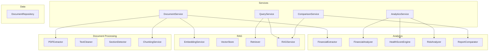
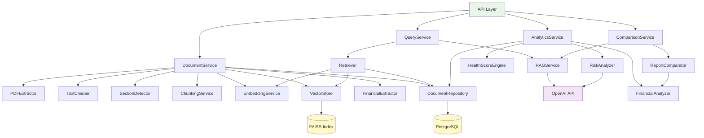

# Module Design Document

## Financial Document Intelligence & RAG Analytics Platform

---

## Table of Contents

- [1. Overview](#1-overview)
- [2. Document Processing Modules](#2-document-processing-modules)
- [3. RAG Modules](#3-rag-modules)
- [4. Analytics Modules](#4-analytics-modules)
- [5. Service Layer](#5-service-layer)
- [6. Dependency Graph](#6-dependency-graph)

---

## 1. Overview

The system is organized into focused, single-responsibility modules grouped into three processing domains (Document Processing, RAG, Analytics) coordinated by a service layer.

---

## 2. Document Processing Modules

### PDFExtractor

| Aspect | Detail |
|---|---|
| **File** | `app/document_processing/pdf_extractor.py` |
| **Responsibility** | Extract raw text and table data from PDF files page by page |
| **Inputs** | `file_path: str` — path to the PDF file |
| **Outputs** | `List[PageContent]` — extracted text and tables per page with page numbers |
| **Dependencies** | PyMuPDF (`fitz`), pdfplumber |
| **Key Methods** | `extract_text(file_path) → List[PageContent]`, `extract_tables(file_path) → List[TableData]` |

### TextCleaner

| Aspect | Detail |
|---|---|
| **File** | `app/document_processing/text_cleaner.py` |
| **Responsibility** | Clean and normalize raw extracted text for downstream processing |
| **Inputs** | `raw_text: str` — raw extracted text |
| **Outputs** | `str` — cleaned, normalized text |
| **Dependencies** | Python `re`, `unicodedata` |
| **Key Methods** | `clean(text) → str`, `normalize_whitespace(text) → str`, `remove_headers_footers(text) → str` |

### SectionDetector

| Aspect | Detail |
|---|---|
| **File** | `app/document_processing/section_detector.py` |
| **Responsibility** | Detect document section boundaries (Income Statement, Risk Factors, etc.) |
| **Inputs** | `text: str` — cleaned text, `page_number: int` |
| **Outputs** | `str` — detected section label (or "General") |
| **Dependencies** | Python `re` |
| **Key Methods** | `detect_section(text, page_number) → str` |

### ChunkingService

| Aspect | Detail |
|---|---|
| **File** | `app/document_processing/chunking.py` |
| **Responsibility** | Split document text into overlapping chunks with metadata |
| **Inputs** | `text: str`, `chunk_size: int = 512`, `overlap: int = 50`, `metadata: dict` |
| **Outputs** | `List[Chunk]` — chunks with content, page_number, section, positions |
| **Dependencies** | None (pure Python) |
| **Key Methods** | `create_chunks(text, chunk_size, overlap, metadata) → List[Chunk]` |

---

## 3. RAG Modules

### EmbeddingService

| Aspect | Detail |
|---|---|
| **File** | `app/rag/embeddings.py` |
| **Responsibility** | Generate vector embeddings for text chunks and queries |
| **Inputs** | `texts: List[str]` — text strings to embed |
| **Outputs** | `np.ndarray` — array of 384-dimensional vectors |
| **Dependencies** | `sentence-transformers` |
| **Key Methods** | `embed_texts(texts) → np.ndarray`, `embed_query(query) → np.ndarray` |
| **State** | Model loaded once at initialization and reused |

### VectorStore

| Aspect | Detail |
|---|---|
| **File** | `app/rag/vector_store.py` |
| **Responsibility** | Store, index, and search vector embeddings |
| **Inputs** | Embeddings (`np.ndarray`), chunk IDs (`List[str]`), query vector |
| **Outputs** | Search results: `List[SearchResult]` (chunk_id, score) |
| **Dependencies** | FAISS (MVP), pgvector (production) |
| **Key Methods** | `add(embeddings, ids)`, `search(query_vector, top_k) → List[SearchResult]`, `delete(document_id)`, `save()`, `load()` |
| **Interface** | Abstract base class allowing swap between FAISS and pgvector |

### Retriever

| Aspect | Detail |
|---|---|
| **File** | `app/rag/retriever.py` |
| **Responsibility** | Orchestrate retrieval: embed query → search vectors → filter → return chunks with metadata |
| **Inputs** | `query: str`, `top_k: int`, `threshold: float`, `document_id: Optional[UUID]` |
| **Outputs** | `List[RetrievedChunk]` — chunks with content, metadata, and similarity scores |
| **Dependencies** | `EmbeddingService`, `VectorStore`, `DocumentRepository` |
| **Key Methods** | `retrieve(query, top_k, threshold, document_id) → List[RetrievedChunk]` |

### RAGService

| Aspect | Detail |
|---|---|
| **File** | `app/rag/generator.py` |
| **Responsibility** | Generate grounded answers using retrieved context and LLM |
| **Inputs** | `question: str`, `retrieved_chunks: List[RetrievedChunk]` |
| **Outputs** | `RAGResponse` — answer text, citations, confidence, metadata |
| **Dependencies** | `openai` library, `Retriever` |
| **Key Methods** | `generate(question, chunks) → RAGResponse`, `build_prompt(question, context) → str` |

---

## 4. Analytics Modules

### FinancialExtractor

| Aspect | Detail |
|---|---|
| **File** | `app/analytics/metric_extractor.py` |
| **Responsibility** | Identify and extract 12 key financial metrics from document text |
| **Inputs** | `chunks: List[Chunk]`, `document_metadata: dict` |
| **Outputs** | `List[ExtractedMetric]` — metric name, value, unit, period, confidence, source page |
| **Dependencies** | Python `re`, `Decimal` |
| **Key Methods** | `extract_metrics(chunks) → List[ExtractedMetric]` |

### FinancialAnalyzer

| Aspect | Detail |
|---|---|
| **File** | `app/analytics/ratio_calculator.py` |
| **Responsibility** | Calculate 8 financial ratios from extracted metrics |
| **Inputs** | `metrics: List[ExtractedMetric]` |
| **Outputs** | `List[FinancialRatio]` — ratio name, value, interpretation |
| **Dependencies** | None (pure Python math) |
| **Key Methods** | `calculate_ratios(metrics) → List[FinancialRatio]`, `calculate_yoy_change(current, previous) → YoYComparison` |

### HealthScoreEngine

| Aspect | Detail |
|---|---|
| **File** | `app/analytics/health_score.py` |
| **Responsibility** | Compute the 0–100 financial health score across 5 dimensions |
| **Inputs** | `metrics: List[ExtractedMetric]`, `ratios: List[FinancialRatio]` |
| **Outputs** | `HealthScore` — composite score, dimension scores, interpretation |
| **Dependencies** | None (pure Python) |
| **Key Methods** | `calculate_score(metrics, ratios) → HealthScore`, `normalize(value, poor, excellent) → float` |

### RiskAnalyzer

| Aspect | Detail |
|---|---|
| **File** | `app/analytics/risk_analyzer.py` |
| **Responsibility** | Identify and classify business/financial risks from document evidence |
| **Inputs** | `chunks: List[Chunk]`, `metrics: List[ExtractedMetric]` |
| **Outputs** | `List[IdentifiedRisk]` — category, description, severity, evidence, source |
| **Dependencies** | `openai` (for LLM-based risk extraction), Python `re` |
| **Key Methods** | `analyze_risks(chunks, metrics) → List[IdentifiedRisk]` |

### ReportComparator

| Aspect | Detail |
|---|---|
| **File** | `app/analytics/comparator.py` |
| **Responsibility** | Compare financial data between two documents |
| **Inputs** | `metrics_1: List[ExtractedMetric]`, `metrics_2: List[ExtractedMetric]`, `risks_1: List[IdentifiedRisk]`, `risks_2: List[IdentifiedRisk]` |
| **Outputs** | `ComparisonResult` — metric changes, risk changes, summary |
| **Dependencies** | `FinancialAnalyzer`, `RAGService` (for AI summary) |
| **Key Methods** | `compare(doc1_data, doc2_data) → ComparisonResult` |

---

## 5. Service Layer

### DocumentService

| Aspect | Detail |
|---|---|
| **File** | `app/services/document_service.py` |
| **Responsibility** | Orchestrate document lifecycle: upload, validate, process, delete |
| **Dependencies** | `PDFExtractor`, `TextCleaner`, `SectionDetector`, `ChunkingService`, `EmbeddingService`, `VectorStore`, `FinancialExtractor`, `DocumentRepository` |

### QueryService

| Aspect | Detail |
|---|---|
| **File** | `app/services/query_service.py` |
| **Responsibility** | Orchestrate RAG query pipeline from question to cited answer |
| **Dependencies** | `Retriever`, `RAGService` |

### AnalyticsService

| Aspect | Detail |
|---|---|
| **File** | `app/services/analytics_service.py` |
| **Responsibility** | Orchestrate financial analytics: ratios, health score, risks |
| **Dependencies** | `FinancialAnalyzer`, `HealthScoreEngine`, `RiskAnalyzer`, `DocumentRepository` |

### DocumentRepository

| Aspect | Detail |
|---|---|
| **File** | `app/models/` + repository pattern |
| **Responsibility** | Data access layer — CRUD operations for all database tables |
| **Dependencies** | SQLAlchemy, PostgreSQL |
| **Key Methods** | `create_document()`, `get_document()`, `list_documents()`, `delete_document()`, `save_chunks()`, `save_metrics()`, `save_analysis()` |

---

## 6. Dependency Graph

