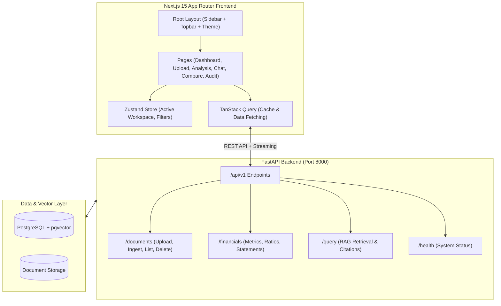
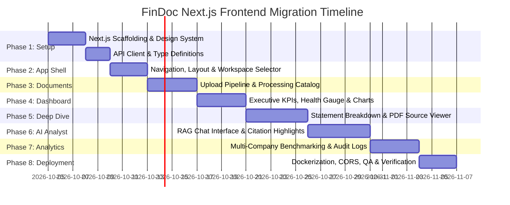

# FinDoc - Next.js Frontend Migration & Implementation Plan

This document outlines the architecture, implementation phases, component hierarchy, API integrations, and rollout strategy for converting the **FinDoc (Financial Document Intelligence & RAG Analytics Platform)** Streamlit frontend into a modern, enterprise-grade **Next.js 15 (App Router)** web application.

---

## 1. Executive Summary & Goals

### 1.1 Motivation
The current Streamlit interface served as a rapid prototyping frontend. Migrating to **Next.js** provides:
- **Sub-second Navigation & Dynamic Rendering:** Server-Side Rendering (SSR), Server Components (RSC), and client-side page transitions without full page re-runs.
- **Enterprise Fintech UX:** Custom animations, responsive layouts, split-screen PDF previewers, and low-latency interactive financial dashboards.
- **Streaming AI Analyst Responses:** Real-time token streaming and citation highlights for RAG conversations.
- **Robust State & Cache Management:** Fine-grained client caching via TanStack Query and workspace state management via Zustand.
- **Production Scalability:** Decoupled frontend container with optimized static assets, production caching, and standard CI/CD deployment.

---

## 2. Technology Stack & Architecture

### 2.1 Core Stack
| Layer | Technology | Purpose |
| :--- | :--- | :--- |
| **Framework** | **Next.js 15+ (App Router)** | Modern React framework with Server Components & nested layouts |
| **Language** | **TypeScript 5+** | Strict typing for financial metrics, schemas, and API responses |
| **Styling** | **Tailwind CSS + CSS Variables** | Utility-first styling with dark/light mode token architecture |
| **UI Components** | **shadcn/ui + Radix UI** | Accessible, headless, customizable component primitives |
| **Charts & Analytics** | **Recharts + Tremor + Lucide React** | Financial visualizations (P&L waterfalls, radar, KPI cards, gauges) |
| **State Management** | **TanStack Query (v5) + Zustand** | Server-state caching/invalidation and global workspace state |
| **PDF & Citations** | **react-pdf / @react-pdf-viewer/core** | In-browser PDF rendering with jump-to-page citation links |
| **Icons** | **Lucide React** | Clean, consistent UI iconography |
| **HTTP Client** | **Axios / Native fetch** | Typed API service layer communicating with FastAPI |

### 2.2 System Architecture Diagram


---

## 3. Project Directory Structure

The Next.js application will be structured under `frontend-next/` (or `frontend/` upon deprecation of Streamlit):

```
frontend/
├── public/                     # Static assets, logos, favicon
├── src/
│   ├── app/                    # Next.js App Router
│   │   ├── (auth)/             # Optional authentication routes
│   │   ├── (dashboard)/        # Main app shell with sidebar layout
│   │   │   ├── layout.tsx      # Sidebar, Topbar, Workspace Selector
│   │   │   ├── page.tsx        # Redirects to /dashboard
│   │   │   ├── dashboard/      # Executive Financial Dashboard
│   │   │   ├── documents/      # Document Upload & Processing Catalog
│   │   │   ├── analysis/       # Statement & Financial Ratio Deep-Dive
│   │   │   ├── chat/           # AI Analyst (RAG Interface with Citations)
│   │   │   ├── compare/        # Multi-Document / Peer Comparison
│   │   │   └── audit/          # Extraction & System Audit Logs
│   │   ├── api/                # Optional Next.js internal API route handlers
│   │   ├── layout.tsx          # Root HTML layout with providers
│   │   └── globals.css         # Tailwind tokens & custom financial theme
│   ├── components/
│   │   ├── ui/                 # shadcn/ui primitives (button, card, dialog, table...)
│   │   ├── shared/             # Common UI (Header, Sidebar, ThemeToggle, StatCard)
│   │   ├── dashboard/          # KPI Cards, Health Gauges, Trend Charts
│   │   ├── documents/          # Dropzone, Processing Stepper, Document Table
│   │   ├── analysis/           # Statement Tables, Ratio Breakdowns, PDF Inspector
│   │   ├── chat/               # Chat Message, Streaming Bubble, Citation Pill
│   │   ├── compare/            # Comparison Matrix, Radar Overlay
│   │   └── audit/              # Audit Log Table, Log Detail Sheet
│   ├── hooks/                  # Custom React hooks (useDocuments, useFinancials, useChat)
│   ├── lib/
│   │   ├── api-client.ts       # Axios instance with interceptors & error handler
│   │   ├── formatters.ts       # Currency (INR/USD), percentages, date formatting
│   │   └── utils.ts            # Class name merger (cn) & helpers
│   ├── stores/
│   │   ├── workspace-store.ts  # Selected company, year, active document ID
│   │   └── chat-store.ts       # Conversation history and citation drawers
│   └── types/
│       ├── document.ts         # Document metadata & ingestion status types
│       ├── financial.ts        # Financial statements, KPIs, and ratios types
│       └── rag.ts              # Query request, answer, citation chunks types
├── .env.example
├── next.config.ts
├── package.json
├── tailwind.config.ts
└── tsconfig.json
```

---

## 4. Phase-by-Phase Implementation Plan



---

### Phase 1: Project Setup, Design System & Architecture
- **Goal:** Initialize Next.js 15 project, configure Tailwind theme, install shadcn/ui components, and setup typed API clients.
- **Deliverables:**
  - `package.json` with all required dependencies.
  - Tailwind design tokens supporting Dark/Light mode with fintech color palettes (slate, emerald, indigo, amber).
  - Configured `@/` import aliases and TypeScript strict mode.
  - `src/lib/api-client.ts` with Axios base configuration connecting to FastAPI backend.
  - Comprehensive TypeScript interfaces matching backend models (`DocumentOut`, `FinancialMetrics`, `RAGResponse`, `HealthStatus`).

---

### Phase 2: Core Shell, Layout & Workspace State
- **Goal:** Build the persistent application layout with intuitive navigation and workspace management.
- **Deliverables:**
  - Collapsible Sidebar with links:
    - 📊 **Dashboard** (`/dashboard`)
    - 📁 **Document Processing** (`/documents`)
    - 📈 **Financial Analysis** (`/analysis`)
    - 🤖 **AI Analyst** (`/chat`)
    - ⚖️ **Benchmarking & Comparison** (`/compare`)
    - 🛡️ **Audit Logs** (`/audit`)
  - Header Topbar containing:
    - Workspace / Company & Fiscal Year Selector.
    - Live Backend Health Status indicator (polling `/api/v1/health`).
    - Dark/Light Theme toggle button.
  - Global `workspace-store.ts` (Zustand) keeping the selected document/company synchronized across all pages.

---

### Phase 3: Document Upload & Real-Time Processing Pipeline
- **Goal:** Replace Streamlit file uploader with a rich drag-and-drop dropzone and multi-stage status tracker.
- **Deliverables:**
  - File Dropzone supporting PDF and Excel files with validation and file size limits.
  - Metadata Input Form: Company Name, Fiscal Year, Filing Type (10-K, Annual Report, Ind AS financial statements).
  - Real-Time Ingestion Stepper: Visual state tracker for `Uploaded` $\rightarrow$ `Text Extraction / OCR` $\rightarrow$ `Chunking` $\rightarrow$ `Vector Embedding` $\rightarrow$ `LLM Metric Extraction`.
  - Document Catalog Table:
    - Searchable and filterable data table of all indexed documents.
    - Badges for processing status (`COMPLETED`, `PROCESSING`, `FAILED`).
    - Actions menu: Re-process, View Raw Metadata, Download Original, Delete Document.

---

### Phase 4: Executive Financial Dashboard
- **Goal:** Replicate and elevate the Streamlit Dashboard (`1_Dashboard.py`) with high-performance charts and KPI cards.
- **Deliverables:**
  - Top-line KPI Cards: Revenue, EBITDA, Net Margin, Operating Margin, EPS, Debt-to-Equity with YoY change badges.
  - Financial Health Gauge: Altman Z-score or Composite Health Score rendered with interactive SVG / radial gauges.
  - Interactive Visualizations:
    - Revenue & Net Income multi-year bar/line trends (Recharts).
    - Financial Dimension Radar Chart (Profitability, Solvency, Liquidity, Efficiency, Growth).
    - Capital structure breakdown (Equity vs. Debt donut chart).
  - Executive Insights Card: AI-generated executive summary with highlight cards.

---

### Phase 5: Financial Statement & Deep-Dive Analysis
- **Goal:** Provide detailed financial statement exploration (`3_Analysis.py`) with Ind AS compliance metrics.
- **Deliverables:**
  - Interactive Financial Statement Tabs: Income Statement (P&L), Balance Sheet, Cash Flow.
  - Unit normalization switch (Thousands, Millions, Crores, Billions) and currency toggle (INR / USD).
  - Ratio Analysis Grid: Categorized cards for Liquidity ratios, Profitability ratios, Solvency ratios, and Turnover ratios with standard benchmark comparisons.
  - PDF & Source Chunk Inspector: Split view or slide-over drawer allowing users to inspect extracted raw chunks, confidence scores, and source page references.

---

### Phase 6: AI Analyst (RAG Chatbot) with Citations
- **Goal:** Migrate `4_AI_Analyst.py` and `chat_interface.py` into a modern conversational assistant.
- **Deliverables:**
  - Conversational message thread with Markdown rendering and syntax-highlighted financial tables.
  - Suggested Query Pills (e.g., "*What were the main revenue drivers?*", "*Analyze debt trends over the last 3 years*").
  - Interactive Citation System:
    - Inline citation tags (e.g., `[Page 38, Chunk #4]`).
    - Clicking a citation opens a side sheet displaying the exact source text, section header, and retrieval similarity score.
  - Chat Export (Export conversation to Markdown / PDF).

---

### Phase 7: Multi-Company Comparison & Audit Logs
- **Goal:** Rebuild `5_Comparison.py` and `6_Audit_Logs.py`.
- **Deliverables:**
  - Multi-Entity Comparison Grid: Side-by-side metric comparison table for 2–4 companies or multi-year filings.
  - Comparative Overlay Charts: Revenue growth comparison and margin expansion comparison.
  - Audit Trail & Telemetry Table:
    - Detailed logs of all extraction jobs, RAG retrieval queries, token usage, and latency.
    - Filterable by status, date range, and entity.
    - CSV export functionality.

---

### Phase 8: Dockerization, Testing, CORS & Production Polish
- **Goal:** Finalize production build, containerization, and end-to-end QA.
- **Deliverables:**
  - Multi-stage `Dockerfile` for the Next.js frontend (standalone output for minimal image size).
  - Updated `docker-compose.yml` and `docker-compose.prod.yml` running FastAPI backend and Next.js frontend together.
  - Fast-API CORS verification ensuring seamless communication in development (`localhost:3000`) and production.
  - Responsive testing (Desktop, Tablet, Mobile) and accessibility (WCAG AA).

---

## 5. Backend API Integration Mapping

| Next.js Page / Feature | FastAPI Backend Endpoint | Method | Data Passed / Expected |
| :--- | :--- | :---: | :--- |
| **System Status** | `/api/v1/health` | `GET` | Health status, DB connectivity, model readiness |
| **Upload Document** | `/api/v1/documents/upload` | `POST` | `multipart/form-data` with PDF and metadata |
| **Document Catalog** | `/api/v1/documents` | `GET` | List of documents with status, company, date |
| **Delete Document** | `/api/v1/documents/{id}` | `DELETE` | Deletes vector chunks and relational metadata |
| **Financial Metrics** | `/api/v1/financials/{doc_id}` | `GET` | P&L, Balance Sheet, Ratios, Health score |
| **Comparative Analytics**| `/api/v1/financials/compare` | `POST` | List of `doc_ids`, returns unified comparison matrix |
| **AI Analyst / Query** | `/api/v1/query` | `POST` | `{ query, document_id, top_k }` $\rightarrow$ `{ answer, citations }` |

---

## 6. Migration Strategy & Coexistence

To ensure uninterrupted development:
1. **Parallel Development:** The Next.js frontend will be created in a new directory (`frontend-next/` or structured alongside).
2. **Independent Testing:** Next.js will connect to the existing FastAPI backend (`http://localhost:8000`) via CORS.
3. **Switchover:** Once Phase 6 is completed and verified against Streamlit feature parity, the Streamlit frontend can be archived or replaced in `docker-compose.yml`.

---
*Created on 2026-10-02 as part of the FinDoc Modernization Initiative.*
