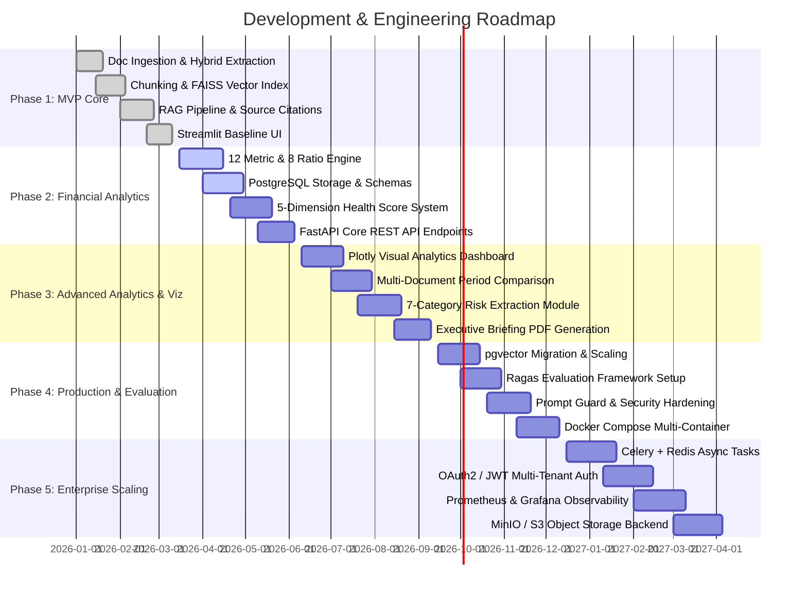

# Product & Engineering Roadmap

This document outlines the phased development and evolution roadmap for the **Financial Document Intelligence & RAG Analytics Platform**. It defines milestones from the minimal viable product (MVP) to an enterprise-grade financial analytics infrastructure.

---

## Roadmap Overview & Milestones



---

## Phase 1: Core Foundation & RAG MVP

**Status**: Completed (Baseline) 
**Primary Goal**: Establish an end-to-end operational pipeline capable of parsing PDF filings, embedding text chunks into a vector store, answering analytical queries with context citations, and rendering answers in a clean interface.

### Objectives
1. Parse financial PDF documents containing text and standard tables.
2. Formulate token-aware semantic chunks preserving section continuity.
3. Compute dense vector embeddings and index in-memory using FAISS.
4. Execute Retrieval-Augmented Generation (RAG) with context-bound prompt templates.
5. Provide precise source provenance (document name, page number, snippet).

### Key Tasks
- [x] Configure PDF extraction combining `PyPDF2` (raw text) and `pdfplumber` (tables, visual layout).
- [x] Implement `RecursiveCharacterTextSplitter` with 800-character target chunk size and 150-character overlap.
- [x] Integrate `sentence-transformers/all-MiniLM-L6-v2` (384-dimensional vector space).
- [x] Build in-memory FAISS flat L2 index (`IndexFlatIP` on normalized embeddings for cosine similarity).
- [x] Create OpenAI GPT-4o-mini client wrapper with Ollama fallback capability.
- [x] Author system prompt strictly enforcing answer grounding and source attribution.
- [x] Build initial Streamlit single-page application for document upload and Q&A chat.

### Deliverables
- Functional CLI and single-page Streamlit prototype.
- Ingestion pipeline parsing standard earnings releases and annual reports.
- Working vector search retrieving Top-5 relevant chunks per query.
- Source attribution showing document name, page, and raw snippet.

### Technical Dependencies
- Python 3.10+
- `PyPDF2`, `pdfplumber`, `sentence-transformers`, `faiss-cpu`, `openai`, `streamlit`.

### Definition of Done (DoD)
- Document parses with text extraction accuracy > 95% on clean digital PDFs.
- RAG system answers financial queries without hallucinations when the answer exists in document text.
- Fallback message triggered when queried fact is absent from context.
- UI displays answers alongside expandable source reference cards.

---

## Phase 2: Financial Analytics & Quantitative Extraction

**Status**: Active / In Progress 
**Primary Goal**: Move beyond pure conversational NLP by extracting structured financial metrics, computing standardized financial ratios, deriving financial health scores, and persisting state in PostgreSQL.

### Objectives
1. Automatically recognize and extract 12 standard financial metrics across P&L, Balance Sheet, and Cash Flow statements.
2. Derive 8 essential financial ratios covering profitability, liquidity, and leverage.
3. Formulate an explainable, 5-dimension financial health scoring algorithm (0–100 scale).
4. Persist structured metadata, chunk references, metrics, and analyses into relational schemas.
5. Expose REST API endpoints via FastAPI for programmatic consumption.

### Key Tasks
- [x] Define relational schema (`users`, `documents`, `document_chunks`, `financial_metrics`, `analysis_results`).
- [ ] Implement dual-engine metric extractor:
  - Pattern matcher for explicit INR currency figures (e.g., `₹ 1,250.50 Cr`).
  - Structured LLM JSON extraction for irregular line items.
- [ ] Implement ratio calculation engine with zero-division handling and unit normalization (`calculate_ratios()`).
- [ ] Implement weighted financial health scoring module (`calculate_health_score()`):
  - Revenue & PAT Growth (20%)
  - Profitability - OPM & NPM (25%)
  - Liquidity - Current Ratio (20%)
  - Leverage - Debt-to-Equity (20%)
  - Cash Flow Sufficiency (15%)
- [ ] Implement core FastAPI endpoints (`/documents/upload`, `/query`, `/financial-metrics/{id}`, `/health-score/{id}`).

### Deliverables
- Production-ready PostgreSQL DDL and SQLAlchemy data models.
- Standardized financial calculation library unit-tested against audited sample figures.
- Modular scoring engine outputting overall score, dimensional grades, and textual rationales.
- Interactive API documentation at `/docs` (Swagger UI).

### Technical Dependencies
- PostgreSQL 15+
- `sqlalchemy`, `psycopg2-binary`, `pydantic`, `fastapi`, `uvicorn`.

### Definition of Done (DoD)
- All 12 financial metrics successfully parsed from test 10-K/annual filing samples.
- Health score engine produces deterministically reproducible results for given metric inputs.
- All derived ratios match manual spreadsheet verification within 0.1% rounding tolerance.
- FastAPI endpoints pass integration test suite with standard HTTP status codes.

---

## Phase 3: Advanced Intelligence, Visualization & Dashboards

**Status**: Planned 
**Primary Goal**: Elevate user experience and analytical depth through interactive visualization dashboards, multi-period comparative analytics, automated executive summaries, and qualitative risk categorization.

### Objectives
1. Provide visual analytics utilizing Plotly for metric distribution, ratio radar charts, and trend line plots.
2. Support comparative analytics across multiple fiscal periods (QoQ, YoY) and peer companies.
3. Automatically identify and classify qualitative risk factors across 7 domain categories.
4. Generate downloadable, comprehensive executive PDF briefing summaries.

### Key Tasks
- [ ] Build multi-page Streamlit application (Dashboard, Financial Analysis, Document Q&A, Comparative Analytics, Audit Logs).
- [ ] Construct interactive Plotly charts:
  - Health score radar chart showing 5 dimensional performance bars.
  - Historical revenue vs. profit margin multi-axis bar/line chart.
  - Working capital and leverage ratio comparison gauge charts.
- [ ] Implement multi-document aggregation logic to calculate YoY and QoQ variance percentages.
- [ ] Develop 7-category risk classification NLP prompt chain (Credit, Market, Liquidity, Operational, Regulatory, Strategic, Macroeconomic).
- [ ] Implement ReportLab PDF generator compiling executive summary, extracted metrics, health rating, and risk breakdown.

### Deliverables
- 5-page Streamlit analytical dashboard suite.
- Comparative analytics view supporting side-by-side filing inspection.
- Categorized risk matrix with severity weighting (High, Medium, Low).
- One-click executive briefing PDF report download.

### Technical Dependencies
- `streamlit`, `plotly`, `pandas`, `reportlab`, `matplotlib`.

### Definition of Done (DoD)
- Dashboard visualizes all extracted metrics without UI lag (< 1.5s chart render).
- Comparison view correctly flags positive/negative delta trends with directional indicators.
- Risk extraction tags at least 3 relevant risk disclosures from Annual Report Item 1A / Notes.
- Exported PDF reproduces platform findings faithfully with print-ready formatting.

---

## Phase 4: Production Engineering, Security & Evaluation

**Status**: Planned 
**Primary Goal**: Harden the architecture for production resilience, replace in-memory indices with persistent vector databases, integrate automated RAG evaluation metrics, and implement defensive security controls.

### Objectives
1. Migrate from in-memory FAISS indices to persistent `pgvector` inside PostgreSQL.
2. Establish continuous RAG evaluation using the Ragas framework (Faithfulness, Answer Relevance, Context Precision, Context Recall).
3. Implement defensive prompt injection guards and input sanitization filters.
4. Containerize the full stack using multi-stage Docker builds and Docker Compose orchestration.

### Key Tasks
- [ ] Install `pgvector` extension and configure IVFFlat/HNSW vector index partitions.
- [ ] Implement vector migration script porting FAISS embeddings into PostgreSQL `document_chunks`.
- [ ] Create benchmark dataset of 50 ground-truth financial question-answer pairs.
- [ ] Configure automated evaluation script reporting Ragas scores:
  - Faithfulness Target: $\ge 0.90$
  - Answer Relevance Target: $\ge 0.85$
  - Context Precision Target: $\ge 0.85$
- [ ] Integrate prompt sanitization regex patterns and heuristic system boundary delimiters.
- [ ] Author multi-stage `Dockerfile` configurations for FastAPI backend and Streamlit frontend.
- [ ] Build production `docker-compose.yml` orchestrating PostgreSQL (with pgvector), API backend, and UI.

### Deliverables
- Unified database holding both relational financial data and vector embeddings.
- CI-integrated RAG evaluation benchmark harness.
- Security middleware blocking malicious prompt injection payloads.
- Multi-container Docker deployment running with a single `docker compose up` command.

### Technical Dependencies
- `pgvector`, `ragas`, `docker`, `docker-compose`, `pytest`, `httpx`.

### Definition of Done (DoD)
- Retrieval queries against `pgvector` achieve sub-200ms latency on 50,000 indexed chunks.
- Evaluation pipeline scores achieve: Faithfulness $\ge 0.90$, Answer Relevance $\ge 0.85$.
- Malicious prompt override test suite rejected with 100% detection rate.
- Fresh environment spins up completely via Docker Compose with zero host tool dependencies.

---

## Phase 5: Enterprise Scaling & Infrastructure

**Status**: Future Concept 
**Primary Goal**: Scale system capacity to handle enterprise document volumes, asynchronous background processing, strict access control, and complete cloud-native observability.

### Objectives
1. Offload heavy PDF parsing and embedding jobs to an asynchronous worker queue.
2. Implement secure multi-tenant authentication and Role-Based Access Control (RBAC).
3. Connect cloud-native S3/MinIO object storage for secure, encrypted document archiving.
4. Implement telemetry with Prometheus metrics, Grafana dashboards, and OpenTelemetry tracing.

### Key Tasks
- [ ] Deploy Celery worker nodes backed by Redis message broker for asynchronous document processing.
- [ ] Implement task status polling endpoints (`/tasks/{task_id}`) with progress percentage indicators.
- [ ] Implement OAuth2 / JWT authentication flow with bcrypt password hashing and tenant isolation.
- [ ] Integrate AWS S3 / MinIO client storing original raw PDFs and extracted artifacts with server-side encryption.
- [ ] Configure Prometheus client exporting API response latencies, token consumption, and error rates.
- [ ] Construct Grafana dashboard visualizing operational and financial analytics metrics.

### Deliverables
- Non-blocking ingestion pipeline capable of queuing 100+ documents simultaneously.
- Secure multi-user login with user document sandboxing.
- S3-compatible document storage replacing local filesystem directories.
- Real-time observability dashboard for system health, latency, and LLM costs.

### Technical Dependencies
- `celery`, `redis`, `minio`, `boto3`, `prometheus-fastapi-instrumentator`, `grafana`.

### Definition of Done (DoD)
- Document uploads return immediate 202 Accepted status and process asynchronously.
- Users cannot access documents or analysis results belonging to other tenants.
- System processes 100-page filings without timeout or degradation of user experience.
- Prometheus alerts trigger if 5xx API error rate exceeds 1% over 5 minutes.

---

## Feature Priority Matrix

| Feature / Capability | Phase | Complexity | Business Value | Priority |
| :--- | :--- | :--- | :--- | :--- |
| **PDF Ingestion & Hybrid Parsing** | Phase 1 | Medium | High | P0 (Critical) |
| **FAISS Vector Retrieval & RAG** | Phase 1 | Medium | High | P0 (Critical) |
| **Source Provenance Citations** | Phase 1 | Low | High | P0 (Critical) |
| **12 Financial Metrics Extractor** | Phase 2 | High | High | P0 (Critical) |
| **8 Financial Ratios Calculator** | Phase 2 | Medium | High | P0 (Critical) |
| **5-Dimension Health Score** | Phase 2 | Medium | High | P1 (High) |
| **PostgreSQL Relational Persistence** | Phase 2 | Medium | High | P1 (High) |
| **FastAPI REST Endpoints** | Phase 2 | Medium | High | P1 (High) |
| **Interactive Plotly Visualizations** | Phase 3 | Medium | Medium | P1 (High) |
| **Multi-Period YoY/QoQ Comparison** | Phase 3 | High | High | P1 (High) |
| **7-Category Risk Extraction** | Phase 3 | Medium | Medium | P2 (Medium) |
| **Executive PDF Summary Generator** | Phase 3 | Medium | Medium | P2 (Medium) |
| **pgvector Native Storage** | Phase 4 | Medium | High | P1 (High) |
| **Ragas Continuous Evaluation** | Phase 4 | High | High | P1 (High) |
| **Prompt Injection Protection** | Phase 4 | Medium | High | P1 (High) |
| **Docker Compose Orchestration** | Phase 4 | Low | High | P1 (High) |
| **Celery/Redis Async Queue** | Phase 5 | High | Medium | P2 (Medium) |
| **OAuth2 / RBAC Multi-Tenancy** | Phase 5 | High | High | P2 (Medium) |
| **S3/MinIO Object Storage** | Phase 5 | Medium | Medium | P3 (Low) |
| **Prometheus / Grafana Telemetry** | Phase 5 | Medium | Low | P3 (Low) |

---

## Release Milestones & Versioning

```
v0.1.0-alpha (Phase 1 Completed)
 └── Basic Streamlit RAG tool, FAISS vector search, PDF parsing, grounded answers.

v0.5.0-beta (Phase 2 In Progress)
 └── FastAPI integration, PostgreSQL storage, 12 metrics, 8 ratios, 5D health score.

v1.0.0-rc (Phase 3 Target)
 └── Multi-page dashboard, Plotly charts, period-over-period comparisons, executive summaries.

v1.2.0-prod (Phase 4 Target)
 └── pgvector persistent search, Ragas evaluation harness, prompt guard, containerized Docker deployment.

v2.0.0-ent (Phase 5 Vision)
 └── Asynchronous task architecture, multi-tenant RBAC, enterprise object storage, telemetry.
```
