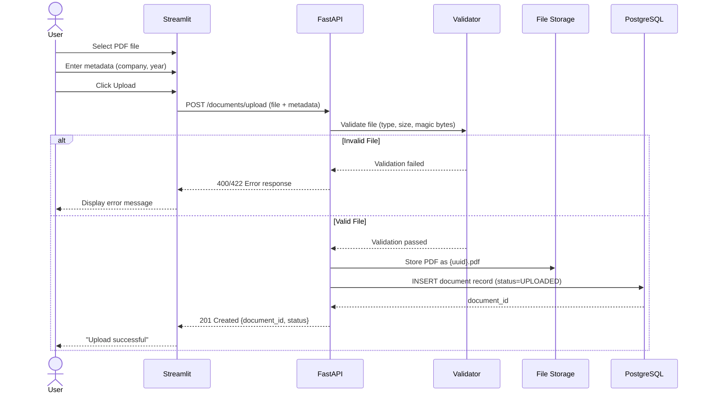
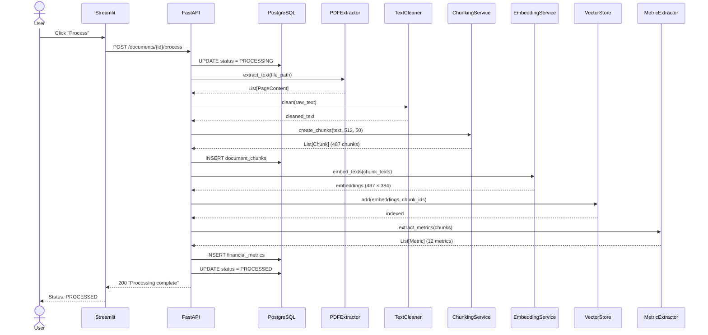
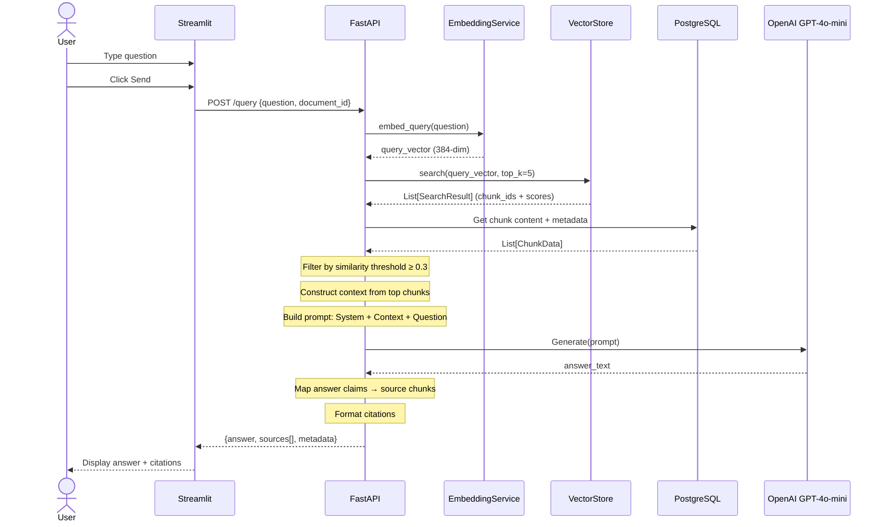
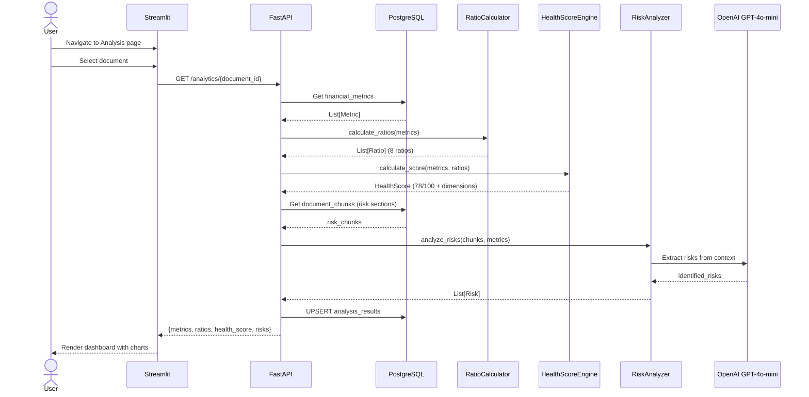
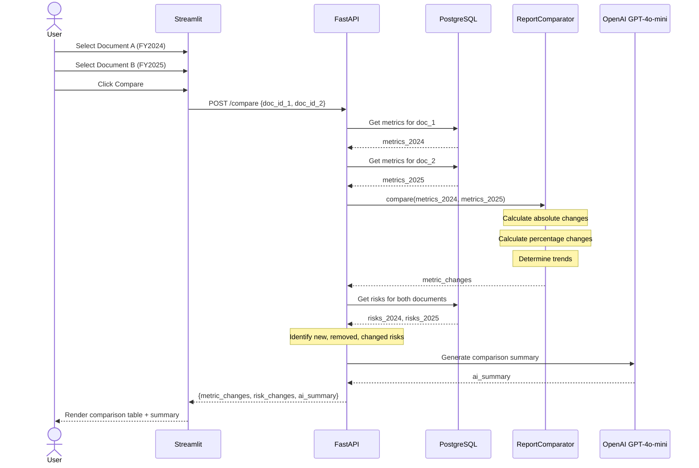
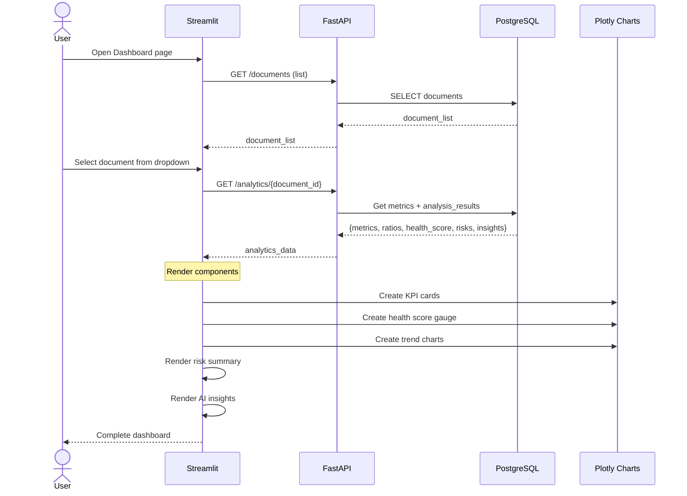

# Sequence Diagrams

## Financial Document Intelligence & RAG Analytics Platform

---

## 1. Document Upload

---

## 2. Document Processing

---

## 3. RAG Question Answering

---

## 4. Financial Analysis

---

## 5. Document Comparison

---

## 6. Dashboard Generation

