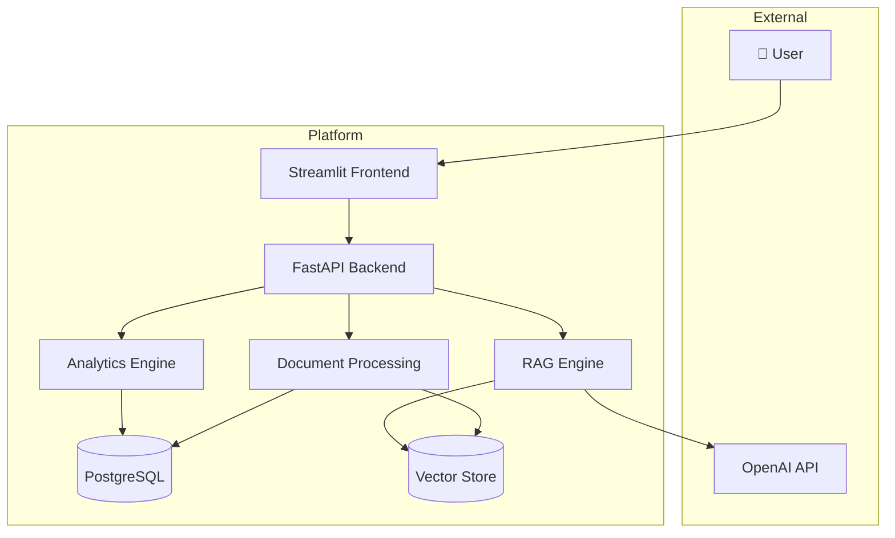

# Software Requirements Specification

## Financial Document Intelligence & RAG Analytics Platform

| Field | Value |
|---|---|
| **Document Version** | 1.0 |
| **Date** | September 2026 |
| **Status** | Approved |
| **Author** | Samar |
| **Project Type** | AI/ML + Financial Analytics |

---

## Table of Contents

- [1. Introduction](#1-introduction)
- [2. Overall Description](#2-overall-description)
- [3. Functional Requirements](#3-functional-requirements)
- [4. Non-Functional Requirements](#4-non-functional-requirements)
- [5. External Interfaces](#5-external-interfaces)
- [6. Data Requirements](#6-data-requirements)
- [7. Security Requirements](#7-security-requirements)
- [8. Constraints](#8-constraints)
- [9. Acceptance Criteria](#9-acceptance-criteria)

---

## 1. Introduction

### 1.1 Purpose

This Software Requirements Specification (SRS) defines the functional and non-functional requirements for the **Financial Document Intelligence & RAG Analytics Platform** — an AI-powered system that processes financial documents, enables natural-language querying through Retrieval-Augmented Generation (RAG), and provides automated financial analytics.

This document serves as:

- The authoritative specification for all system features
- A reference for developers implementing the system
- A basis for testing and validation
- A contract between stakeholders on system capabilities

### 1.2 Scope

The platform enables users to upload financial documents (annual reports, quarterly reports, earnings reports, investor presentations, financial statements), process them through an AI pipeline, and interact with the extracted information through:

1. Natural-language question answering with source citations
2. Automated financial metric extraction
3. Financial ratio calculation and year-over-year comparison
4. Financial health scoring (0–100 scale)
5. Business and financial risk identification
6. Interactive analytics dashboards
7. Multi-document comparison

**In Scope:**

- PDF document upload and management
- Document parsing, chunking, and embedding
- Vector-based semantic search
- RAG-based question answering with citations
- Financial metric extraction (12 metrics)
- Financial ratio calculation (8 ratios)
- Financial health scoring
- Risk identification and classification
- Interactive dashboard visualization
- REST API
- Docker-based deployment

**Out of Scope:**

- Investment advice or trading recommendations
- Automated trading or brokerage integration
- Certified financial reporting or auditing
- Real-time market data integration
- Guaranteed financial predictions
- Multi-language document support (MVP)

### 1.3 Intended Audience

| Audience | Purpose |
|---|---|
| **Developers** | Implementation reference for building system components |
| **Testers** | Basis for test case design and acceptance testing |
| **Project Evaluators** | Assessment of technical scope and depth |
| **Interviewers** | Understanding of system design and requirements engineering |
| **Students/Researchers** | Reference for similar AI/financial analytics projects |

### 1.4 Definitions

| Term | Definition |
|---|---|
| **RAG** | Retrieval-Augmented Generation — an AI architecture that grounds LLM responses in retrieved document evidence |
| **LLM** | Large Language Model — a neural network trained on large text corpora for language understanding and generation |
| **Embedding** | A dense numerical vector representation of text that captures semantic meaning |
| **Vector Database** | A database optimized for storing and searching high-dimensional vectors |
| **Chunk** | A segment of document text used as a retrieval unit in the RAG pipeline |
| **Financial Metric** | A quantitative measure of a company's financial performance (e.g., Revenue, EBITDA) |
| **Financial Ratio** | A calculated value derived from financial metrics to assess relative performance (e.g., Debt-to-Equity) |
| **Health Score** | An indicative 0–100 score summarizing a company's financial condition across multiple dimensions |
| **Citation** | A reference to the specific document, page, and section supporting an AI-generated claim |
| **Semantic Search** | Search based on meaning similarity rather than exact keyword matching |

### 1.5 Acronyms

| Acronym | Expansion |
|---|---|
| API | Application Programming Interface |
| CRUD | Create, Read, Update, Delete |
| EBITDA | Earnings Before Interest, Taxes, Depreciation, and Amortization |
| EPS | Earnings Per Share |
| FAISS | Facebook AI Similarity Search |
| NLP | Natural Language Processing |
| OCR | Optical Character Recognition |
| ORM | Object-Relational Mapping |
| PDF | Portable Document Format |
| REST | Representational State Transfer |
| ROA | Return on Assets |
| ROE | Return on Equity |
| SRS | Software Requirements Specification |
| UUID | Universally Unique Identifier |
| YoY | Year-over-Year |

### 1.6 References

| Reference | Description |
|---|---|
| IEEE 830-1998 | IEEE Recommended Practice for Software Requirements Specifications |
| System Design Document | [SYSTEM_DESIGN.md](SYSTEM_DESIGN.md) — Detailed architecture documentation |
| Database Design | [DATABASE.md](DATABASE.md) — Schema and ER diagram |
| API Documentation | [API.md](API.md) — REST API specification |

---

## 2. Overall Description

### 2.1 Product Perspective

The Financial Document Intelligence & RAG Analytics Platform is a self-contained, full-stack application that integrates:

- A **document processing pipeline** for ingesting financial PDFs
- A **RAG engine** for grounded question answering
- A **financial analytics engine** for metric extraction, ratio calculation, and scoring
- A **web-based dashboard** for visualization and interaction
- A **REST API** for programmatic access

The system is designed as a monolithic application for the MVP, with a modular architecture that supports future decomposition into microservices.

### 2.2 Product Functions

The platform provides the following high-level functions:

| Function | Description |
|---|---|
| **Document Management** | Upload, validate, list, view, and delete financial documents |
| **Document Processing** | Extract text, detect sections, chunk, embed, and index documents |
| **Question Answering** | Accept natural-language queries and return grounded, cited answers |
| **Financial Extraction** | Automatically identify and extract 12 key financial metrics |
| **Financial Analysis** | Calculate 8 financial ratios and year-over-year comparisons |
| **Health Scoring** | Generate an explainable 0–100 financial health score |
| **Risk Identification** | Detect and classify business/financial risks from document evidence |
| **Document Comparison** | Compare metrics, risks, and outlook across two documents |
| **Semantic Search** | Search documents using natural language and financial terms |
| **Dashboard** | Visualize KPIs, charts, health scores, risks, and AI insights |

### 2.3 User Classes

#### UC-1: Financial Analyst

- **Description**: Professional who analyzes company reports and extracts relevant information
- **Frequency of Use**: Daily
- **Technical Expertise**: Moderate
- **Key Needs**: Quick metric extraction, ratio analysis, comparison across periods, risk identification
- **Security Level**: Standard user access

#### UC-2: Investment Researcher

- **Description**: Researcher comparing companies and understanding financial performance
- **Frequency of Use**: Weekly
- **Technical Expertise**: Moderate
- **Key Needs**: Multi-document comparison, financial health assessment, trend analysis
- **Security Level**: Standard user access

#### UC-3: Student/Academic Researcher

- **Description**: Individual using financial documents for academic or analytical study
- **Frequency of Use**: Occasional
- **Technical Expertise**: Basic to moderate
- **Key Needs**: Document Q&A, financial concept understanding, data extraction
- **Security Level**: Standard user access

#### UC-4: System Administrator

- **Description**: Technical user managing the platform, documents, and system configuration
- **Frequency of Use**: As needed
- **Technical Expertise**: Advanced
- **Key Needs**: Document management, system monitoring, user management
- **Security Level**: Administrative access

### 2.4 Operating Environment

| Component | Requirement |
|---|---|
| **Server OS** | Linux (Ubuntu 22.04+), macOS, or Windows with WSL |
| **Python** | 3.11 or higher |
| **Database** | PostgreSQL 15+ |
| **Container Runtime** | Docker 24+ with Docker Compose |
| **Browser** | Chrome, Firefox, Edge, Safari (latest versions) |
| **Memory** | Minimum 8 GB RAM (16 GB recommended for local embedding) |
| **Storage** | Minimum 10 GB for application + models + uploaded documents |
| **Network** | Internet access required for OpenAI API calls |

### 2.5 Design Constraints

| Constraint | Description |
|---|---|
| **LLM Dependency** | RAG generation requires API access to OpenAI (or compatible LLM provider) |
| **PDF-Only Input** | MVP supports only PDF documents; other formats are out of scope |
| **English Language** | Document processing and NLP optimized for English-language financial documents |
| **Single-Tenant** | MVP is designed for single-user or small-team usage |
| **Context Window** | LLM context window limits the amount of retrieved context per query |
| **Embedding Model** | Fixed embedding dimension (384) determined by `all-MiniLM-L6-v2` model |

### 2.6 Assumptions

| ID | Assumption |
|---|---|
| A-001 | Uploaded financial documents are legitimate PDF files with extractable text |
| A-002 | Financial documents follow generally standard reporting formats (income statement, balance sheet, cash flow) |
| A-003 | Users have basic financial literacy to interpret extracted metrics and ratios |
| A-004 | The OpenAI API is available and responsive during system operation |
| A-005 | PostgreSQL database is properly configured and accessible |
| A-006 | Financial figures in documents are in a consistent currency within a single document |
| A-007 | Document text is primarily in English |

### 2.7 Dependencies

| Dependency | Type | Description |
|---|---|---|
| OpenAI API | External Service | LLM inference for RAG response generation |
| Sentence Transformers | Python Library | Embedding generation (`all-MiniLM-L6-v2`) |
| PyMuPDF | Python Library | PDF text extraction |
| pdfplumber | Python Library | PDF table extraction |
| FAISS | Python Library | Vector similarity search |
| PostgreSQL | External Service | Relational data storage |
| FastAPI | Python Framework | REST API framework |
| Streamlit | Python Framework | Frontend dashboard |
| Pandas | Python Library | Financial data manipulation |
| Plotly | Python Library | Interactive chart generation |

---

## 3. Functional Requirements

### FR-001 — User Document Upload

| Field | Description |
|---|---|
| **Requirement ID** | FR-001 |
| **Priority** | High |
| **Status** | Planned |
| **Description** | The system shall allow users to upload financial documents in PDF format through the web interface or REST API. |

**Inputs:**
- PDF file (binary)
- Optional metadata: company name, financial year

**Processing:**
1. Validate file type (must be PDF)
2. Validate file size (must not exceed configured maximum, default 50 MB)
3. Check MIME type and PDF magic bytes
4. Detect duplicate uploads based on filename and file hash
5. Store the file in the designated upload directory
6. Create a document record in PostgreSQL with status `UPLOADED`
7. Return document ID and upload confirmation

**Outputs:**
- Document ID (UUID)
- Upload status (success/failure)
- Document metadata record

**Acceptance Criteria:**
- [ ] Valid PDF files are accepted and stored successfully
- [ ] Non-PDF files are rejected with a clear error message
- [ ] Files exceeding the size limit are rejected
- [ ] Duplicate files are detected and flagged
- [ ] Document record is created with status `UPLOADED`
- [ ] Upload progress is displayed to the user

---

### FR-002 — Document Validation

| Field | Description |
|---|---|
| **Requirement ID** | FR-002 |
| **Priority** | High |
| **Status** | Planned |
| **Description** | The system shall validate uploaded documents before processing. |

**Inputs:**
- Uploaded PDF file
- File metadata (name, size, type)

**Processing:**
1. Verify file extension is `.pdf`
2. Verify MIME type is `application/pdf`
3. Verify PDF magic bytes (`%PDF-`)
4. Check file size against configured maximum
5. Attempt to open and read the PDF to detect corruption
6. Check for encrypted/password-protected PDFs
7. Verify the document contains extractable text

**Outputs:**
- Validation result (pass/fail)
- Validation error details (if failed)

**Acceptance Criteria:**
- [ ] Corrupted PDFs are detected and rejected with appropriate error
- [ ] Password-protected PDFs are detected and rejected
- [ ] Empty documents (no extractable text) are flagged
- [ ] Renamed non-PDF files (e.g., `.jpg` renamed to `.pdf`) are rejected
- [ ] Validation errors include specific, user-friendly messages

---

### FR-003 — PDF Text Extraction

| Field | Description |
|---|---|
| **Requirement ID** | FR-003 |
| **Priority** | High |
| **Status** | Planned |
| **Description** | The system shall extract text content from uploaded PDF documents, including text from tables where possible. |

**Inputs:**
- Validated PDF file

**Processing:**
1. Open PDF using PyMuPDF for general text extraction
2. Extract text page by page, preserving page number metadata
3. Use pdfplumber for table detection and structured table extraction
4. Merge text and table data per page
5. Handle multi-column layouts where detectable
6. Record extraction statistics (pages processed, text length, tables found)

**Outputs:**
- Extracted text content per page
- Extracted table data (structured)
- Page-level metadata (page number, content type)
- Extraction statistics

**Acceptance Criteria:**
- [ ] Text is extracted from all readable pages
- [ ] Tables are extracted with row/column structure preserved where possible
- [ ] Page numbers are accurately mapped to extracted content
- [ ] Multi-column text is handled reasonably
- [ ] Extraction failures on individual pages do not halt processing of remaining pages

---

### FR-004 — Document Chunking

| Field | Description |
|---|---|
| **Requirement ID** | FR-004 |
| **Priority** | High |
| **Status** | Planned |
| **Description** | The system shall split extracted document text into semantic chunks suitable for embedding and retrieval. |

**Inputs:**
- Extracted text content with page metadata
- Chunking configuration (chunk size, overlap)

**Processing:**
1. Clean and normalize extracted text (remove excessive whitespace, fix encoding)
2. Detect document sections (e.g., "Management Discussion," "Financial Statements")
3. Split text into chunks of approximately 512 tokens with 50-token overlap
4. Prefer splitting at sentence boundaries and paragraph boundaries
5. Preserve section context — avoid splitting mid-section when possible
6. Attach metadata to each chunk: document_id, page_number, section, position

**Outputs:**
- List of text chunks with metadata
- Chunk count and statistics

**Acceptance Criteria:**
- [ ] Chunks are within the configured size range (±10%)
- [ ] Chunks overlap by the configured overlap amount
- [ ] No information is lost between chunks (overlap ensures continuity)
- [ ] Each chunk retains its source page number and section
- [ ] Section boundaries are respected where possible

---

### FR-005 — Embedding Generation

| Field | Description |
|---|---|
| **Requirement ID** | FR-005 |
| **Priority** | High |
| **Status** | Planned |
| **Description** | The system shall generate vector embeddings for each document chunk using a pre-trained embedding model. |

**Inputs:**
- Text chunks with metadata

**Processing:**
1. Load the Sentence Transformers model (`all-MiniLM-L6-v2`)
2. Encode each chunk into a 384-dimensional dense vector
3. Normalize embeddings for cosine similarity search
4. Batch processing for efficiency (batch size configurable)

**Outputs:**
- 384-dimensional embedding vector per chunk
- Embedding generation statistics (count, time)

**Acceptance Criteria:**
- [ ] Each chunk produces exactly one 384-dimensional embedding
- [ ] Embeddings are normalized for cosine similarity
- [ ] Batch processing completes without memory errors for documents up to 500 pages
- [ ] Embedding failures for individual chunks are logged but do not halt processing

---

### FR-006 — Vector Storage

| Field | Description |
|---|---|
| **Requirement ID** | FR-006 |
| **Priority** | High |
| **Status** | Planned |
| **Description** | The system shall store chunk embeddings in a vector database for efficient similarity search. |

**Inputs:**
- Chunk embeddings (384-dimensional vectors)
- Chunk metadata (document_id, page_number, section, content)

**Processing:**
1. Add embeddings to the FAISS index with associated metadata
2. Persist the FAISS index to disk
3. Optionally store embeddings in PostgreSQL via pgvector extension (production)
4. Maintain a mapping between vector index positions and chunk IDs

**Outputs:**
- Indexed vectors available for similarity search
- Persisted index on disk

**Acceptance Criteria:**
- [ ] All chunk embeddings are indexed and retrievable
- [ ] FAISS index is persisted to disk and loadable on restart
- [ ] Vector search returns results in < 100ms for indices up to 100K vectors
- [ ] Deleting a document removes its vectors from the index

---

### FR-007 — Semantic Retrieval

| Field | Description |
|---|---|
| **Requirement ID** | FR-007 |
| **Priority** | High |
| **Status** | Planned |
| **Description** | The system shall retrieve the most relevant document chunks for a given user query using vector similarity search. |

**Inputs:**
- User query (natural language text)
- Retrieval parameters (top_k, similarity threshold, document filter)

**Processing:**
1. Encode the user query into a 384-dimensional embedding
2. Perform cosine similarity search against the vector index
3. Retrieve top-K most similar chunks (default K=5)
4. Apply similarity score threshold to filter low-relevance results
5. Optionally filter by specific document_id or company
6. Return chunks sorted by relevance score

**Outputs:**
- List of retrieved chunks with content, metadata, and similarity scores
- Retrieval statistics (query time, result count)

**Acceptance Criteria:**
- [ ] Top-K retrieval returns the configured number of results
- [ ] Results are sorted by descending similarity score
- [ ] Low-relevance results below the threshold are filtered out
- [ ] Document-specific filtering works correctly
- [ ] Retrieval latency is < 200ms for typical queries

---

### FR-008 — RAG Question Answering

| Field | Description |
|---|---|
| **Requirement ID** | FR-008 |
| **Priority** | High |
| **Status** | Planned |
| **Description** | The system shall generate natural-language answers to user questions using retrieved document context and an LLM. |

**Inputs:**
- User question (natural language)
- Retrieved document chunks (from FR-007)

**Processing:**
1. Construct a context string from retrieved chunks
2. Build a prompt containing: system instructions, context, and user question
3. System instructions enforce grounding: "Answer ONLY based on the provided context"
4. Send prompt to OpenAI GPT-4o-mini API
5. Parse and format the LLM response
6. If context is insufficient, return a "not found" response instead of fabricating

**Outputs:**
- Generated answer text
- Confidence indicator (sufficient/insufficient context)
- Source chunk references
- Response generation time

**Acceptance Criteria:**
- [ ] Answers are generated from the provided context, not LLM parametric knowledge
- [ ] System returns "information not found" when context is insufficient
- [ ] Response time is < 5 seconds for typical queries
- [ ] Answers are coherent, relevant, and professionally worded
- [ ] System handles OpenAI API failures gracefully

---

### FR-009 — Source Citation

| Field | Description |
|---|---|
| **Requirement ID** | FR-009 |
| **Priority** | High |
| **Status** | Planned |
| **Description** | The system shall provide source citations for every document-based answer, linking claims to specific document pages and sections. |

**Inputs:**
- Generated answer
- Retrieved chunks with metadata (document name, page number, section)

**Processing:**
1. Map each claim or data point in the answer to its source chunk
2. Extract citation metadata: document name, page number, section
3. Format citations as a structured list
4. Deduplicate citations from the same source

**Outputs:**
- Formatted citation list (document, page, section)
- Citation count

**Acceptance Criteria:**
- [ ] Every document-based answer includes at least one citation
- [ ] Citations include document name, page number, and section (when available)
- [ ] Citations are accurate and traceable to the actual source content
- [ ] Citations are deduplicated

---

### FR-010 — Financial Metric Extraction

| Field | Description |
|---|---|
| **Requirement ID** | FR-010 |
| **Priority** | High |
| **Status** | Planned |
| **Description** | The system shall automatically extract key financial metrics from processed documents. |

**Inputs:**
- Processed document chunks
- Document metadata (company, financial year)

**Processing:**
1. Identify sections likely to contain financial data (income statement, balance sheet, cash flow statement)
2. Use pattern matching and NLP to locate financial metrics
3. Extract numerical values with associated units and periods
4. Normalize extracted values (handle crore/lakh/million/billion notation)
5. Store extracted metrics with confidence scores
6. Handle missing metrics gracefully (record as unavailable)

**Metrics to extract:**

| # | Metric | Typical Source |
|---|---|---|
| 1 | Revenue / Net Sales | Income Statement |
| 2 | Gross Profit | Income Statement |
| 3 | EBITDA | Income Statement / Notes |
| 4 | Operating Income | Income Statement |
| 5 | Net Income | Income Statement |
| 6 | EPS | Income Statement / Notes |
| 7 | Total Assets | Balance Sheet |
| 8 | Total Liabilities | Balance Sheet |
| 9 | Total Debt | Balance Sheet / Notes |
| 10 | Cash & Cash Equivalents | Balance Sheet |
| 11 | Operating Cash Flow | Cash Flow Statement |
| 12 | Free Cash Flow | Cash Flow Statement |

**Outputs:**
- List of extracted metrics with values, units, periods, and confidence scores
- Extraction summary (metrics found vs. expected)

**Acceptance Criteria:**
- [ ] System attempts to extract all 12 listed metrics
- [ ] Extracted values include unit (e.g., "₹ Crore") and period (e.g., "FY2025")
- [ ] Each extraction includes a confidence score
- [ ] Missing metrics are recorded as unavailable rather than fabricated
- [ ] Values are normalized to a consistent format

---

### FR-011 — Financial Ratio Calculation

| Field | Description |
|---|---|
| **Requirement ID** | FR-011 |
| **Priority** | High |
| **Status** | Planned |
| **Description** | The system shall calculate standard financial ratios from extracted metrics. |

**Inputs:**
- Extracted financial metrics (from FR-010)

**Processing:**
1. Validate that required input metrics are available for each ratio
2. Calculate each ratio using standard financial formulas
3. Handle division-by-zero and missing data cases
4. Round ratios to appropriate decimal places
5. Flag ratios where input data has low confidence

**Ratios to calculate:**

| # | Ratio | Formula | Required Metrics |
|---|---|---|---|
| 1 | Revenue Growth (%) | (Revenue_current − Revenue_previous) / Revenue_previous × 100 | Revenue (two periods) |
| 2 | Profit Margin (%) | Net Income / Revenue × 100 | Net Income, Revenue |
| 3 | EBITDA Margin (%) | EBITDA / Revenue × 100 | EBITDA, Revenue |
| 4 | Current Ratio | Current Assets / Current Liabilities | Current Assets, Current Liabilities |
| 5 | Debt-to-Equity | Total Debt / Total Equity | Total Debt, Total Equity |
| 6 | Return on Assets (%) | Net Income / Total Assets × 100 | Net Income, Total Assets |
| 7 | Return on Equity (%) | Net Income / Shareholders' Equity × 100 | Net Income, Shareholders' Equity |
| 8 | Operating Cash Flow Ratio | Operating Cash Flow / Current Liabilities | Operating Cash Flow, Current Liabilities |

**Outputs:**
- Calculated ratios with values
- List of ratios that could not be calculated (with reason)

**Acceptance Criteria:**
- [ ] All calculable ratios are computed correctly
- [ ] Division-by-zero cases return a meaningful indicator (e.g., "N/A — zero denominator")
- [ ] Ratios with low-confidence inputs are flagged
- [ ] Missing required metrics prevent ratio calculation rather than using default values

---

### FR-012 — Year-over-Year Comparison

| Field | Description |
|---|---|
| **Requirement ID** | FR-012 |
| **Priority** | High |
| **Status** | Planned |
| **Description** | The system shall compare financial metrics across different reporting periods to calculate year-over-year changes. |

**Inputs:**
- Financial metrics from two or more periods (same company)
- Period identifiers (e.g., FY2024, FY2025)

**Processing:**
1. Align metrics from different periods by metric name
2. Calculate absolute change (Current − Previous)
3. Calculate percentage change: (Current − Previous) / |Previous| × 100
4. Identify significant changes (above a configurable threshold)
5. Determine trend direction (increase/decrease/stable)
6. Handle missing metrics in one or both periods

**Outputs:**
- Comparison table with: metric name, previous value, current value, absolute change, percentage change, trend direction
- List of significant changes
- Summary narrative

**Acceptance Criteria:**
- [ ] Percentage change is calculated correctly for all matching metrics
- [ ] Metrics present in only one period are listed as "new" or "missing"
- [ ] Significant changes (>10% by default) are highlighted
- [ ] Comparison handles different currency/unit formats gracefully

---

### FR-013 — Financial Health Scoring

| Field | Description |
|---|---|
| **Requirement ID** | FR-013 |
| **Priority** | Medium |
| **Status** | Planned |
| **Description** | The system shall generate an indicative financial health score between 0 and 100, broken down across five dimensions. |

**Inputs:**
- Extracted financial metrics
- Calculated financial ratios
- Year-over-year changes (if available)

**Processing:**
1. Calculate sub-scores for each dimension (0–100 scale):
   - **Growth (20%)**: Based on revenue growth, earnings growth
   - **Profitability (25%)**: Based on profit margin, EBITDA margin
   - **Liquidity (20%)**: Based on current ratio, cash position
   - **Leverage (20%)**: Based on debt-to-equity, debt trends
   - **Cash Flow (15%)**: Based on operating cash flow ratio, free cash flow
2. Normalize sub-scores using predefined benchmarks
3. Calculate weighted composite score
4. Generate interpretive text for each dimension

**Scoring interpretation:**

| Score Range | Interpretation |
|---|---|
| 80–100 | Strong financial health |
| 60–79 | Moderate financial health |
| 40–59 | Fair — some areas of concern |
| 20–39 | Weak — significant concerns |
| 0–19 | Critical — major financial distress indicators |

**Outputs:**
- Composite health score (0–100)
- Dimension sub-scores with weights
- Interpretive text per dimension
- Disclaimer statement

**Acceptance Criteria:**
- [ ] Composite score is between 0 and 100
- [ ] Sub-scores are calculated for all five dimensions where data is available
- [ ] Dimensions with missing data are excluded from weighting (weights redistributed)
- [ ] Score includes a disclaimer: "This is an indicative analytical score, not a certified credit rating or investment recommendation"
- [ ] Scoring methodology is transparent and documented

---

### FR-014 — Risk Identification

| Field | Description |
|---|---|
| **Requirement ID** | FR-014 |
| **Priority** | Medium |
| **Status** | Planned |
| **Description** | The system shall identify and classify business and financial risks mentioned in uploaded documents. |

**Inputs:**
- Processed document chunks
- Financial metrics and ratios

**Processing:**
1. Identify risk-related sections in documents (e.g., "Risk Factors," "Management Discussion")
2. Use NLP/LLM to extract specific risk mentions
3. Classify each risk into a category:
   - Financial Risk
   - Market Risk
   - Operational Risk
   - Regulatory Risk
   - Credit Risk
   - Liquidity Risk
   - Business Risk
4. Assign severity (High / Medium / Low) based on language intensity and financial impact
5. Record supporting evidence (text excerpt, page number, section)
6. Assign confidence score to each identified risk

**Outputs:**
- List of identified risks, each containing:
  - Risk category
  - Risk description
  - Severity (High / Medium / Low)
  - Evidence (text excerpt)
  - Source (document name, page number, section)
  - Confidence score

**Acceptance Criteria:**
- [ ] Risks are categorized into the defined categories
- [ ] Each risk includes evidence and source reference
- [ ] Severity levels are assigned consistently
- [ ] System does not fabricate risks not present in the documents
- [ ] Risk identification covers major risk-related sections of the document

---

### FR-015 — Dashboard Generation

| Field | Description |
|---|---|
| **Requirement ID** | FR-015 |
| **Priority** | Medium |
| **Status** | Planned |
| **Description** | The system shall provide an interactive dashboard displaying financial analytics, health scores, risks, and AI insights. |

**Inputs:**
- Selected document metadata
- Extracted financial metrics
- Calculated ratios and comparisons
- Health score and sub-scores
- Identified risks
- AI-generated insights

**Processing:**
1. Load analytics data for the selected document(s)
2. Render KPI cards (Revenue, EBITDA, Net Income, EPS, Debt, Cash Flow)
3. Render financial health score gauge
4. Render trend charts (Revenue, Profit, Debt, Cash Flow)
5. Display risk summary with severity indicators
6. Display AI-generated key insights

**Outputs:**
- Interactive Streamlit dashboard with:
  - Company overview section
  - KPI cards with change indicators
  - Health score gauge
  - Trend charts (Plotly)
  - Risk summary
  - AI insights panel

**Acceptance Criteria:**
- [ ] Dashboard loads within 3 seconds for a processed document
- [ ] KPI cards display correct values with percentage changes
- [ ] Health score gauge displays the composite score and sub-scores
- [ ] Charts are interactive (hover, zoom)
- [ ] Risk summary displays risks sorted by severity
- [ ] Dashboard is responsive and usable

---

### FR-016 — Document Search

| Field | Description |
|---|---|
| **Requirement ID** | FR-016 |
| **Priority** | Medium |
| **Status** | Planned |
| **Description** | The system shall allow users to search across uploaded documents using natural language, keywords, and financial terms. |

**Inputs:**
- Search query (natural language or keywords)
- Optional filters (company, financial year, document type)

**Processing:**
1. Encode the search query into an embedding
2. Perform vector similarity search across all indexed documents
3. Optionally filter results by document metadata
4. Return matching chunks sorted by relevance
5. Group results by document for clarity

**Outputs:**
- List of matching document chunks with:
  - Document name
  - Page number
  - Section
  - Content snippet
  - Relevance score

**Acceptance Criteria:**
- [ ] Search returns relevant results for both keyword and natural-language queries
- [ ] Results are sorted by relevance
- [ ] Metadata filters work correctly
- [ ] Search returns results within 500ms

---

### FR-017 — Multi-Document Comparison

| Field | Description |
|---|---|
| **Requirement ID** | FR-017 |
| **Priority** | Medium |
| **Status** | Planned |
| **Description** | The system shall allow users to compare two financial documents (e.g., FY2024 vs FY2025 annual reports) and display differences. |

**Inputs:**
- Two document IDs for comparison
- Comparison parameters (metrics to compare)

**Processing:**
1. Load financial metrics for both documents
2. Calculate metric changes (absolute and percentage)
3. Compare risk profiles
4. Identify new, removed, and changed risks
5. Generate an AI summary highlighting key differences
6. Display comparison results in a structured format

**Outputs:**
- Side-by-side metric comparison table
- Risk change summary (new / removed / changed)
- AI-generated comparison summary with citations
- Trend indicators for each metric

**Acceptance Criteria:**
- [ ] Comparison correctly calculates changes between two documents
- [ ] New, removed, and changed risks are identified
- [ ] AI summary is grounded in actual document differences
- [ ] Comparison works for documents of the same company across different periods
- [ ] Missing metrics in one document are handled gracefully

---

### FR-018 — API Access

| Field | Description |
|---|---|
| **Requirement ID** | FR-018 |
| **Priority** | Medium |
| **Status** | Planned |
| **Description** | The system shall expose all major functionality through a REST API for programmatic access. |

**Inputs:**
- HTTP requests (JSON bodies, path/query parameters)

**Processing:**
- Route requests to appropriate service layer
- Validate request parameters using Pydantic schemas
- Return structured JSON responses
- Handle errors with appropriate HTTP status codes

**Endpoints:**

| Method | Endpoint | Function |
|---|---|---|
| POST | `/documents/upload` | Upload document |
| GET | `/documents` | List documents |
| GET | `/documents/{id}` | Get document details |
| DELETE | `/documents/{id}` | Delete document |
| POST | `/documents/{id}/process` | Process document |
| POST | `/query` | RAG question answering |
| POST | `/compare` | Compare documents |
| GET | `/analytics/{document_id}` | Get financial analytics |
| GET | `/health` | System health check |

**Outputs:**
- Structured JSON responses
- Appropriate HTTP status codes

**Acceptance Criteria:**
- [ ] All listed endpoints are implemented and functional
- [ ] Request/response schemas are documented and validated
- [ ] Errors return appropriate HTTP status codes (400, 404, 500)
- [ ] API documentation is auto-generated via FastAPI `/docs` (Swagger UI)

---

### FR-019 — Document Management

| Field | Description |
|---|---|
| **Requirement ID** | FR-019 |
| **Priority** | Medium |
| **Status** | Planned |
| **Description** | The system shall allow users to manage uploaded documents including viewing, listing, and deleting. |

**Inputs:**
- User actions (list, view, delete)
- Document ID (for view/delete)

**Processing:**
1. **List**: Query database for all documents with metadata (filename, company, year, status, upload date)
2. **View**: Return document details including processing status, extracted metrics count, and chunk count
3. **Delete**: Remove document record, associated chunks, embeddings, metrics, and analysis results; remove vectors from the index

**Outputs:**
- Document list with metadata
- Document details
- Deletion confirmation

**Acceptance Criteria:**
- [ ] Document list displays all uploaded documents with status
- [ ] Document details show complete metadata and processing statistics
- [ ] Deletion removes all associated data (chunks, embeddings, metrics, analysis)
- [ ] Deletion is confirmed before execution
- [ ] Status values are: UPLOADED, PROCESSING, PROCESSED, FAILED

---

### FR-020 — Error Handling

| Field | Description |
|---|---|
| **Requirement ID** | FR-020 |
| **Priority** | High |
| **Status** | Planned |
| **Description** | The system shall handle errors gracefully across all operations, providing informative messages to users and logging details for debugging. |

**Inputs:**
- Error conditions from any system component

**Processing:**
1. Catch and classify errors by type (validation, processing, API, database, LLM)
2. Generate user-friendly error messages
3. Log detailed error information (stack trace, context) to application logs
4. Return appropriate HTTP status codes for API errors
5. Implement fallback behaviors where possible

**Error categories:**

| Error Type | User Message | HTTP Code |
|---|---|---|
| Invalid file | "The uploaded file is not a valid PDF" | 400 |
| Corrupt PDF | "The PDF file appears to be corrupted" | 422 |
| Empty document | "No readable text was found in this document" | 422 |
| Embedding failure | "Document processing encountered an error" | 500 |
| LLM failure | "The AI service is temporarily unavailable" | 503 |
| Database failure | "A system error occurred. Please try again" | 500 |
| Missing metric | "The requested information could not be found in the document" | 200 (with notice) |

**Outputs:**
- User-facing error messages
- Internal error logs

**Acceptance Criteria:**
- [ ] All error types return user-friendly messages (no stack traces to users)
- [ ] Errors are logged with full context for debugging
- [ ] API errors return appropriate HTTP status codes
- [ ] System recovers gracefully from transient errors
- [ ] Critical failures do not leave the system in an inconsistent state

---

## 4. Non-Functional Requirements

### NFR-001 — Performance

| Metric | Target |
|---|---|
| Dashboard page load | < 3 seconds |
| Document upload response | < 2 seconds (excl. processing) |
| Vector search latency | < 200 milliseconds |
| RAG query response | < 5 seconds (end-to-end) |
| Document processing | < 2 minutes for 200-page PDF |
| API response (non-LLM) | < 500 milliseconds |

### NFR-002 — Scalability

| Aspect | Requirement |
|---|---|
| Document count | Support 100+ uploaded documents |
| Vector index | Support 500K+ vectors without performance degradation |
| Concurrent users | MVP: support 5 concurrent users |
| Architecture | Modular design enabling future horizontal scaling |
| Vector store migration | Architecture supports migration from FAISS to pgvector |

### NFR-003 — Reliability

| Aspect | Requirement |
|---|---|
| Error recovery | System recovers from individual component failures |
| Data consistency | Database transactions ensure data integrity |
| Partial failures | Document processing failures do not affect other documents |
| Idempotency | Reprocessing a document does not create duplicate data |
| Graceful degradation | System remains functional if analytics or LLM is temporarily unavailable |

### NFR-004 — Availability

| Aspect | Requirement |
|---|---|
| Target uptime | 99% during operational hours (MVP) |
| Startup time | Application starts within 30 seconds |
| Health checks | `/health` endpoint confirms system readiness |
| Restart recovery | System recovers state from persistent storage on restart |

### NFR-005 — Security

| Aspect | Requirement |
|---|---|
| File validation | Validate file type, size, and content before processing |
| API authentication | Token-based authentication for API endpoints |
| Secrets management | API keys and credentials stored in environment variables only |
| SQL injection | Prevented via ORM parameterized queries |
| Input validation | All user inputs validated and sanitized |
| Prompt injection | System prompts designed to resist manipulation |
| Document isolation | Uploaded documents stored in isolated, non-public directories |

### NFR-006 — Maintainability

| Aspect | Requirement |
|---|---|
| Code style | PEP 8 compliance |
| Type hints | All function signatures include type annotations |
| Documentation | All modules and public functions have docstrings |
| Modularity | Clear separation: API, document processing, RAG, analytics, database |
| Configuration | All configurable values externalized to environment variables |
| Logging | Structured logging at appropriate levels (DEBUG, INFO, WARNING, ERROR) |

### NFR-007 — Usability

| Aspect | Requirement |
|---|---|
| Learning curve | Users can upload and query documents within 5 minutes |
| Error messages | All errors display actionable, non-technical messages |
| Navigation | Dashboard pages are accessible within 2 clicks from any page |
| Responsiveness | UI adapts to different screen sizes |
| Feedback | Processing status updates are visible to the user |

### NFR-008 — Explainability

| Aspect | Requirement |
|---|---|
| Answer citations | Every RAG answer includes document source references |
| Score transparency | Health score methodology and weights are visible to users |
| Risk evidence | Every identified risk includes supporting document evidence |
| Metric sources | Extracted metrics link to their source pages |
| Methodology | All analytical methods are documented and accessible |

### NFR-009 — Observability

| Aspect | Requirement |
|---|---|
| Application logging | All operations logged with timestamps and context |
| Error tracking | Errors logged with stack traces and request context |
| Performance metrics | API latency, processing time, and query time tracked |
| Health monitoring | System health endpoint reports component status |
| Audit trail | Document uploads and deletions are logged |

### NFR-010 — Portability

| Aspect | Requirement |
|---|---|
| Containerization | Application runs in Docker containers |
| Platform independence | No platform-specific dependencies (runs on Linux, macOS, Windows) |
| Configuration | Environment-based configuration for different deployment targets |
| Data migration | Database schema managed through migration scripts (Alembic) |

---

## 5. External Interfaces

### 5.1 User Interface

| Aspect | Detail |
|---|---|
| **Type** | Web-based dashboard |
| **Technology** | Streamlit |
| **Pages** | Dashboard, Document Upload, Financial Analysis, AI Analyst, Comparison |
| **Interaction** | Mouse/keyboard; drag-and-drop file upload; chat text input |
| **Visualization** | Interactive Plotly charts, KPI cards, health score gauges |
| **Specification** | [UI_SPECIFICATION.md](UI_SPECIFICATION.md) |

### 5.2 REST API

| Aspect | Detail |
|---|---|
| **Type** | RESTful HTTP API |
| **Technology** | FastAPI |
| **Format** | JSON request/response bodies |
| **Documentation** | Auto-generated Swagger UI at `/docs` |
| **Authentication** | Bearer token (planned) |
| **Specification** | [API.md](API.md) |

### 5.3 Database

| Aspect | Detail |
|---|---|
| **Type** | Relational database |
| **Technology** | PostgreSQL 15+ |
| **ORM** | SQLAlchemy |
| **Migrations** | Alembic |
| **Connection** | Connection string via `DATABASE_URL` environment variable |
| **Schema** | 5 tables: users, documents, document_chunks, financial_metrics, analysis_results |
| **Specification** | [DATABASE.md](DATABASE.md) |

### 5.4 LLM Interface

| Aspect | Detail |
|---|---|
| **Type** | External API |
| **Provider** | OpenAI |
| **Model** | GPT-4o-mini (configurable) |
| **Protocol** | HTTPS REST API |
| **Authentication** | API key via `OPENAI_API_KEY` environment variable |
| **Purpose** | RAG response generation, risk analysis, comparison summaries |

### 5.5 Embedding Model

| Aspect | Detail |
|---|---|
| **Type** | Local model |
| **Model** | `all-MiniLM-L6-v2` (Sentence Transformers) |
| **Dimension** | 384 |
| **Purpose** | Generate embeddings for document chunks and user queries |
| **Loading** | Loaded into memory at application startup |

### 5.6 Vector Database

| Aspect | Detail |
|---|---|
| **Type** | Vector similarity search index |
| **Technology (MVP)** | FAISS |
| **Technology (Production)** | pgvector (PostgreSQL extension) |
| **Index Type** | Flat L2 / IVF (FAISS); HNSW (pgvector) |
| **Dimension** | 384 |
| **Operations** | Add, search, delete |

### 5.7 File Storage

| Aspect | Detail |
|---|---|
| **Type** | Local filesystem |
| **Upload Directory** | `./data/uploads/` |
| **FAISS Index** | `./data/faiss_index/` |
| **Max File Size** | Configurable (default 50 MB) |
| **Allowed Types** | PDF only |

---

## 6. Data Requirements

### 6.1 Input Data

| Data Type | Format | Source | Constraints |
|---|---|---|---|
| Financial documents | PDF | User upload | Max 50 MB, English language, text-based (not purely scanned) |
| User queries | Text | User input via UI or API | Max 500 characters |
| Company metadata | Text | User input (optional) or auto-detection | Company name, financial year |

### 6.2 Processed Data

| Data Type | Storage | Retention |
|---|---|---|
| Extracted text | PostgreSQL (document_chunks) | Until document deletion |
| Embeddings | FAISS index + PostgreSQL | Until document deletion |
| Financial metrics | PostgreSQL (financial_metrics) | Until document deletion |
| Analysis results | PostgreSQL (analysis_results) | Until document deletion |
| Uploaded PDFs | Local filesystem | Until document deletion |

### 6.3 Output Data

| Data Type | Format | Destination |
|---|---|---|
| RAG answers | Text + citations | UI / API response |
| Financial analytics | JSON + charts | UI / API response |
| Health score | Numeric (0–100) + breakdown | UI / API response |
| Risk summary | Structured list | UI / API response |
| Comparison report | Table + narrative | UI / API response |

### 6.4 Data Volume Estimates

| Entity | MVP Estimate | Growth Projection |
|---|---|---|
| Documents | 10–50 | 100–500 |
| Chunks per document | 200–1000 | — |
| Total chunks | 2K–50K | 20K–500K |
| Embeddings | 2K–50K (384-dim each) | 20K–500K |
| Financial metrics per document | 12 | 12 |
| Analysis results per document | 1 | 1 |

---

## 7. Security Requirements

### SR-001 — File Upload Security

The system shall validate uploaded files for type, size, and content integrity. Files must be PDF format with valid PDF magic bytes. Maximum file size shall be configurable and enforced.

### SR-002 — API Authentication

API endpoints shall require authentication via bearer tokens. Unauthenticated requests shall receive a 401 response.

> **Assumption**: MVP may initially operate without authentication for development purposes. Production deployment must enforce authentication.

### SR-003 — Secrets Management

All API keys, database credentials, and sensitive configuration shall be stored in environment variables. No secrets shall be committed to version control.

### SR-004 — Input Validation

All user inputs (queries, file metadata, API parameters) shall be validated using Pydantic schemas. Invalid inputs shall be rejected with descriptive error messages.

### SR-005 — SQL Injection Prevention

All database queries shall use parameterized queries via the SQLAlchemy ORM. No raw SQL string concatenation shall be used with user inputs.

### SR-006 — Prompt Injection Mitigation

System prompts shall include explicit instructions constraining the LLM to answer only from provided context. User inputs shall be treated as untrusted content within the prompt structure.

### SR-007 — Document Isolation

Uploaded documents shall be stored in isolated directories. File paths shall be validated to prevent directory traversal attacks.

### SR-008 — Logging and Audit

Security-relevant events (uploads, deletions, authentication failures) shall be logged with timestamps and user context.

---

## 8. Constraints

| Constraint | Description |
|---|---|
| **Budget** | No paid infrastructure beyond OpenAI API usage; development uses free tiers where possible |
| **Timeline** | MVP delivered in phased approach (see [ROADMAP.md](ROADMAP.md)) |
| **Single developer** | System designed, implemented, and tested by a single developer |
| **PDF only** | MVP restricted to PDF input format |
| **English only** | NLP pipeline optimized for English financial documents |
| **OpenAI dependency** | RAG generation requires OpenAI API access (or compatible provider) |
| **No real-time data** | System operates on uploaded documents only; no live market data integration |
| **Indicative scoring** | Financial health score is for analytical/educational use only |

---

## 9. Acceptance Criteria

### System-Level Acceptance

| # | Criterion | Verification Method |
|---|---|---|
| AC-001 | User can upload a PDF and receive confirmation | Manual test |
| AC-002 | Uploaded PDF is processed (extracted, chunked, embedded) within 2 minutes for a 200-page document | Performance test |
| AC-003 | User can ask a question and receive a relevant, cited answer | Manual test + RAG evaluation |
| AC-004 | Financial metrics are extracted from a standard annual report | Manual verification against source document |
| AC-005 | Financial ratios are calculated correctly | Unit test with known inputs/outputs |
| AC-006 | Health score is generated between 0–100 with dimension breakdown | Unit test + manual review |
| AC-007 | Risks are identified from documents with evidence and source references | Manual verification |
| AC-008 | Dashboard displays KPIs, charts, health score, and risk summary | Manual UI test |
| AC-009 | Two documents can be compared with metric changes displayed | Manual test |
| AC-010 | All REST API endpoints return correct responses | API test suite |
| AC-011 | System handles invalid files, empty documents, and API failures gracefully | Error handling test suite |
| AC-012 | System runs in Docker containers via Docker Compose | Deployment test |
| AC-013 | System does not fabricate financial data — returns "not found" when information is absent | RAG evaluation |

### RAG Acceptance

| Metric | Target |
|---|---|
| Retrieval Precision | ≥ 80% |
| Answer Relevance | ≥ 0.8 (semantic similarity) |
| Citation Accuracy | ≥ 90% |
| Faithfulness | ≥ 95% |
| Hallucination Rate | ≤ 5% |
