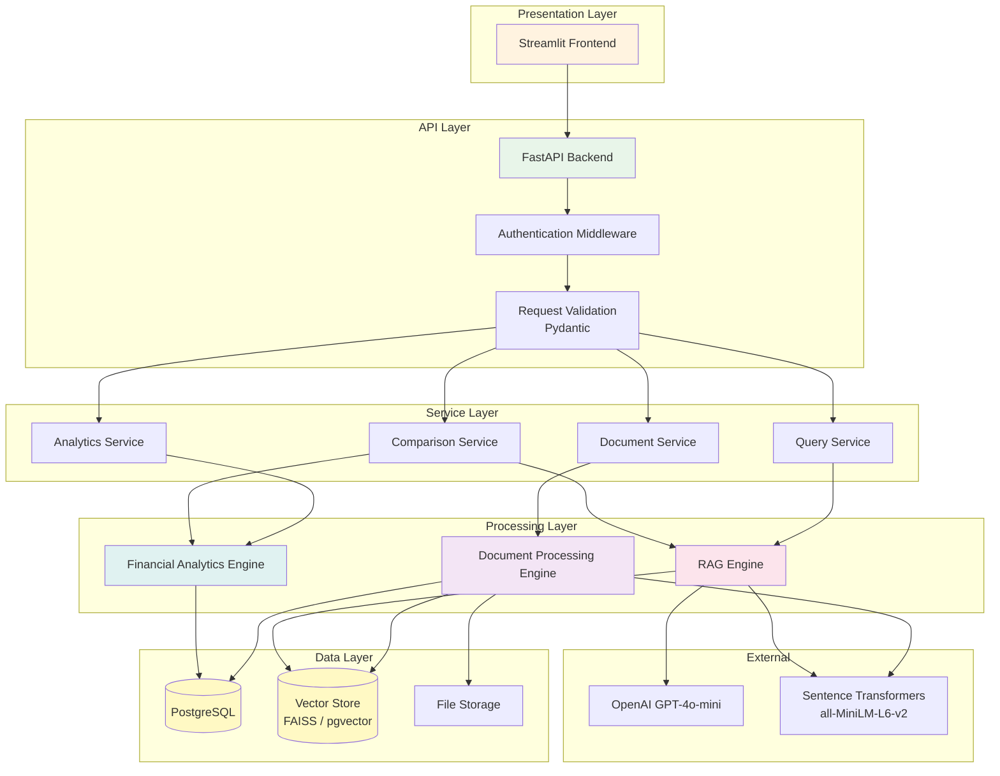
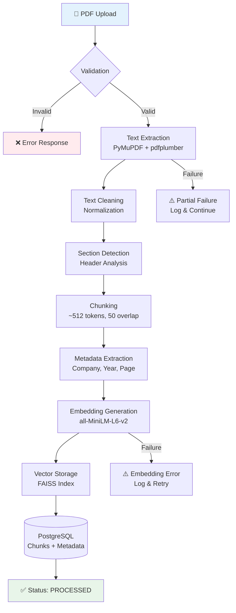
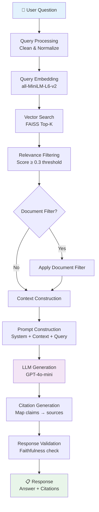
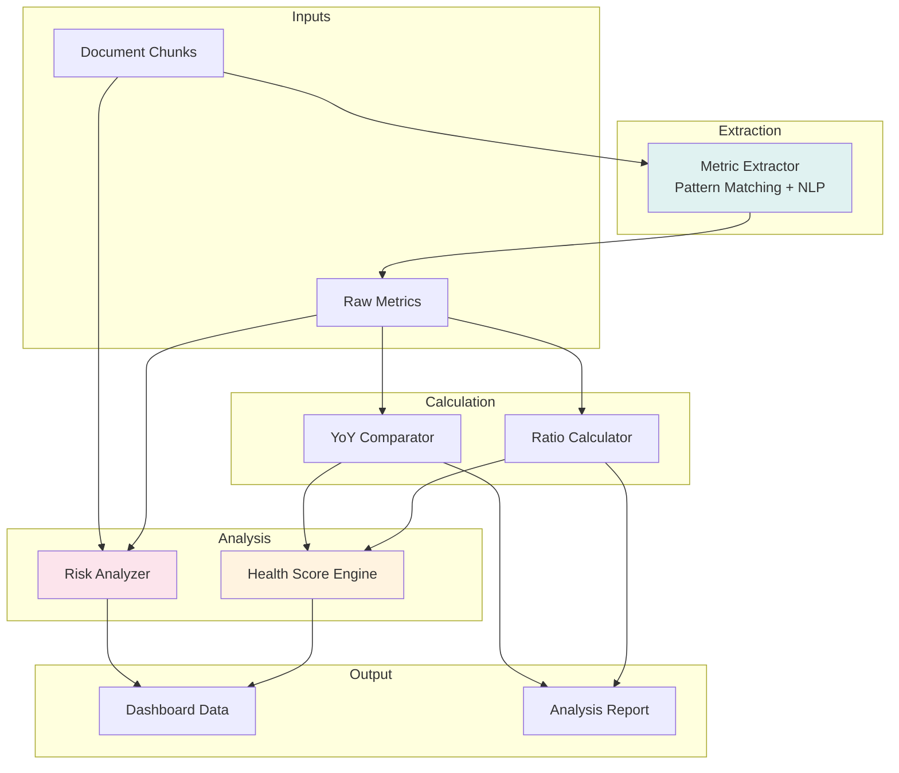
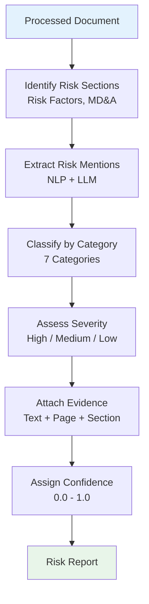
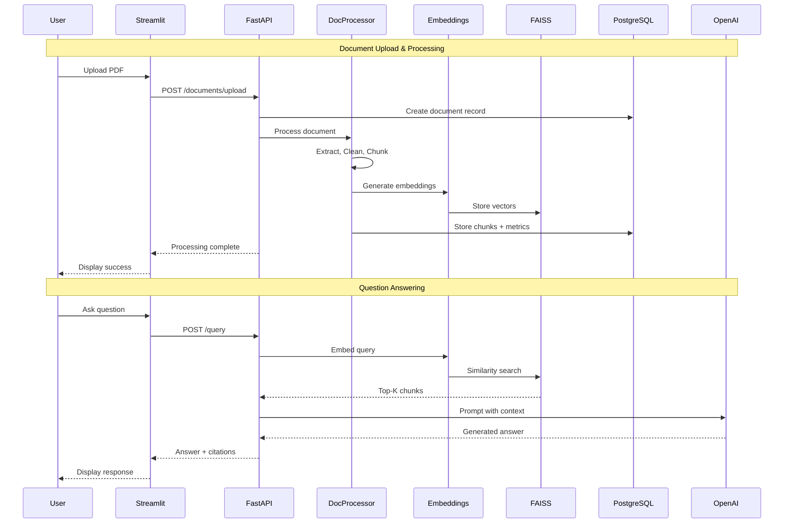

# System Design Document

## Financial Document Intelligence & RAG Analytics Platform

| Field | Value |
|---|---|
| **Document Version** | 1.0 |
| **Date** | September 2026 |
| **Status** | Approved |
| **Author** | Samar |

---

## Table of Contents

- [1. Architecture Overview](#1-architecture-overview)
- [2. Document Processing Architecture](#2-document-processing-architecture)
- [3. RAG Architecture](#3-rag-architecture)
- [4. Financial Analytics Engine](#4-financial-analytics-engine)
- [5. Financial Health Score](#5-financial-health-score)
- [6. Risk Analysis Module](#6-risk-analysis-module)
- [7. Data Flow](#7-data-flow)
- [8. Component Interactions](#8-component-interactions)

---

## 1. Architecture Overview

The platform follows a **layered monolithic architecture** with clear module boundaries, designed to be deployable as a single application (MVP) while supporting future decomposition into microservices.

### High-Level Architecture



### Layer Responsibilities

| Layer | Responsibility | Key Technologies |
|---|---|---|
| **Presentation** | User interface rendering, user input capture, data visualization | Streamlit, Plotly |
| **API** | HTTP request handling, routing, authentication, input validation | FastAPI, Pydantic |
| **Service** | Business logic orchestration, workflow coordination | Python |
| **Processing** | Document ingestion, RAG pipeline, financial analysis | PyMuPDF, FAISS, Sentence Transformers, OpenAI |
| **Data** | Persistence, vector storage, file storage | PostgreSQL, FAISS/pgvector, filesystem |

### Design Principles

| Principle | Application |
|---|---|
| **Separation of Concerns** | Each layer has a single responsibility; processing modules are independent |
| **Dependency Inversion** | Services depend on abstractions (interfaces), not concrete implementations |
| **Configuration Externalization** | All environment-specific values in `.env` files |
| **Fail-Safe Defaults** | Missing data returns "not found" rather than fabricated values |
| **Modularity** | Document processing, RAG, and analytics can be developed and tested independently |

---

## 2. Document Processing Architecture

The document processing pipeline transforms raw PDF files into indexed, searchable, embeddable content.

### Pipeline Diagram



### Stage Details

#### Stage 1: Validation

| Aspect | Detail |
|---|---|
| **Why it exists** | Prevents processing of invalid, corrupt, or malicious files |
| **Input** | Raw uploaded file (binary) |
| **Output** | Validation result (pass/fail with reason) |
| **Technology** | Python `magic` library, PyMuPDF |
| **Checks performed** | File extension (.pdf), MIME type (application/pdf), magic bytes (%PDF-), file size (≤ 50 MB), corruption test (can file be opened?), password protection, text extractability |
| **Failure cases** | Non-PDF file, corrupt file, password-protected, empty/scanned-only |
| **Design considerations** | Validation is fast and performed before any expensive processing. Fail early to avoid wasting resources. |

#### Stage 2: Text Extraction

| Aspect | Detail |
|---|---|
| **Why it exists** | Converts visual PDF content into machine-readable text |
| **Input** | Validated PDF file |
| **Output** | Raw text content per page, extracted table structures |
| **Technology** | PyMuPDF (general text), pdfplumber (tables) |
| **Process** | Page-by-page extraction; PyMuPDF extracts flowing text; pdfplumber detects and extracts table structures; results merged per page |
| **Failure cases** | Scanned/image-only pages (no text layer), complex layouts, multi-column text misalignment |
| **Design considerations** | Two-library approach: PyMuPDF is fast for general text, pdfplumber excels at table detection. Individual page failures logged but don't halt the pipeline. |

#### Stage 3: Text Cleaning

| Aspect | Detail |
|---|---|
| **Why it exists** | Raw extracted text contains noise that reduces embedding and retrieval quality |
| **Input** | Raw extracted text per page |
| **Output** | Cleaned, normalized text |
| **Technology** | Python string operations, regex |
| **Operations** | Remove excessive whitespace/newlines, fix encoding issues (UTF-8 normalization), remove headers/footers/page numbers where detectable, normalize special characters (curly quotes → straight quotes), preserve paragraph structure |
| **Failure cases** | Over-aggressive cleaning removing meaningful content |
| **Design considerations** | Cleaning is conservative — better to retain noise than lose information. Financial numbers and symbols (₹, %, commas in numbers) are preserved. |

#### Stage 4: Section Detection

| Aspect | Detail |
|---|---|
| **Why it exists** | Financial documents have structured sections; section awareness improves retrieval relevance and citation quality |
| **Input** | Cleaned text per page |
| **Output** | Text annotated with section labels |
| **Technology** | Rule-based heuristics, regex patterns |
| **Detected sections** | Management Discussion & Analysis, Financial Statements, Income Statement, Balance Sheet, Cash Flow Statement, Notes to Financial Statements, Risk Factors, Director's Report, Auditor's Report, Corporate Governance |
| **Failure cases** | Non-standard section headers, missing headers, inconsistent formatting |
| **Design considerations** | Uses a priority-ordered list of common financial document section patterns. Falls back to "General" for unrecognized sections. Section labels are attached as metadata, not used for splitting. |

#### Stage 5: Chunking

| Aspect | Detail |
|---|---|
| **Why it exists** | Embedding models and LLMs have token limits; documents must be split into retrieval-sized units |
| **Input** | Cleaned, section-annotated text |
| **Output** | List of text chunks with position metadata |
| **Technology** | Custom recursive text splitter |
| **Configuration** | Chunk size: ~512 tokens; Chunk overlap: ~50 tokens |
| **Strategy** | Split at paragraph boundaries first, then sentence boundaries, then word boundaries as a last resort. Maintain overlap to preserve cross-boundary context. Respect section boundaries when possible (avoid chunks spanning two different sections). |
| **Failure cases** | Very long unbroken text (no paragraph breaks), very short sections producing tiny chunks |
| **Design considerations** | 512 tokens balances retrieval granularity (smaller = more precise) against context completeness (larger = more context). 50-token overlap ensures no information is lost at chunk boundaries. |

#### Stage 6: Metadata Extraction

| Aspect | Detail |
|---|---|
| **Why it exists** | Metadata enables filtered retrieval, citation generation, and document management |
| **Input** | Text chunks, document information |
| **Output** | Chunks enriched with metadata |
| **Metadata fields** | document_id (UUID), chunk_index (sequential position), page_number (source page), section (detected section label), company (from document or user input), financial_year (from document or user input), char_start / char_end (position in original text) |
| **Failure cases** | Company name or financial year not detectable from document |
| **Design considerations** | Metadata is stored alongside the chunk in PostgreSQL and in the vector index. Users can optionally provide company and year during upload if auto-detection fails. |

#### Stage 7: Embedding Generation

| Aspect | Detail |
|---|---|
| **Why it exists** | Vector embeddings enable semantic similarity search, the foundation of the RAG pipeline |
| **Input** | Text chunks (list of strings) |
| **Output** | 384-dimensional dense vectors (one per chunk) |
| **Technology** | Sentence Transformers (`all-MiniLM-L6-v2`) |
| **Process** | Batch encoding (batch size = 32 for memory efficiency), L2 normalization for cosine similarity |
| **Performance** | ~500 chunks/second on CPU; ~2000 chunks/second on GPU |
| **Failure cases** | Out-of-memory for very large documents, encoding errors on unusual characters |
| **Design considerations** | `all-MiniLM-L6-v2` chosen for balance of quality vs. speed vs. memory. 384-dim vectors are small enough for efficient FAISS indexing while capturing sufficient semantic information. Model loaded once at startup and reused. |

#### Stage 8: Vector Storage

| Aspect | Detail |
|---|---|
| **Why it exists** | Vectors must be persisted and indexed for fast similarity search |
| **Input** | Embedding vectors + chunk IDs |
| **Output** | Updated FAISS index on disk |
| **Technology (MVP)** | FAISS (IndexFlatIP for cosine similarity on normalized vectors) |
| **Technology (Production)** | pgvector (PostgreSQL extension with HNSW indexing) |
| **Operations** | Add vectors, search by similarity, delete by document |
| **Failure cases** | Disk write failure, index corruption |
| **Design considerations** | FAISS is used for MVP because it requires no additional infrastructure and provides excellent search speed. The vector store interface is abstracted so that switching to pgvector requires only implementing the same interface. Index is persisted to disk after each document processing. |

---

## 3. RAG Architecture

The Retrieval-Augmented Generation pipeline is the core intelligence layer that enables natural-language interaction with financial documents.

### RAG Pipeline Diagram



### Stage Details

#### 1. Query Processing

**Purpose**: Normalize and prepare the user's question for embedding.

**Operations:**
- Trim whitespace and normalize Unicode
- Expand common abbreviations (e.g., "YoY" → "year over year")
- Preserve financial terms and numbers
- Detect query intent (factual question, comparison, analysis)

#### 2. Query Embedding

**Purpose**: Convert the user's question into a vector for similarity search.

**Process:**
- Encode the processed query using the same `all-MiniLM-L6-v2` model used for document chunks
- Output: 384-dimensional normalized vector
- Critical: Query and document chunks must use the same embedding model for meaningful similarity comparison

#### 3. Vector Search

**Purpose**: Find the document chunks most semantically similar to the query.

**Process:**
- Perform cosine similarity search against the FAISS index
- Return top-K results (default K=5)
- Each result includes: chunk content, similarity score, chunk metadata

#### 4. Retrieval Filtering

**Purpose**: Remove low-relevance results to improve answer quality.

**Process:**
- Apply similarity score threshold (default: 0.3)
- Optionally filter by document_id (if user selected a specific document)
- Optionally filter by company or financial year
- If no results pass the threshold, return "insufficient information" response

#### 5. Context Construction

**Purpose**: Assemble retrieved chunks into a coherent context string for the LLM.

**Process:**
- Sort retrieved chunks by relevance score (descending)
- Format each chunk with its metadata:
  ```
  [Source: {document_name}, Page {page_number}, Section: {section}]
  {chunk_content}
  ```
- Concatenate chunks, respecting the LLM context window limit
- If total context exceeds the limit, prioritize higher-scoring chunks

#### 6. Prompt Construction

**Purpose**: Create a structured prompt that instructs the LLM to answer grounded in the provided context.

**System prompt template:**

```
You are a financial document analyst. Answer the user's question based ONLY on 
the provided document context. Follow these rules:

1. Answer ONLY using information from the provided context
2. If the answer is not in the context, say "The requested information could not 
   be found in the uploaded documents"
3. Do NOT use your general knowledge to supplement or fabricate financial data
4. Cite specific sources (document name, page number) for every claim
5. Use precise financial figures as they appear in the documents
6. If you are uncertain, express your uncertainty clearly

Context:
{retrieved_context}

User Question: {user_question}
```

#### 7. LLM Generation

**Purpose**: Generate a natural-language answer grounded in the retrieved context.

**Configuration:**
- Model: GPT-4o-mini (configurable)
- Temperature: 0.1 (low temperature for factual accuracy)
- Max tokens: 1024
- Timeout: 30 seconds

#### 8. Citation Generation

**Purpose**: Map claims in the generated answer to their source chunks.

**Process:**
- Parse the LLM's response for cited information
- Match cited data points to retrieved chunks using text overlap
- Format citations as structured references:
  ```
  Sources:
  • {document_name}, Page {page_number} — {section}
  ```

#### 9. Response Validation

**Purpose**: Check the response for potential hallucinations or unsupported claims.

**Checks:**
- Verify that key claims in the answer appear in the retrieved context
- Flag numerical values that don't match any retrieved chunk
- If validation fails, append a confidence warning to the response

### RAG Configuration

| Parameter | Default Value | Rationale |
|---|---|---|
| **Chunk size** | 512 tokens | Balances retrieval precision with context completeness |
| **Chunk overlap** | 50 tokens | Prevents information loss at chunk boundaries |
| **Top-K retrieval** | 5 | Sufficient context for most financial questions; limits noise |
| **Similarity threshold** | 0.3 | Filters clearly irrelevant results while retaining borderline matches |
| **LLM temperature** | 0.1 | Low temperature for factual, deterministic responses |
| **LLM max tokens** | 1024 | Adequate for detailed financial answers with citations |
| **Embedding model** | all-MiniLM-L6-v2 | Good quality-to-speed ratio; 384-dim vectors are storage-efficient |
| **Embedding dimension** | 384 | Determined by model architecture |

### Hallucination Mitigation Strategies

| Strategy | Implementation |
|---|---|
| **Retrieval grounding** | LLM receives only retrieved chunks, not its full parametric knowledge |
| **Explicit system prompt** | System prompt explicitly forbids using external knowledge |
| **Low temperature** | Temperature 0.1 reduces creative/generative tendencies |
| **Citation requirement** | Prompt requires the LLM to cite sources for every claim |
| **No-answer fallback** | System returns "not found" rather than guessing when context is insufficient |
| **Relevance filtering** | Low-relevance chunks are removed before context construction |
| **Response validation** | Post-generation check verifies claims against source context |
| **Context limits** | Only the most relevant chunks are included, reducing noise |

---

## 4. Financial Analytics Engine

The analytics engine extracts, calculates, and analyzes financial information from processed documents.

### Analytics Architecture



### Financial Metrics

The system extracts 12 key financial metrics from document content:

| # | Metric | Definition | Typical Source | Unit |
|---|---|---|---|---|
| 1 | **Revenue** | Total revenue or net sales | Income Statement | Currency |
| 2 | **Gross Profit** | Revenue minus cost of goods sold | Income Statement | Currency |
| 3 | **EBITDA** | Earnings before interest, taxes, depreciation, and amortization | Income Statement / Notes | Currency |
| 4 | **Operating Income** | Profit from core business operations | Income Statement | Currency |
| 5 | **Net Income** | Profit after all expenses, taxes, and interest | Income Statement | Currency |
| 6 | **EPS** | Earnings per share (basic) | Income Statement / Notes | Currency/share |
| 7 | **Total Assets** | Sum of all current and non-current assets | Balance Sheet | Currency |
| 8 | **Total Liabilities** | Sum of all current and non-current liabilities | Balance Sheet | Currency |
| 9 | **Total Debt** | Short-term borrowings + long-term borrowings | Balance Sheet / Notes | Currency |
| 10 | **Cash** | Cash and cash equivalents | Balance Sheet | Currency |
| 11 | **Operating Cash Flow** | Cash generated from operating activities | Cash Flow Statement | Currency |
| 12 | **Free Cash Flow** | Operating cash flow minus capital expenditures | Cash Flow Statement | Currency |

### Financial Ratios

| # | Ratio | Formula | Meaning | Interpretation | Data Requirements | Limitations |
|---|---|---|---|---|---|---|
| 1 | **Revenue Growth** | (Rev_curr − Rev_prev) / Rev_prev × 100 | Rate of top-line growth | Positive = growing; >10% = strong growth; negative = declining | Revenue from two periods | Requires comparable periods; doesn't account for acquisitions or divestitures |
| 2 | **Profit Margin** | Net Income / Revenue × 100 | Percentage of revenue retained as profit | Higher = better cost control; industry-dependent benchmarks | Net Income, Revenue | Varies significantly by industry; one-time items can distort |
| 3 | **EBITDA Margin** | EBITDA / Revenue × 100 | Operating profitability before non-cash charges | Higher = stronger core profitability; useful for cross-company comparison | EBITDA, Revenue | Excludes capital expenditure needs; can mask high debt service |
| 4 | **Current Ratio** | Current Assets / Current Liabilities | Ability to meet short-term obligations | >1.0 = can cover short-term debt; >2.0 = very liquid; <1.0 = concern | Current Assets, Current Liabilities | High inventory can inflate; doesn't distinguish liquid vs. illiquid current assets |
| 5 | **Debt-to-Equity** | Total Debt / Total Equity | Financial leverage | <1.0 = conservative; >2.0 = highly leveraged; industry norms vary | Total Debt, Total Equity | Equity can be negative; industry norms differ significantly |
| 6 | **Return on Assets** | Net Income / Total Assets × 100 | Efficiency of asset utilization | Higher = assets generate more profit; asset-heavy industries naturally lower | Net Income, Total Assets | Asset valuation methods affect comparison; depreciation policies matter |
| 7 | **Return on Equity** | Net Income / Shareholders' Equity × 100 | Return generated for shareholders | Higher = better shareholder value; but high leverage inflates ROE | Net Income, Shareholders' Equity | High debt can artificially inflate; negative equity makes meaningless |
| 8 | **Operating Cash Flow Ratio** | Operating Cash Flow / Current Liabilities | Cash coverage of short-term obligations | >1.0 = operating cash covers current liabilities | Operating Cash Flow, Current Liabilities | Seasonal variations can distort; single-period snapshot |

---

## 5. Financial Health Score

### Overview

The financial health score is an **indicative analytical metric** that summarizes a company's financial condition into a single 0–100 score, broken down across five dimensions.

> ⚠️ **Disclaimer**: This score is designed for research and educational purposes. It is **not** a certified credit rating, investment recommendation, or professional financial advice. Users should consult qualified financial professionals for investment decisions.

### Scoring Dimensions

| Dimension | Weight | What It Measures | Key Inputs |
|---|---|---|---|
| **Growth** | 20% | Revenue and earnings growth trajectory | Revenue growth %, earnings growth % |
| **Profitability** | 25% | Margin quality and earnings power | Profit margin, EBITDA margin |
| **Liquidity** | 20% | Short-term obligation coverage | Current ratio, cash position |
| **Leverage** | 20% | Debt burden and capital structure | Debt-to-equity, debt trends |
| **Cash Flow** | 15% | Cash generation and operational efficiency | OCF ratio, free cash flow |

### Weight Rationale

| Dimension | Weight | Rationale |
|---|---|---|
| Growth | 20% | Revenue growth is a primary indicator of business momentum, but growth alone doesn't ensure financial health |
| Profitability | 25% | Highest weight because sustainable profitability is the most critical indicator of long-term viability. A growing but unprofitable company is at risk |
| Liquidity | 20% | Short-term solvency is critical — companies fail from cash crises, not from income statement losses |
| Leverage | 20% | Equal to liquidity because excessive debt is a structural risk that compounds over time |
| Cash Flow | 15% | Slightly lower because cash flow is partially captured by profitability and liquidity. However, earnings quality (cash vs. accrual) deserves explicit measurement |

### Score Calculation

#### Step 1: Sub-Score Calculation (per dimension)

Each dimension's raw metric is normalized to a 0–100 scale using predefined benchmarks:

```python
def normalize_score(value: float, poor: float, excellent: float) -> float:
    """Normalize a metric value to a 0-100 score using linear interpolation."""
    if value <= poor:
        return 0.0
    if value >= excellent:
        return 100.0
    return ((value - poor) / (excellent - poor)) * 100.0
```

**Benchmark Table:**

| Dimension | Metric | Poor (0) | Excellent (100) |
|---|---|---|---|
| Growth | Revenue Growth % | -10% | +25% |
| Profitability | Profit Margin % | 0% | 20% |
| Profitability | EBITDA Margin % | 5% | 35% |
| Liquidity | Current Ratio | 0.5 | 2.5 |
| Leverage | Debt-to-Equity | 3.0 | 0.3 |
| Cash Flow | OCF Ratio | 0.2 | 1.5 |

> **Assumption**: Benchmarks are based on general corporate financial analysis norms. Industry-specific benchmarks would improve accuracy but are not implemented in the MVP.

#### Step 2: Dimension Score

If a dimension uses multiple metrics, the dimension score is the average of its constituent metric scores.

#### Step 3: Composite Score

```
Health Score = Σ (dimension_score × dimension_weight)
            = Growth × 0.20 + Profitability × 0.25 + Liquidity × 0.20 
              + Leverage × 0.20 + Cash Flow × 0.15
```

#### Step 4: Missing Data Handling

If a dimension cannot be calculated (missing required metrics), its weight is redistributed proportionally among the remaining dimensions.

### Score Interpretation

| Score Range | Label | Description |
|---|---|---|
| 80–100 | **Strong** | Company shows strong performance across most financial dimensions |
| 60–79 | **Moderate** | Generally healthy with some areas that could improve |
| 40–59 | **Fair** | Mixed results — some dimensions are concerning |
| 20–39 | **Weak** | Multiple areas of financial concern |
| 0–19 | **Critical** | Significant financial distress indicators present |

---

## 6. Risk Analysis Module

### Overview

The risk analysis module identifies and classifies business and financial risks mentioned in uploaded documents. Each risk is grounded in document evidence — the system does not speculate about risks not present in the source material.

### Risk Categories

| Category | Definition | Example Indicators |
|---|---|---|
| **Financial Risk** | Risks related to financial performance, funding, and capital | Declining revenue, margin compression, high interest costs |
| **Market Risk** | Risks from external market conditions | Competition, market share loss, economic downturn, commodity prices |
| **Operational Risk** | Risks from internal processes, systems, and people | Supply chain disruption, technology failure, key person dependency |
| **Regulatory Risk** | Risks from regulatory changes or compliance requirements | New regulations, compliance costs, legal proceedings, policy changes |
| **Credit Risk** | Risks from counterparty defaults or receivable issues | High receivables, customer concentration, bad debt provisions |
| **Liquidity Risk** | Risks from inability to meet short-term obligations | Low cash reserves, high short-term debt, working capital constraints |
| **Business Risk** | Strategic and competitive risks | Market disruption, product obsolescence, failed expansion |

### Risk Identification Process



### Risk Output Structure

Each identified risk contains:

| Field | Type | Description | Example |
|---|---|---|---|
| **risk_id** | UUID | Unique identifier | `a1b2c3d4-...` |
| **category** | Enum | Risk category | `Financial` |
| **description** | String | Clear description of the risk | "Significant increase in long-term debt relative to equity" |
| **severity** | Enum | Impact assessment | `High` |
| **evidence** | String | Supporting text from document | "Total borrowings increased by 34% from ₹4,200 Cr to ₹5,628 Cr" |
| **source_document** | String | Document filename | "ABC_Annual_Report_2025.pdf" |
| **page_number** | Integer | Page where evidence appears | 103 |
| **section** | String | Document section | "Risk Factors" |
| **confidence** | Float | Confidence score (0.0–1.0) | 0.87 |

### Severity Assignment

| Severity | Criteria |
|---|---|
| **High** | Directly threatens financial viability; involves large monetary amounts; language indicates urgency (e.g., "significant," "material," "substantial") |
| **Medium** | Noteworthy concern; manageable but requires attention; language is cautionary |
| **Low** | Minor or well-mitigated risk; mentioned for disclosure purposes; language is neutral |

---

## 7. Data Flow

### End-to-End Data Flow

```mermaid
flowchart LR
    subgraph Upload
        U1[PDF File] --> U2[Validate] --> U3[Store File]
        U3 --> U4[Create DB Record<br/>Status: UPLOADED]
    end
    
    subgraph Process
        P1[Extract Text] --> P2[Clean Text]
        P2 --> P3[Detect Sections]
        P3 --> P4[Create Chunks]
        P4 --> P5[Generate Embeddings]
        P5 --> P6[Store Vectors]
        P6 --> P7[Extract Metrics]
        P7 --> P8[Update DB<br/>Status: PROCESSED]
    end
    
    subgraph Query
        Q1[User Question] --> Q2[Embed Query]
        Q2 --> Q3[Vector Search]
        Q3 --> Q4[Build Context]
        Q4 --> Q5[LLM Generate]
        Q5 --> Q6[Add Citations]
        Q6 --> Q7[Return Answer]
    end
    
    subgraph Analytics
        A1[Load Metrics] --> A2[Calculate Ratios]
        A2 --> A3[Compute Health Score]
        A3 --> A4[Identify Risks]
        A4 --> A5[Render Dashboard]
    end
    
    U4 --> P1
    P8 --> Q1
    P8 --> A1
```



---

## 8. Component Interactions

### Technology Mapping

| Component | Technology | Port/Path | Purpose |
|---|---|---|---|
| Frontend | Streamlit | :8501 | User interface |
| Backend API | FastAPI | :8000 | REST API |
| Database | PostgreSQL | :5432 | Relational data |
| Vector Store (MVP) | FAISS | ./data/faiss_index | Vector search |
| Embedding Model | Sentence Transformers | In-process | Text → Vector |
| LLM | OpenAI API | HTTPS | Generation |
| File Storage | Filesystem | ./data/uploads | PDF storage |

### Inter-Component Communication


