# 3-Developer Team Implementation & Execution Plan

**Project**: Financial Document Intelligence & RAG Analytics Platform 
**Target Delivery**: 8 Weeks (4 Sprints $\times$ 2 Weeks) or Accelerated 4 Weeks (4 Sprints $\times$ 1 Week) 
**Team Allocation**:
- **Developer 1**: AI, RAG & Financial Analytics Lead *(Core Intelligence & Analytics Engine)*
- **Developer 2**: Backend, Database & API Architect *(Data Infrastructure, Persistence & REST Layer)*
- **Developer 3**: Frontend, Visual Analytics & DevOps Engineer *(Streamlit Dashboard, Visualizations & Deployment)*

---

## 1. Executive Summary & Revised Team Structure

In this structure, **Developer 1** has unified ownership over all domain-specific intelligence—both qualitative RAG retrieval and quantitative financial calculations. This prevents silos between NLP extraction and financial math.

**Developer 2** focuses on enterprise-grade backend infrastructure, database persistence, REST API routes, and testing. 
**Developer 3** owns the complete user-facing visual experience, interactive Streamlit dashboards, automated PDF report generation, and DevOps/CI/CD containerization.

```
+---------------------------------------------------------------------------------------+
| DEVELOPER 1: AI, RAG & FINANCIAL ANALYTICS LEAD |
| * PDF Ingestion & Hybrid Parsing (pdfplumber + PyPDF2) |
| * Financial-Aware Chunking (800-char window, 150-char overlap) |
| * Sentence Transformers (all-MiniLM-L6-v2) & FAISS / pgvector Vector Search |
| * Grounded RAG & LLM Integration (OpenAI GPT-4o-mini + Ollama Fallback) |
| * Source Citation Generation & Hallucination Mitigation |
| * 12 Financial Metrics Extractor (Regex + LLM Extraction) |
| * 8 Financial Ratios Engine (OPM, NPM, ROE, ROCE, Current, Quick, D/E, ICR) |
| * 5D Corporate Health Scoring (Growth, Profit, Liquidity, Leverage, Cash Flow) |
| * 7-Domain Qualitative Risk Classifier & Ragas AI Evaluation |
+---------------------------------------------------------------------------------------+
                                           |
                                           | Core Intelligence Services
                                           v
+---------------------------------------------------------------------------------------+
| DEVELOPER 2: BACKEND, DATABASE & API ARCHITECT |
| * PostgreSQL Relational Schema (5 Tables in 3NF) & Alembic Migrations |
| * Connection Pooling, Transaction Management & Repository Layer |
| * 9 FastAPI REST API Endpoints (/documents/*, /query, /metrics, /health, etc.) |
| * Strict Pydantic Data Request & Response Schemas |
| * Security, Input Sanitization, Rate Limiting & Error Codes (DOC, RAG, ANA, DB) |
| * Automated Pytest Integration & API Test Suite |
+---------------------------------------------------------------------------------------+
                                           |
                                           | Clean JSON REST API
                                           v
+---------------------------------------------------------------------------------------+
| DEVELOPER 3: FRONTEND, VISUAL ANALYTICS & DEVOPS |
| * Streamlit 5-Page Dashboard (Executive, Financial Analysis, Q&A, Compare, Audit) |
| * Plotly Visual Analytics (Margin Trends, 5D Radar Chart, Ratio Gauges) |
| * Interactive Document Q&A with Expandable Citation & Proof Snippet Cards |
| * One-Click Executive Briefing PDF Report Exporter (ReportLab) |
| * Multi-Stage Dockerfiles (API & Frontend) & Docker Compose Orchestration |
| * GitHub Actions CI/CD (Linting, MyPy, Pytest, Docker Builds) |
| * Prometheus Observability Metrics & System Health Monitoring |
+---------------------------------------------------------------------------------------+
```

### Rendered Mermaid Flowchart

```mermaid
graph TD
    subgraph Dev1["Developer 1: AI, RAG & Financial Analytics Lead"]
        D1_1["PDF Ingestion & Hybrid Parsing"]
        D1_2["Financial-Aware Chunking (800/150)"]
        D1_3["Dense Embeddings & Vector Search"]
        D1_4["Grounded RAG & Citation Engine"]
        D1_5["12 Financial Metrics Extractor"]
        D1_6["8 Financial Ratios Engine"]
        D1_7["5D Corporate Health Scoring (0-100)"]
        D1_8["7-Domain Qualitative Risk Classifier"]
        D1_9["Ragas AI & Financial Evaluation"]
    end

    subgraph Dev2["Developer 2: Backend, Database & API Architect"]
        D2_1["PostgreSQL 3NF Data Models & DDL"]
        D2_2["Alembic Database Migrations"]
        D2_3["Repository Pattern & Data Access Layer"]
        D2_4["9 FastAPI REST Endpoints"]
        D2_5["Pydantic Request & Response Schemas"]
        D2_6["Security, Rate Limiting & Error Codes"]
        D2_7["Automated Pytest API Test Suite"]
    end

    subgraph Dev3["Developer 3: Frontend, Visual Analytics & DevOps"]
        D3_1["Streamlit 5-Page Application Suite"]
        D3_2["Plotly Charts & 5D Radar Visualizations"]
        D3_3["Interactive Citation & Evidence Cards"]
        D3_4["Executive PDF Report Exporter"]
        D3_5["Multi-Stage Docker & Compose Setup"]
        D3_6["GitHub Actions CI/CD & Linting"]
        D3_7["Prometheus Metrics & Health Probes"]
    end

    D1_4 -->|RAG Service Engine| D2_4
    D1_7 -->|Financial Metrics & Scores| D2_4
    D2_4 -->|JSON REST API Endpoints| D3_1
    D1_4 -.->|Citation Metadata Schema| D3_3
```



---

## 2. Detailed Developer Role Breakdown

### Developer 1: AI, RAG & Financial Analytics Lead
* **Primary Mission**: Build the entire "brains" of the platform—transforming raw unstructured corporate PDF filings into structured quantitative metrics, deterministic ratios, health scores, and grounded natural-language answers with page-level source citations.
* **Core Modules Owned**:
  - `app/services/pdf_service.py` (Hybrid extraction: `pdfplumber` tables + `PyPDF2` narrative text, cleaning).
  - `app/services/chunking_service.py` (Recursive splitting: 800-char target, 150-char overlap, section/table preservation).
  - `app/services/embedding_service.py` (`all-MiniLM-L6-v2` dense vectors with L2 normalization).
  - `app/services/vector_store.py` (FAISS in-memory index $\rightarrow$ pgvector migration).
  - `app/services/rag_service.py` (Context prompt assembly, negative constraints, OpenAI GPT-4o-mini & Ollama fallback).
  - `app/services/citation_service.py` (Provenance mapping, page number matching, snippet extraction).
  - `app/services/financial_extractor.py` (12 core metrics extraction via regex patterns + structured JSON parsing, INR unit normalization).
  - `app/services/ratio_calculator.py` (8 core ratios: OPM, NPM, ROE, ROCE, Current, Quick, D/E, ICR with zero-division protections).
  - `app/services/health_scorer.py` (5-dimension weighted corporate health scoring: Growth 20%, Profitability 25%, Liquidity 20%, Leverage 20%, Cash Flow 15%).
  - `app/services/risk_analyzer.py` (7-category risk tagging: Credit, Market, Liquidity, Operational, Regulatory, Strategic, Macroeconomic).
  - `evaluation/` (50-pair golden benchmark dataset, Ragas continuous evaluation harness).
* **Key Deliverables**:
  - Sub-50ms similarity search index.
  - Zero-hallucination RAG query engine with page-level citations.
  - High-precision deterministic financial calculation library tested against audited figures.
  - Ragas evaluation score: Faithfulness $\ge 0.90$, Answer Relevance $\ge 0.85$.

---

### Developer 2: Backend, Database & API Architect
* **Primary Mission**: Build the robust server-side foundation—relational data persistence, database migrations, FastAPI endpoint routing, request validation, authentication/security middleware, and backend automated testing.
* **Core Modules Owned**:
  - `app/models/` (SQLAlchemy 3NF relational models: `users`, `documents`, `document_chunks`, `financial_metrics`, `analysis_results`).
  - `app/schemas/` (Pydantic schemas for all request payloads and response contracts).
  - `app/db/` (Database engine, connection pooling with `QueuePool`, session dependency `get_db()`).
  - `alembic/` (Version-controlled database migration scripts).
  - `app/api/v1/endpoints/` (9 FastAPI REST operations):
    - `POST /documents/upload`
    - `GET /documents`
    - `GET /documents/{id}`
    - `DELETE /documents/{id}`
    - `POST /query`
    - `GET /financial-metrics/{id}`
    - `GET /financial-ratios/{id}`
    - `GET /health-score/{id}`
    - `GET /health`
  - `app/core/` (Application settings, security middleware, rate limiting, standardized error handling with codes: `DOC_xxx`, `PROC_xxx`, `RAG_xxx`, `ANA_xxx`, `DB_xxx`).
  - `tests/test_api.py`, `tests/test_database.py` (FastAPI `TestClient` integration test suite).
* **Key Deliverables**:
  - Fully normalized 3NF PostgreSQL database with automated Alembic migrations.
  - High-performance asynchronous REST API with auto-generated Swagger UI (`/docs`).
  - Standardized error catalog and JSON error responses.
  - $\ge 85\%$ backend test coverage via `pytest`.

---

### Developer 3: Frontend, Visual Analytics & DevOps Engineer
* **Primary Mission**: Build the entire presentation and delivery layer—the interactive multi-page Streamlit analytics dashboard, Plotly data visualizations, executive PDF reporting, Docker containerization, and automated CI/CD pipelines.
* **Core Modules Owned**:
  - `frontend/` (Streamlit 5-page analytical dashboard):
    - `1_Executive_Dashboard.py` (Top KPI cards, health score radar chart, quick company switcher).
    - `2_Financial_Analysis.py` (Interactive financial tables, margin trends, ratio gauges).
    - `3_Document_QA.py` (Conversational interface with expandable citation proof drawers).
    - `4_Comparative_Analytics.py` (Side-by-side YoY/QoQ period comparison with delta indicators).
    - `5_Audit_Logs.py` (System telemetry, processing logs, and database status).
  - `frontend/components/` (Plotly charts, 5D radar chart, gauge visualizers, citation cards).
  - `frontend/utils/api_client.py` (HTTP client interacting with Developer 2's FastAPI endpoints).
  - `app/services/report_generator.py` (One-click downloadable executive PDF briefing summary via ReportLab).
  - `docker/` (`Dockerfile.api`, `Dockerfile.frontend`, `docker-compose.yml`, `docker-compose.prod.yml`).
  - `.github/workflows/` (GitHub Actions CI/CD workflows: Black, Flake8, MyPy, Pytest, Docker build).
  - `deploy/` (Prometheus instrumentation, Grafana dashboard config, health check monitors).
* **Key Deliverables**:
  - 5-page responsive Streamlit dashboard with sub-1.5s chart render latency.
  - Clickable citation cards linking generated answers directly to underlying filing snippets.
  - One-click executive PDF report export.
  - Single-command orchestration via `docker compose up` and automated CI/CD pipeline.

---

## 3. Parallel Development Contracts (Zero Blocking)

To allow all three developers to write code simultaneously from Day 1:

```mermaid
sequenceDiagram
    autonumber
    participant Dev3 as Dev 3 (Frontend & DevOps)
    participant Dev2 as Dev 2 (Backend & DB)
    participant Dev1 as Dev 1 (AI, RAG & Analytics)

    Note over Dev1,Dev2: Contract 1: Service Engine Interface
    Dev1->>Dev2: Publishes Python Service Class Signatures & Return Types
    Note over Dev2,Dev3: Contract 2: REST API JSON Interface
    Dev2->>Dev3: Publishes OpenAPI / Swagger JSON Schemas
    
    par Parallel Development
        Dev1->>Dev1: Builds RAG & Financial Calculators using local test fixtures
    and
        Dev2->>Dev2: Builds PostgreSQL DB & FastAPI routes using Stub Service
    and
        Dev3->>Dev3: Builds Streamlit UI & Plotly charts using Mock API Client
    end

    Note over Dev1,Dev2: Integration Point (Sprint 2)
    Dev2 integrates real Dev 1 services into FastAPI routes
    Note over Dev2,Dev3: Integration Point (Sprint 2-3)
    Dev3 points Streamlit UI to live Dev 2 API endpoints
```

### Fixed Interface Specifications
1. **Developer 1 $\rightarrow$ Developer 2 (Internal Python Service Contract)**:
   - `FinancialExtractor.extract_metrics(text: str) -> ExtractedMetricsDTO`
   - `RatioCalculator.calculate(metrics: ExtractedMetricsDTO) -> FinancialRatiosDTO`
   - `HealthScorer.compute_score(metrics, ratios) -> HealthScoreDTO`
   - `RAGService.query(document_id: UUID, question: str) -> RAGResultDTO`
2. **Developer 2 $\rightarrow$ Developer 3 (HTTP REST API Contract)**:
   - All 9 endpoints documented with fixed request/response JSON schemas in [docs/API.md](file:///c:/Users/samar/Desktop/projects/Financial%20Document%20Intelligence%20&%20RAG%20Analytics%20Platform/docs/API.md).

---

## 4. Sprint-by-Sprint Implementation Roadmap

### Sprint 1: Architecture, Contracts & Foundation (Weeks 1–2)

| Developer | Sprint 1 Goals & Deliverables |
| :--- | :--- |
| **Dev 1 (AI & Analytics)** | 1. Implement `pdf_service.py` (`pdfplumber` + `PyPDF2` hybrid parsing).<br>2. Build `chunking_service.py` (800-char window, 150-char overlap).<br>3. Set up `all-MiniLM-L6-v2` embeddings and FAISS `IndexFlatIP`.<br>4. Implement deterministic `ratio_calculator.py` (8 ratios with zero-division guards).<br>5. Unit test ratio formulas against manual spreadsheet figures. |
| **Dev 2 (Backend & DB)** | 1. Initialize PostgreSQL 15, write SQLAlchemy 3NF models for all 5 tables.<br>2. Write Alembic initial migration scripts.<br>3. Scaffold FastAPI application structure, CORS, and settings.<br>4. Implement document management CRUD endpoints (`/documents/upload`, `/documents`).<br>5. Build stub service engine allowing routes to respond immediately with dummy data. |
| **Dev 3 (UI & DevOps)** | 1. Set up Git hooks (`black`, `flake8`, `mypy`) and GitHub Actions CI workflow.<br>2. Author multi-stage `Dockerfile.api` and `Dockerfile.frontend`.<br>3. Build `docker-compose.yml` orchestrating PostgreSQL, FastAPI, and Streamlit.<br>4. Scaffold Streamlit 5-page navigation layout with theme styles and mock data client. |

**Sprint 1 Milestone**: Docker containers spin up; document upload stores records in PostgreSQL; ratio calculator math is validated; Streamlit displays navigation shell.

---

### Sprint 2: Core Intelligence, Vector Retrieval & Dashboard (Weeks 3–4)

| Developer | Sprint 2 Goals & Deliverables |
| :--- | :--- |
| **Dev 1 (AI & Analytics)** | 1. Build `rag_service.py` connecting OpenAI GPT-4o-mini with local Ollama fallback.<br>2. Author context-bound prompts enforcing strict negative constraints.<br>3. Implement `citation_service.py` (mapping claims to `[Doc, Page, Snippet]`).<br>4. Implement `financial_extractor.py` parsing 12 core line items from PDF text.<br>5. Implement `health_scorer.py` computing the 5D weighted score (0–100 scale). |
| **Dev 2 (Backend & DB)** | 1. Wire Dev 1's real RAG and Financial services into FastAPI route handlers.<br>2. Implement `/query`, `/financial-metrics/{id}`, and `/health-score/{id}` endpoints.<br>3. Persist extracted metrics, calculated ratios, and chunks into PostgreSQL.<br>4. Implement centralized exception handling and standardized error codes (`DOC_xxx`, `RAG_xxx`). |
| **Dev 3 (UI & DevOps)** | 1. Build **Executive Dashboard** (`1_Dashboard.py`) with KPI cards and 5D radar chart.<br>2. Build **Document Q&A Interface** (`3_Document_QA.py`) with chat history and expandable citation cards.<br>3. Connect Streamlit `api_client.py` to live FastAPI endpoints.<br>4. Implement CI test automation running `pytest` on every pull request. |

**Sprint 2 Milestone**: Full end-to-end user loop works: Upload financial PDF $\rightarrow$ extract 12 metrics $\rightarrow$ view 5D health score $\rightarrow$ ask questions with verified page citations.

---

### Sprint 3: Advanced Intelligence, Comparison & Reporting (Weeks 5–6)

| Developer | Sprint 3 Goals & Deliverables |
| :--- | :--- |
| **Dev 1 (AI & Analytics)** | 1. Implement `risk_analyzer.py` classifying disclosures into 7 domain risk categories.<br>2. Build 50-pair golden benchmark dataset (`benchmark_dataset.json`).<br>3. Build automated Ragas evaluation harness (Faithfulness $\ge 0.90$, Relevance $\ge 0.85$).<br>4. Implement prompt injection defenses and `<context>` boundary isolation. |
| **Dev 2 (Backend & DB)** | 1. Implement `/financial-ratios/{id}` and `/compare` multi-document endpoints.<br>2. Build comparative analytics calculation engine (YoY/QoQ deltas, percentage change).<br>3. Add database indexes on composite keys `(document_id, fiscal_year, fiscal_period)`.<br>4. Implement input sanitization, file-type verification, and request rate limiting. |
| **Dev 3 (UI & DevOps)** | 1. Build **Financial Analysis View** (`2_Financial_Analysis.py`) with Plotly interactive trend charts.<br>2. Build **Comparative Analytics View** (`4_Comparative_Analytics.py`) with side-by-side delta tables.<br>3. Implement `report_generator.py` generating one-click downloadable executive PDF reports.<br>4. Author `docker-compose.prod.yml` with health checks, restart policies, and volume mounts. |

**Sprint 3 Milestone**: Multi-document comparison active; 7-domain risk matrix displayed; executive PDF download operational; Ragas evaluation benchmark passed.

---

### Sprint 4: Hardening, pgvector Migration & Production Release (Weeks 7–8)

| Developer | Sprint 4 Goals & Deliverables |
| :--- | :--- |
| **Dev 1 (AI & Analytics)** | 1. Migrate vector storage from in-memory FAISS to persistent `pgvector` inside PostgreSQL.<br>2. Profile vector retrieval latency under 50,000 chunks (sub-50ms target).<br>3. Finalize air-gapped Ollama Llama 3 fallback testing.<br>4. Write AI and financial analytics sections of final documentation. |
| **Dev 2 (Backend & DB)** | 1. Database query profiling (`EXPLAIN ANALYZE`) and connection pool tuning.<br>2. Achieve $\ge 85\%$ backend test coverage via `pytest`.<br>3. Finalize CORS, security headers, and Swagger documentation.<br>4. Conduct database backup, restore, and data integrity tests. |
| **Dev 3 (UI & DevOps)** | 1. Build **Audit Logs & Telemetry View** (`5_Audit_Logs.py`) monitoring system status.<br>2. Set up Prometheus metrics exporter (`/metrics`) and basic Grafana dashboard.<br>3. Perform UI polish, responsive layout testing, and cross-browser checks.<br>4. Tag release `v1.0.0`, build production Docker images, conduct final demo dry run. |

**Sprint 4 Milestone**: Production-ready `v1.0.0` release deployed via Docker Compose with persistent `pgvector` storage, comprehensive automated test suites, and monitoring.

---

## 5. Revised RACI Responsibility Matrix

| Feature / Artifact | Dev 1 (AI & Analytics) | Dev 2 (Backend & DB) | Dev 3 (UI & DevOps) |
| :--- | :---: | :---: | :---: |
| **PDF Ingestion & Hybrid Parsing** | **Accountable / Responsible** | Consulted | Informed |
| **Chunking & Vector Embeddings** | **Accountable / Responsible** | Consulted | Informed |
| **FAISS $\rightarrow$ pgvector Search** | **Accountable** | Responsible | Informed |
| **Grounded RAG & Citation Engine** | **Accountable / Responsible** | Consulted | Informed |
| **12 Financial Metrics Extractor** | **Accountable / Responsible** | Consulted | Informed |
| **8 Financial Ratios Calculator** | **Accountable / Responsible** | Consulted | Informed |
| **5D Financial Health Scoring** | **Accountable / Responsible** | Consulted | Consulted |
| **7-Domain Qualitative Risk Tagging**| **Accountable / Responsible** | Consulted | Informed |
| **Ragas AI Evaluation Harness** | **Accountable / Responsible** | Informed | Informed |
| **PostgreSQL 3NF Schemas & Alembic** | Consulted | **Accountable / Responsible** | Informed |
| **FastAPI REST Endpoints (9 routes)**| Consulted | **Accountable / Responsible** | Consulted |
| **Security, Rate Limiting & Errors** | Consulted | **Accountable / Responsible** | Informed |
| **Streamlit 5-Page Application** | Informed | Consulted | **Accountable / Responsible** |
| **Plotly Interactive Charts** | Consulted | Consulted | **Accountable / Responsible** |
| **Executive PDF Report Generator** | Consulted | Consulted | **Accountable / Responsible** |
| **Docker & Docker Compose** | Consulted | Consulted | **Accountable / Responsible** |
| **GitHub Actions CI/CD Pipeline** | Consulted | Consulted | **Accountable / Responsible** |
| **Prometheus Telemetry & Health** | Informed | Consulted | **Accountable / Responsible** |

*Legend: **Accountable** (Primary owner), **Responsible** (Does the work), **Consulted** (Provides input/review), **Informed** (Kept updated).*

---

## 6. Summary of Benefits of this Reorganization

1. **Eliminates Knowledge Fragmentation**: All domain-specific financial logic (P&L, Balance Sheet, Cash Flow metrics, ratios, health scores, and risk tagging) is co-located with the NLP and RAG pipelines under Developer 1.
2. **Clean Architectural Boundaries**: Developer 2 focuses entirely on database integrity, clean API contracts, and high-performance backend serving without getting bogged down in financial formula nuances.
3. **Dedicated User Experience & Release Engineering**: Developer 3 ensures that the Streamlit interface is polished, interactive, responsive, and deployable with modern Docker and CI/CD pipelines.
