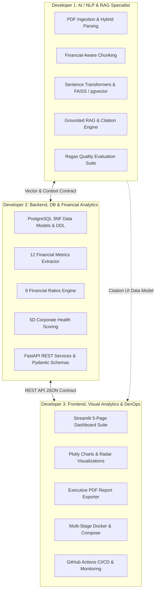

# 3-Developer Team Implementation & Execution Plan

**Project**: Financial Document Intelligence & RAG Analytics Platform  
**Target Delivery**: 8 Weeks (4 Sprints $\times$ 2 Weeks) or Accelerated 4 Weeks (4 Sprints $\times$ 1 Week)  
**Team Size**: 3 Specialized Full-Stack / Domain Engineers  

---

## 1. Executive Summary & Team Structure

To maximize engineering velocity, avoid merge conflicts, and prevent cross-team blocking, the platform is divided into three distinct, decoupled ownership domains with strict interface contracts:



---

## 2. Developer Role Profiles & Responsibilities

### Developer 1: AI / NLP & RAG Specialist
- **Focus Area**: Unstructured document processing, semantic retrieval, LLM prompt engineering, hallucination mitigation, vector databases, and AI quality evaluation.
- **Key Modules Owned**:
  - `app/services/pdf_service.py` (PyPDF2 + pdfplumber hybrid extraction)
  - `app/services/chunking_service.py` (800-char window, 150-char overlap, recursive splitting)
  - `app/services/embedding_service.py` (`all-MiniLM-L6-v2`, normalization, batching)
  - `app/services/vector_store.py` (FAISS in-memory index $\rightarrow$ pgvector migration)
  - `app/services/rag_service.py` (Prompt templates, OpenAI GPT-4o-mini & Ollama fallback)
  - `app/services/citation_service.py` (Citation token extraction, page mapping, validation)
  - `evaluation/` (50-pair golden benchmark dataset, Ragas automated scoring harness)
- **Primary Deliverables**:
  - Sub-50ms similarity search index on 50,000+ chunks.
  - Context-grounded RAG query handler returning answers with verified page citations.
  - Continuous Ragas evaluation pipeline maintaining Faithfulness $\ge 0.90$.

---

### Developer 2: Backend, Database & Financial Analytics Engineer
- **Focus Area**: Relational database architecture, deterministic financial mathematics, quantitative extraction, scoring algorithms, API design, and data validation.
- **Key Modules Owned**:
  - `app/models/` (SQLAlchemy 3NF models: `users`, `documents`, `document_chunks`, `financial_metrics`, `analysis_results`)
  - `app/schemas/` (Pydantic request/response validation schemas)
  - `app/services/financial_extractor.py` (12 metrics regex & LLM JSON parser, INR unit normalization)
  - `app/services/ratio_calculator.py` (8 financial ratios with IEEE 754 zero-division guards)
  - `app/services/health_scorer.py` (5-dimension weighted scoring algorithm 0–100)
  - `app/services/risk_analyzer.py` (7-category qualitative risk tagging)
  - `app/api/v1/endpoints/` (9 FastAPI REST routes, error handling, session management)
  - `app/core/` (database configuration, exception handlers, security middleware)
- **Primary Deliverables**:
  - Production-ready PostgreSQL schemas and Alembic migration scripts.
  - High-precision financial calculation engine matching audited spreadsheet figures.
  - 9 fully tested FastAPI REST endpoints with interactive Swagger UI (`/docs`).

---

### Developer 3: Frontend, Visual Analytics & DevOps / Platform Engineer
- **Focus Area**: User interface, interactive data visualization, multi-period comparative analytics, executive report generation, containerization, and automated CI/CD.
- **Key Modules Owned**:
  - `frontend/` (Streamlit multi-page application: `1_Executive_Dashboard.py`, `2_Financial_Analysis.py`, `3_Document_QA.py`, `4_Comparative_Analytics.py`, `5_Audit_Logs.py`)
  - `frontend/components/` (Plotly charts, KPI scorecards, 5D radar chart, citation cards)
  - `frontend/utils/api_client.py` (Asynchronous HTTP client for FastAPI backend)
  - `app/services/report_generator.py` (ReportLab / WeasyPrint executive PDF exporter)
  - `docker/` (`Dockerfile.api`, `Dockerfile.frontend`, `docker-compose.yml`, `docker-compose.prod.yml`)
  - `.github/workflows/` (Linting, type checking, automated pytest, Docker build CI/CD)
  - `deploy/` (Prometheus metrics configuration, health check probes)
- **Primary Deliverables**:
  - 5-page responsive Streamlit dashboard with interactive Plotly visual analytics.
  - One-click executive briefing PDF report generator.
  - Single-command orchestration via `docker compose up` and automated CI/CD pipeline.

---

## 3. Interface Contracts (Enabling Parallel Development)

To enable all three developers to build simultaneously on Day 1 without waiting on dependencies, the team establishes strict mock contracts:

### Contract A: Between Dev 1 (RAG) & Dev 2 (Backend API)
```python
# app/schemas/rag.py
class ChunkMetadata(BaseModel):
    chunk_id: UUID
    document_id: UUID
    chunk_index: int
    page_number: int
    content: str
    score: float

class RAGQueryResult(BaseModel):
    query: str
    answer: str
    confidence: float
    citations: List[CitationItem]  # doc_name, page_number, snippet
    retrieved_chunks: List[ChunkMetadata]
```
*Mock Strategy*: Dev 2 uses a mock RAG service returning deterministic static answers and fake citations while Dev 1 builds the embedding/FAISS pipeline.

### Contract B: Between Dev 2 (API) & Dev 3 (Frontend)
```python
# app/schemas/financial.py
class FinancialMetricsResponse(BaseModel):
    document_id: UUID
    fiscal_year: str
    currency: str = "INR"
    revenue: Decimal
    operating_income: Decimal
    net_income: Decimal
    ebitda: Decimal
    total_assets: Decimal
    total_debt: Decimal
    operating_cash_flow: Decimal
    # ... all 12 metrics

class HealthScoreResponse(BaseModel):
    document_id: UUID
    overall_score: float  # 0 to 100
    rating: str          # Excellent / Good / Moderate / Weak / Distressed
    dimensions: Dict[str, float]  # Growth, Profitability, Liquidity, Leverage, Cash Flow
    rationales: List[str]
```
*Mock Strategy*: Dev 3 builds the Streamlit UI using a mock API client (`api_client_mock.py`) returning sample JSON matching these schemas.

---

## 4. Sprint-by-Sprint Implementation Roadmap

### Sprint 1: Architecture, Contracts & Core Foundation (Weeks 1–2)

| Developer | Sprint 1 Goals & Deliverables |
| :--- | :--- |
| **Dev 1 (AI/RAG)** | 1. Implement `pdf_service.py` with `PyPDF2` + `pdfplumber` hybrid parsing.<br>2. Build `chunking_service.py` (800-char target, 150-char overlap, table-aware).<br>3. Set up Sentence Transformers (`all-MiniLM-L6-v2`) and in-memory FAISS `IndexFlatIP`.<br>4. Write unit tests verifying text extraction on sample 10-K filings. |
| **Dev 2 (Backend)** | 1. Initialize PostgreSQL database and write SQLAlchemy models for all 5 tables.<br>2. Write Alembic initial migration scripts.<br>3. Set up FastAPI skeleton with Pydantic schemas and dependency injection (`get_db`).<br>4. Implement document management CRUD endpoints (`/documents/upload`, `/documents`). |
| **Dev 3 (UI/DevOps)** | 1. Set up project repository, pre-commit hooks (`black`, `flake8`, `mypy`), and GitHub Actions.<br>2. Author multi-stage `Dockerfile.api` and `Dockerfile.frontend`.<br>3. Build basic `docker-compose.yml` with PostgreSQL and stub containers.<br>4. Scaffold Streamlit multi-page structure with sidebar navigation and global theme styling. |

**Sprint 1 Milestone**: Documents can be uploaded through API, parsed into chunks, stored in database, and verified in Docker container.

---

### Sprint 2: Core Analytics, Vector Engine & Interactive Views (Weeks 3–4)

| Developer | Sprint 2 Goals & Deliverables |
| :--- | :--- |
| **Dev 1 (AI/RAG)** | 1. Build `rag_service.py` integrating OpenAI GPT-4o-mini and local Ollama client.<br>2. Author strict context-bound system prompts with negative constraints.<br>3. Implement `citation_service.py` extracting page references from LLM outputs.<br>4. Expose internal RAG query method connected to FAISS search. |
| **Dev 2 (Backend)** | 1. Implement `financial_extractor.py` extracting 12 line items via regex + structured JSON.<br>2. Implement `ratio_calculator.py` computing 8 ratios with zero-division protection.<br>3. Implement `health_scorer.py` computing the 5D weighted financial health score (0–100).<br>4. Implement endpoints: `/query`, `/financial-metrics/{id}`, `/health-score/{id}`. |
| **Dev 3 (UI/DevOps)** | 1. Build **Executive Dashboard** (`1_Dashboard.py`) with KPI cards and health score radar chart.<br>2. Build **Document Q&A Interface** (`3_Document_QA.py`) with chat history and expandable citation cards.<br>3. Connect Streamlit `api_client.py` to live FastAPI endpoints.<br>4. Configure CI test pipeline running `pytest` on PR creation. |

**Sprint 2 Milestone**: Full end-to-end flow works: upload PDF $\rightarrow$ extract metrics $\rightarrow$ compute health score $\rightarrow$ run Q&A query with page citations visible in Streamlit.

---

### Sprint 3: Advanced Intelligence, Comparison & Evaluation (Weeks 5–6)

| Developer | Sprint 3 Goals & Deliverables |
| :--- | :--- |
| **Dev 1 (AI/RAG)** | 1. Construct golden evaluation dataset of 50 financial Q&A pairs (`benchmark_dataset.json`).<br>2. Implement Ragas automated evaluation harness (Faithfulness, Relevance, Precision).<br>3. Implement prompt injection defenses and context boundary delimiters (`<context>`).<br>4. Optimize FAISS retrieval speed and evaluate similarity confidence thresholds. |
| **Dev 2 (Backend)** | 1. Implement `risk_analyzer.py` classifying risks across 7 domain categories.<br>2. Build comparative analytics endpoints calculating YoY and QoQ percentage variances.<br>3. Implement `/financial-ratios/{id}` and `/compare` endpoints.<br>4. Harden API with standardized error handling codes (`DOC_xxx`, `RAG_xxx`, `ANA_xxx`). |
| **Dev 3 (UI/DevOps)** | 1. Build **Financial Analysis View** (`2_Financial_Analysis.py`) with Plotly interactive trend charts.<br>2. Build **Comparative Analytics View** (`4_Comparative_Analytics.py`) with side-by-side delta tables.<br>3. Implement `report_generator.py` generating one-click downloadable PDF summaries.<br>4. Author `docker-compose.prod.yml` with health checks and restart policies. |

**Sprint 3 Milestone**: Multi-document comparison operational, 7-category risk analysis functional, Ragas evaluation passing targets, and executive PDF generation complete.

---

### Sprint 4: Hardening, pgvector Migration & Launch (Weeks 7–8)

| Developer | Sprint 4 Goals & Deliverables |
| :--- | :--- |
| **Dev 1 (AI/RAG)** | 1. Migrate vector storage from in-memory FAISS to persistent `pgvector` in PostgreSQL.<br>2. Benchmark retrieval latency between FAISS and pgvector IVFFlat/HNSW.<br>3. Document embedding performance and Ragas evaluation report.<br>4. Finalize air-gapped Ollama fallback test suite. |
| **Dev 2 (Backend)** | 1. Run database index optimizations and query profiling using `EXPLAIN ANALYZE`.<br>2. Achieve $\ge 85\%$ test coverage across all backend services via `pytest`.<br>3. Finalize input sanitization, rate limiting, and CORS security configurations.<br>4. Complete Swagger API documentation and verify all status code responses. |
| **Dev 3 (UI/DevOps)** | 1. Build **Audit Logs & Telemetry View** (`5_Audit_Logs.py`) monitoring system status.<br>2. Configure Prometheus instrumentation (`prometheus-fastapi-instrumentator`).<br>3. Perform UI polish, cross-browser verification, and responsive layout testing.<br>4. Tag production release `v1.0.0`, conduct end-to-end demo dry run. |

**Sprint 4 Milestone**: Complete containerized release (`v1.0.0`) running pgvector, fully tested, documented, and ready for production demonstration.

---

## 5. RACI Responsibility Matrix

| Feature / Artifact | Dev 1 (AI/RAG) | Dev 2 (Backend) | Dev 3 (UI/DevOps) |
| :--- | :---: | :---: | :---: |
| **PDF Ingestion & Hybrid Parsing** | **Accountable / Responsible** | Consulted | Informed |
| **Chunking & Vector Embeddings** | **Accountable / Responsible** | Consulted | Informed |
| **FAISS $\rightarrow$ pgvector Storage** | **Accountable / Responsible** | Responsible | Informed |
| **Grounded RAG & Citation Service**| **Accountable / Responsible** | Consulted | Informed |
| **Ragas Quality Evaluation Harness** | **Accountable / Responsible** | Informed | Informed |
| **Prompt Injection Protection** | **Accountable / Responsible** | Consulted | Informed |
| **PostgreSQL Schema & Migrations** | Consulted | **Accountable / Responsible** | Informed |
| **12 Financial Metrics Extractor** | Consulted | **Accountable / Responsible** | Informed |
| **8 Financial Ratios Calculator** | Informed | **Accountable / Responsible** | Informed |
| **5D Financial Health Scoring** | Informed | **Accountable / Responsible** | Consulted |
| **7-Category Risk Classifier** | Responsible | **Accountable** | Informed |
| **FastAPI REST Endpoints** | Consulted | **Accountable / Responsible** | Consulted |
| **Streamlit 5-Page Dashboard** | Informed | Consulted | **Accountable / Responsible** |
| **Plotly Interactive Charts** | Informed | Consulted | **Accountable / Responsible** |
| **Executive PDF Report Generator** | Informed | Consulted | **Accountable / Responsible** |
| **Docker & Docker Compose** | Consulted | Consulted | **Accountable / Responsible** |
| **GitHub Actions CI/CD Pipeline** | Consulted | Consulted | **Accountable / Responsible** |
| **Prometheus Telemetry & Logging**| Informed | Consulted | **Accountable / Responsible** |

*Legend: **Accountable** (Final ownership), **Responsible** (Does the work), **Consulted** (Provides input), **Informed** (Kept updated).*

---

## 6. Daily Engineering Workflow & Collaboration Rituals

### Git Branching Model
```
main (Production releases: v1.0.0)
 └── develop (Integration branch)
      ├── feature/rag-chunking-faiss     (Dev 1)
      ├── feature/financial-calculator   (Dev 2)
      └── feature/streamlit-dashboard    (Dev 3)
```

### Collaboration Conventions
1. **Never commit directly to `develop` or `main`**: All work occurs on short-lived feature branches prefixed with `feature/`, `fix/`, or `test/`.
2. **Pull Request Protocol**:
   - Every PR requires at least **1 approving review** from a peer developer.
   - GitHub Actions CI checks (Black, Flake8, MyPy, Pytest) must pass with zero errors before merge.
3. **Daily Standup (15 Minutes)**:
   - What did I complete yesterday?
   - What am I shipping today?
   - Are there any blocking contract mismatches?
4. **End-of-Sprint Integration Demo (1 Hour)**:
   - Live walkthrough of completed features inside Docker Compose.
   - Review Ragas evaluation metrics and test coverage delta.
