# 4-Developer Team Implementation & Execution Plan

**Project**: Financial Document Intelligence & RAG Analytics Platform  
**Target Delivery**: 8 Weeks (4 Sprints * 2 Weeks) or Accelerated 4 Weeks (4 Sprints * 1 Week)  
**Team Allocation**:
- **Developer 1**: AI, RAG & Financial Analytics Lead *(Core Intelligence & Analytics Engine)*
- **Developer 2**: Backend, Database & API Architect *(Data Persistence, REST API & Business Logic Layer)*
- **Developer 3**: Frontend & Visual Analytics Engineer *(Streamlit User Interface & Interactive Dashboards)*
- **Developer 4**: DevOps, Platform & Security Engineer *(Containerization, CI/CD, Security & Observability)*

---

## 1. Executive Summary & 4-Developer Team Structure

This 4-developer structure maximizes velocity by establishing clear boundaries across domain intelligence, backend infrastructure, user experience, and platform operations:

- **Developer 1** retains full end-to-end ownership of all domain-specific intelligence: unstructured PDF extraction, financial-aware chunking, vector retrieval, RAG grounding, citation generation, 12 financial metrics extraction, 8 ratios calculation, 5D health scoring, and 7-domain risk categorization.
- **Developer 2** builds the backend data foundation: normalized PostgreSQL 3NF schema, Alembic migrations, database connection pooling, 9 FastAPI REST endpoints, Pydantic validation schemas, error catalog, and backend automated testing.
- **Developer 3** owns the complete user-facing experience: the 5-page Streamlit analytical dashboard, interactive Plotly visualizations, conversational Q&A interface with expandable citation proof drawers, comparative analytics views, and executive PDF generation.
- **Developer 4** manages deployment, operations, and security: multi-stage Docker containerization, Docker Compose orchestration, GitHub Actions CI/CD automation, Prometheus/Grafana observability, security middleware, rate limiting, and async Celery/Redis queue readiness.

```
+---------------------------------------------------------------------------------------+
|                 DEVELOPER 1: AI, RAG & FINANCIAL ANALYTICS LEAD                       |
|  * PDF Ingestion & Hybrid Parsing (pdfplumber + PyPDF2)                              |
|  * Financial-Aware Chunking (800-char window, 150-char overlap)                       |
|  * Sentence Transformers (all-MiniLM-L6-v2) & FAISS / pgvector Vector Search         |
|  * Grounded RAG & LLM Integration (OpenAI GPT-4o-mini + Ollama Fallback)             |
|  * Source Citation Generation & Hallucination Mitigation                             |
|  * 12 Financial Metrics Extractor (Regex + LLM Extraction)                            |
|  * 8 Financial Ratios Engine (OPM, NPM, ROE, ROCE, Current, Quick, D/E, ICR)         |
|  * 5D Corporate Health Scoring (Growth, Profit, Liquidity, Leverage, Cash Flow)      |
|  * 7-Domain Qualitative Risk Classifier & Ragas AI Evaluation                        |
+---------------------------------------------------------------------------------------+
                     |                                              |
                     | Core Services & Calculators                  | Context & Citations
                     v                                              v
+---------------------------------------------+  +-------------------------------------+
|   DEVELOPER 2: BACKEND & DATABASE ARCHITECT |  | DEVELOPER 3: FRONTEND & VISUALS     |
| * PostgreSQL 3NF Schemas & Alembic Migrations|  | * Streamlit 5-Page Dashboard Suite  |
| * Database Connection Pooling & Transactions|  | * Plotly Charts (Trends, Radar,     |
| * 9 FastAPI REST API Endpoints & Routing    |  |   Gauges, Comparison Tables)        |
| * Strict Pydantic Request/Response Schemas  |  | * Conversational Q&A Citation Cards |
| * Standardized Error Taxonomy (DOC, RAG, DB)|  | * One-Click Executive PDF Exporter  |
| * Automated Pytest API Integration Tests    |  | * Frontend API Client & State Mgmt  |
+---------------------------------------------+  +-------------------------------------+
                     ^                                              ^
                     | REST API JSON                                | Live UI Serving
                     +----------------------------------------------+
                                              ^
                                              | Containerization, CI/CD, Monitoring
+---------------------------------------------------------------------------------------+
|               DEVELOPER 4: DEVOPS, PLATFORM & SECURITY ENGINEER                       |
|  * Multi-Stage Dockerfiles (Dockerfile.api, Dockerfile.frontend)                      |
|  * Docker Compose Local & Production Orchestration (docker-compose.yml)              |
|  * GitHub Actions CI/CD (Linting, MyPy Type Checks, Automated Pytest, Docker Build)  |
|  * Security Hardening (Prompt Injection Guards, Rate Limiting, CORS, Sanitization)   |
|  * Observability & Telemetry (Prometheus Metrics Exporter, Grafana Dashboards)       |
|  * Asynchronous Background Task Architecture Readiness (Celery + Redis Worker Setup) |
+---------------------------------------------------------------------------------------+
```

### Rendered Mermaid Flowchart

```mermaid
graph TD
    subgraph Dev1["Developer 1: AI, RAG & Financial Analytics Lead"]
        D1_1["PDF Ingestion & Hybrid Parsing"]
        D1_2["Financial-Aware Chunking (800/150)"]
        D1_3["Dense Embeddings & Vector Search"]
        D1_4["Grounded RAG & Citation Engine"]
        D1_5["12 Financial Metrics Extractor"]
        D1_6["8 Financial Ratios Engine"]
        D1_7["5D Corporate Health Scoring (0-100)"]
        D1_8["7-Domain Qualitative Risk Classifier"]
        D1_9["Ragas AI & Financial Evaluation"]
    end

    subgraph Dev2["Developer 2: Backend, Database & API Architect"]
        D2_1["PostgreSQL 3NF Data Models & DDL"]
        D2_2["Alembic Database Migrations"]
        D2_3["Repository Pattern & DB Sessions"]
        D2_4["9 FastAPI REST Endpoints"]
        D2_5["Pydantic Request & Response Schemas"]
        D2_6["Centralized Error Handling (DOC, RAG, DB)"]
        D2_7["Automated Pytest API Test Suite"]
    end

    subgraph Dev3["Developer 3: Frontend & Visual Analytics Engineer"]
        D3_1["Streamlit 5-Page Application Suite"]
        D3_2["Plotly Charts & 5D Radar Visualizations"]
        D3_3["Interactive Citation & Evidence Cards"]
        D3_4["Multi-Period Side-by-Side Comparison"]
        D3_5["Executive PDF Report Exporter"]
        D3_6["Frontend API Client & State Management"]
    end

    subgraph Dev4["Developer 4: DevOps, Platform & Security Engineer"]
        D4_1["Multi-Stage Docker Containerization"]
        D4_2["Docker Compose Orchestration"]
        D4_3["GitHub Actions CI/CD Pipeline"]
        D4_4["Security Hardening & Rate Limiting"]
        D4_5["Prometheus Metrics & Grafana Dashboards"]
        D4_6["Celery & Redis Async Queue Setup"]
    end

    D1_4 -->|RAG Engine| D2_4
    D1_7 -->|Metrics & Ratios| D2_4
    D2_4 -->|JSON REST API| D3_1
    D1_4 -.->|Citation Schema| D3_3
    D4_1 -.->|Containerizes| D2_4
    D4_1 -.->|Containerizes| D3_1
    D4_3 -.->|Validates PRs| D1_9
    D4_3 -.->|Validates PRs| D2_7
```



---

## 2. Detailed Developer Role Breakdown

### Developer 1: AI, RAG & Financial Analytics Lead
* **Primary Mission**: Build the entire intelligence and analytical core—converting unstructured financial PDFs into structured quantitative metrics, deterministic ratios, health scores, and grounded natural-language answers with page-level source citations.
* **Core Modules Owned**:
  - `app/services/pdf_service.py` (Hybrid extraction: `pdfplumber` tables + `PyPDF2` narrative text, cleaning).
  - `app/services/chunking_service.py` (Recursive splitting: 800-char target, 150-char overlap, section/table preservation).
  - `app/services/embedding_service.py` (`all-MiniLM-L6-v2` dense vectors with L2 normalization).
  - `app/services/vector_store.py` (FAISS in-memory index to pgvector migration).
  - `app/services/rag_service.py` (Context prompt assembly, negative constraints, OpenAI GPT-4o-mini & Ollama fallback).
  - `app/services/citation_service.py` (Provenance mapping, page number matching, snippet extraction).
  - `app/services/financial_extractor.py` (12 core metrics extraction via regex patterns + structured JSON parsing, INR unit normalization).
  - `app/services/ratio_calculator.py` (8 core ratios: OPM, NPM, ROE, ROCE, Current, Quick, D/E, ICR with zero-division protections).
  - `app/services/health_scorer.py` (5-dimension weighted corporate health scoring: Growth 20%, Profitability 25%, Liquidity 20%, Leverage 20%, Cash Flow 15%).
  - `app/services/risk_analyzer.py` (7-category risk tagging: Credit, Market, Liquidity, Operational, Regulatory, Strategic, Macroeconomic).
  - `evaluation/` (50-pair golden benchmark dataset, Ragas continuous evaluation harness).
* **Key Deliverables**:
  - Sub-50ms similarity search index.
  - Zero-hallucination RAG query engine with verifiable page-level citations.
  - High-precision deterministic financial calculation library tested against audited figures.
  - Ragas evaluation score: Faithfulness >= 0.90, Answer Relevance >= 0.85.

---

### Developer 2: Backend, Database & API Architect
* **Primary Mission**: Build the server-side persistence and API routing tier—managing database models, database migrations, connection pooling, request validation, endpoint business logic, and backend integration tests.
* **Core Modules Owned**:
  - `app/models/` (SQLAlchemy 3NF relational models: `users`, `documents`, `document_chunks`, `financial_metrics`, `analysis_results`).
  - `app/schemas/` (Pydantic schemas for all request payloads and response contracts).
  - `app/db/` (Database engine, connection pooling with `QueuePool`, session dependency `get_db()`).
  - `alembic/` (Version-controlled database migration scripts).
  - `app/api/v1/endpoints/` (9 FastAPI REST operations):
    - `POST /documents/upload`
    - `GET /documents`
    - `GET /documents/{id}`
    - `DELETE /documents/{id}`
    - `POST /query`
    - `GET /financial-metrics/{id}`
    - `GET /financial-ratios/{id}`
    - `GET /health-score/{id}`
    - `GET /health`
  - `app/services/comparison_service.py` (Multi-period YoY/QoQ delta calculation engine).
  - `app/core/errors.py` (Standardized error catalog: `DOC_xxx`, `PROC_xxx`, `RAG_xxx`, `ANA_xxx`, `DB_xxx`).
  - `tests/test_api.py`, `tests/test_database.py` (FastAPI `TestClient` integration test suite).
* **Key Deliverables**:
  - Fully normalized 3NF PostgreSQL database with automated Alembic migrations.
  - High-performance asynchronous REST API with auto-generated Swagger UI (`/docs`).
  - Multi-period comparative analytics calculation engine.
  - >= 85% backend test coverage via `pytest`.

---

### Developer 3: Frontend & Visual Analytics Engineer
* **Primary Mission**: Build the entire presentation and visual analytics tier—the interactive multi-page Streamlit dashboard, Plotly data visualizations, conversational chat experience with source evidence cards, and automated executive PDF reporting.
* **Core Modules Owned**:
  - `frontend/` (Streamlit 5-page analytical dashboard):
    - `1_Executive_Dashboard.py` (Top KPI cards, health score radar chart, quick company switcher).
    - `2_Financial_Analysis.py` (Interactive financial tables, margin trends, ratio gauges).
    - `3_Document_QA.py` (Conversational interface with expandable citation proof drawers).
    - `4_Comparative_Analytics.py` (Side-by-side YoY/QoQ period comparison with delta indicators).
    - `5_Audit_Logs.py` (System telemetry, processing logs, and database status).
  - `frontend/components/` (Plotly charts, 5D radar chart, gauge visualizers, citation cards).
  - `frontend/utils/api_client.py` (HTTP client interacting with Developer 2's FastAPI endpoints).
  - `app/services/report_generator.py` (One-click downloadable executive PDF briefing summary via ReportLab).
  - Frontend state management (`st.session_state`), session caching (`@st.cache_data`), and theme design tokens.
* **Key Deliverables**:
  - 5-page responsive Streamlit dashboard with sub-1.5s chart render latency.
  - Clickable citation cards linking generated answers directly to underlying filing snippets.
  - One-click executive PDF report export.
  - Fully responsive layout across desktop and tablet viewports.

---

### Developer 4: DevOps, Platform & Security Engineer
* **Primary Mission**: Build the infrastructure, security, and deployment automation foundation—ensuring that the system runs reproducibly in Docker, passes automated CI/CD checks, resists attacks, and maintains production observability.
* **Core Modules Owned**:
  - `docker/` (`Dockerfile.api`, `Dockerfile.frontend`, `docker-compose.yml`, `docker-compose.prod.yml`).
  - `.github/workflows/` (GitHub Actions CI/CD workflows: Black formatting, Flake8 linting, MyPy type checking, Pytest execution, Docker build verification).
  - `app/core/security.py` (Indirect prompt injection delimiters, input sanitization, file-type verification, CORS configuration).
  - `app/core/rate_limit.py` (FastAPI request rate limiting and token bucket middleware).
  - `deploy/monitoring/` (Prometheus instrumentation with `prometheus-fastapi-instrumentator`, Grafana dashboard JSON configs, `/health` deep probes).
  - `app/core/tasks.py` (Asynchronous Celery + Redis worker configuration for 100+ page background document processing).
  - `scripts/` (Database seed scripts, environment setup automation, backup/restore scripts).
* **Key Deliverables**:
  - Multi-stage Docker builds reducing image footprint by 60%.
  - Zero-configuration local startup via a single `docker compose up` command.
  - Automated CI/CD pipeline preventing regression on every pull request.
  - Prometheus metrics exporter and Grafana telemetry dashboards.

---

## 3. Parallel Development Contracts (Zero Blocking)

To allow all four developers to write code simultaneously from Day 1 without waiting on dependencies:

```mermaid
sequenceDiagram
    autonumber
    participant Dev4 as Dev 4 (DevOps & Security)
    participant Dev3 as Dev 3 (Frontend & Visuals)
    participant Dev2 as Dev 2 (Backend & DB)
    participant Dev1 as Dev 1 (AI & Analytics)

    Note over Dev1,Dev2: Contract 1: Internal Python Service Engine DTOs
    Dev1->>Dev2: Publishes Service Class Signatures & Return Types
    Note over Dev2,Dev3: Contract 2: OpenAPI / REST API JSON Contract
    Dev2->>Dev3: Publishes Swagger Endpoints & Schemas
    Note over Dev4,Dev2: Contract 3: Docker & Environment Standards
    Dev4->>Dev2: Publishes Environment Variables & Port Mappings
    Dev4->>Dev3: Publishes Frontend Port Mappings & Reverse Proxy Spec

    par Parallel Development
        Dev1->>Dev1: Builds RAG & Financial Calculators using local fixtures
    and
        Dev2->>Dev2: Builds PostgreSQL DB & FastAPI routes using Stub Service
    and
        Dev3->>Dev3: Builds Streamlit UI & Plotly charts using Mock API Client
    and
        Dev4->>Dev4: Builds Dockerfiles, GitHub Actions CI & Prometheus Config
    end

    Note over Dev1,Dev2: Integration Point (Sprint 2)
    Dev2 integrates real Dev 1 services into FastAPI routes
    Note over Dev2,Dev3: Integration Point (Sprint 2-3)
    Dev3 points Streamlit UI to live Dev 2 API endpoints
    Note over Dev4,Dev2: Container Validation (Sprint 3-4)
    Dev4 validates full stack running in Docker Compose
```

### Fixed Interface Specifications
1. **Developer 1 to Developer 2 (Internal Python Service Contract)**:
   - `FinancialExtractor.extract_metrics(text: str) -> ExtractedMetricsDTO`
   - `RatioCalculator.calculate(metrics: ExtractedMetricsDTO) -> FinancialRatiosDTO`
   - `HealthScorer.compute_score(metrics, ratios) -> HealthScoreDTO`
   - `RAGService.query(document_id: UUID, question: str) -> RAGResultDTO`
2. **Developer 2 to Developer 3 (HTTP REST API Contract)**:
   - All 9 endpoints documented with fixed request/response JSON schemas in [docs/API.md](file:///c:/Users/samar/Desktop/projects/Financial%20Document%20Intelligence%20&%20RAG%20Analytics%20Platform/docs/API.md).
3. **Developer 4 to All (Infrastructure & Configuration Contract)**:
   - Centralized `.env.example` defining database URLs, API ports, model paths, and logging levels.

---

## 4. Sprint-by-Sprint Implementation Roadmap

### Sprint 1: Architecture, Contracts & Foundation (Weeks 1-2)

| Developer | Sprint 1 Goals & Deliverables |
| :--- | :--- |
| **Dev 1 (AI & Analytics)** | 1. Implement `pdf_service.py` (`pdfplumber` + `PyPDF2` hybrid parsing).<br>2. Build `chunking_service.py` (800-char window, 150-char overlap).<br>3. Set up `all-MiniLM-L6-v2` embeddings and FAISS `IndexFlatIP`.<br>4. Implement deterministic `ratio_calculator.py` (8 ratios with zero-division guards).<br>5. Unit test ratio formulas against manual spreadsheet figures. |
| **Dev 2 (Backend & DB)** | 1. Initialize PostgreSQL 15, write SQLAlchemy 3NF models for all 5 tables.<br>2. Write Alembic initial migration scripts.<br>3. Scaffold FastAPI application structure, CORS, and settings.<br>4. Implement document management CRUD endpoints (`/documents/upload`, `/documents`).<br>5. Build stub service engine allowing routes to respond immediately with dummy data. |
| **Dev 3 (Frontend & Visuals)** | 1. Scaffold Streamlit 5-page structure with sidebar navigation and global styling.<br>2. Build reusable UI components (KPI card, metric delta banner, status badge).<br>3. Implement mock API client (`api_client_mock.py`) returning sample financial responses.<br>4. Prototype **Executive Dashboard** layout with dummy metric scorecards. |
| **Dev 4 (DevOps & Security)** | 1. Set up Git repository hooks (`black`, `flake8`, `mypy`) and pre-commit configuration.<br>2. Author multi-stage `Dockerfile.api` and `Dockerfile.frontend`.<br>3. Build basic `docker-compose.yml` orchestrating PostgreSQL, FastAPI, and Streamlit.<br>4. Build GitHub Actions CI pipeline executing linter and static type checks. |

**Sprint 1 Milestone**: Docker containers spin up via `docker compose up`; document upload stores records in PostgreSQL; ratio calculator math is verified; Streamlit displays navigation shell with mock data.

---

### Sprint 2: Core Intelligence, Vector Retrieval & Dashboard (Weeks 3-4)

| Developer | Sprint 2 Goals & Deliverables |
| :--- | :--- |
| **Dev 1 (AI & Analytics)** | 1. Build `rag_service.py` connecting OpenAI GPT-4o-mini with local Ollama fallback.<br>2. Author context-bound prompts enforcing strict negative constraints.<br>3. Implement `citation_service.py` (mapping claims to `[Doc, Page, Snippet]`).<br>4. Implement `financial_extractor.py` parsing 12 core line items from PDF text.<br>5. Implement `health_scorer.py` computing the 5D weighted score (0-100 scale). |
| **Dev 2 (Backend & DB)** | 1. Wire Dev 1's real RAG and Financial services into FastAPI route handlers.<br>2. Implement `/query`, `/financial-metrics/{id}`, and `/health-score/{id}` endpoints.<br>3. Persist extracted metrics, calculated ratios, and chunks into PostgreSQL.<br>4. Implement centralized exception handling and standardized error codes (`DOC_xxx`, `RAG_xxx`). |
| **Dev 3 (Frontend & Visuals)** | 1. Build **Executive Dashboard** (`1_Dashboard.py`) with KPI cards and 5D radar chart.<br>2. Build **Document Q&A Interface** (`3_Document_QA.py`) with chat history and expandable citation cards.<br>3. Connect Streamlit `api_client.py` to live FastAPI endpoints.<br>4. Implement user file upload widget with real-time processing progress bar. |
| **Dev 4 (DevOps & Security)** | 1. Implement security middleware: input sanitization, file magic-byte validation, and CORS restrictions.<br>2. Configure GitHub Actions CI to spin up test PostgreSQL service container and run `pytest`.<br>3. Set up environment variable management and `.env` template validation.<br>4. Configure health check probes (`/health`) in Docker Compose. |

**Sprint 2 Milestone**: Full end-to-end user loop works: Upload financial PDF -> view extracted metrics & health score -> ask questions with verified page citations.

---

### Sprint 3: Advanced Intelligence, Comparison & Reporting (Weeks 5-6)

| Developer | Sprint 3 Goals & Deliverables |
| :--- | :--- |
| **Dev 1 (AI & Analytics)** | 1. Implement `risk_analyzer.py` classifying disclosures into 7 domain risk categories.<br>2. Build 50-pair golden benchmark dataset (`benchmark_dataset.json`).<br>3. Build automated Ragas evaluation harness (Faithfulness >= 0.90, Relevance >= 0.85).<br>4. Implement prompt injection defenses and `<context>` boundary isolation. |
| **Dev 2 (Backend & DB)** | 1. Implement `/financial-ratios/{id}` and `/compare` multi-document endpoints.<br>2. Build comparative analytics calculation engine (YoY/QoQ deltas, percentage change).<br>3. Add database indexes on composite keys `(document_id, fiscal_year, fiscal_period)`.<br>4. Write unit and integration tests for all financial endpoints achieving >= 85% coverage. |
| **Dev 3 (Frontend & Visuals)** | 1. Build **Financial Analysis View** (`2_Financial_Analysis.py`) with Plotly interactive trend charts.<br>2. Build **Comparative Analytics View** (`4_Comparative_Analytics.py`) with side-by-side delta tables.<br>3. Implement `report_generator.py` generating one-click downloadable executive PDF reports.<br>4. Build **Audit Logs & Telemetry View** (`5_Audit_Logs.py`) displaying system activity. |
| **Dev 4 (DevOps & Security)** | 1. Implement API rate limiting using token-bucket algorithm (`slowapi`).<br>2. Configure Prometheus metrics instrumentation (`prometheus-fastapi-instrumentator`).<br>3. Create production `docker-compose.prod.yml` with restart policies, volume mounts, and network isolation.<br>4. Scaffold Celery + Redis worker configuration for async document processing. |

**Sprint 3 Milestone**: Multi-document comparison active; 7-domain risk matrix displayed; executive PDF download operational; Ragas evaluation benchmark passed; rate limiting active.

---

### Sprint 4: Hardening, pgvector Migration & Production Release (Weeks 7-8)

| Developer | Sprint 4 Goals & Deliverables |
| :--- | :--- |
| **Dev 1 (AI & Analytics)** | 1. Migrate vector storage from in-memory FAISS to persistent `pgvector` inside PostgreSQL.<br>2. Profile vector retrieval latency under 50,000 chunks (sub-50ms target).<br>3. Finalize air-gapped Ollama Llama 3 fallback testing.<br>4. Author AI and financial analytics sections of final documentation. |
| **Dev 2 (Backend & DB)** | 1. Database query profiling (`EXPLAIN ANALYZE`) and connection pool tuning.<br>2. Finalize Swagger / ReDoc interactive documentation.<br>3. Conduct database backup, restore, and data integrity verification tests.<br>4. Finalize API error catalog and verify all HTTP status code mappings. |
| **Dev 3 (Frontend & Visuals)** | 1. Perform comprehensive UI polish, layout responsiveness, and cross-browser checks.<br>2. Implement client-side error handling for network dropouts and timeout states.<br>3. Optimize Plotly chart rendering performance.<br>4. Conduct end-to-end user acceptance testing across sample corporate filings. |
| **Dev 4 (DevOps & Security)** | 1. Deploy Grafana dashboards visualizing latency, token usage, and error rates.<br>2. Finalize production Docker image builds and perform image vulnerability scanning (`trivy`).<br>3. Configure automated release tagging workflow in GitHub Actions.<br>4. Tag release `v1.0.0`, conduct final deployment dry run on target server. |

**Sprint 4 Milestone**: Production-ready `v1.0.0` release deployed via Docker Compose with persistent `pgvector` storage, comprehensive automated test suites, Prometheus/Grafana monitoring, and complete documentation.

---

## 5. Revised RACI Responsibility Matrix (4 Developers)

| Feature / Artifact | Dev 1 (AI & Analytics) | Dev 2 (Backend & DB) | Dev 3 (Frontend & Visuals) | Dev 4 (DevOps & Security) |
| :--- | :---: | :---: | :---: | :---: |
| **PDF Ingestion & Hybrid Parsing** | **Accountable / Responsible** | Consulted | Informed | Informed |
| **Chunking & Vector Embeddings** | **Accountable / Responsible** | Consulted | Informed | Informed |
| **FAISS to pgvector Migration** | **Accountable** | Responsible | Informed | Consulted |
| **Grounded RAG & Citation Engine** | **Accountable / Responsible** | Consulted | Informed | Informed |
| **12 Financial Metrics Extractor** | **Accountable / Responsible** | Consulted | Informed | Informed |
| **8 Financial Ratios Calculator** | **Accountable / Responsible** | Consulted | Informed | Informed |
| **5D Financial Health Scoring** | **Accountable / Responsible** | Consulted | Consulted | Informed |
| **7-Domain Qualitative Risk Tagging**| **Accountable / Responsible** | Consulted | Informed | Informed |
| **Ragas AI Evaluation Harness** | **Accountable / Responsible** | Informed | Informed | Consulted |
| **PostgreSQL 3NF Schemas & Alembic** | Consulted | **Accountable / Responsible** | Informed | Consulted |
| **FastAPI REST Endpoints (9 routes)**| Consulted | **Accountable / Responsible** | Consulted | Consulted |
| **Comparative Delta Engine** | Consulted | **Accountable / Responsible** | Consulted | Informed |
| **Backend Integration Tests (Pytest)**| Consulted | **Accountable / Responsible** | Informed | Consulted |
| **Streamlit 5-Page Application** | Informed | Consulted | **Accountable / Responsible** | Informed |
| **Plotly Interactive Visualizations**| Consulted | Consulted | **Accountable / Responsible** | Informed |
| **Executive PDF Report Generator** | Consulted | Consulted | **Accountable / Responsible** | Informed |
| **Multi-Stage Docker & Compose** | Informed | Consulted | Consulted | **Accountable / Responsible** |
| **GitHub Actions CI/CD Pipelines** | Consulted | Consulted | Consulted | **Accountable / Responsible** |
| **Security, Rate Limiting & CORS** | Consulted | Consulted | Informed | **Accountable / Responsible** |
| **Prometheus Telemetry & Grafana** | Informed | Consulted | Informed | **Accountable / Responsible** |
| **Celery + Redis Task Queue Setup** | Consulted | Consulted | Informed | **Accountable / Responsible** |

*Legend: **Accountable** (Primary owner), **Responsible** (Does the work), **Consulted** (Provides input/review), **Informed** (Kept updated).*

---

## 6. Summary of Benefits of the 4-Developer Model

1. **Protects Developer 1's Focus**: Developer 1 is 100% dedicated to high-value domain intelligence (financial formula accuracy, RAG retrieval quality, hallucination prevention, and Ragas evaluation).
2. **Dedicated Backend & Data Integrity**: Developer 2 focuses exclusively on high-performance REST APIs, database queries, transactions, and data modeling without frontend or deployment distractions.
3. **World-Class User Experience**: Developer 3 focuses exclusively on delivering a polished, interactive Streamlit application with responsive Plotly charts, citation cards, and executive PDF exports.
4. **Enterprise Operations & Security**: Developer 4 ensures enterprise-readiness with automated CI/CD checks, containerization, prompt injection defense, rate limiting, and Prometheus/Grafana observability.
