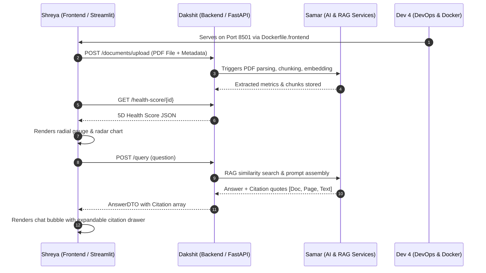

# Micro-Module Technical Roadmap & Implementation Guide — Developer 3 (Shreya)
## Frontend & Visual Analytics Engineer

**Role**: Frontend & Visual Analytics Engineer  
**Domain**: Streamlit User Interface, Interactive Plotly Visualizations, Citation Proof Cards, Comparative Financial Views, Executive PDF Reporting, and API Client Integration  
**Architecture Principle**: Clean component modularity, sub-1.5s chart rendering latency, responsive layout, seamless integration with Backend REST API contracts.  
**Execution Target**: 4 Sprints (8 Weeks standard / 4 Weeks accelerated)  

---

## 1. Developer 3 Micro-Module Topology & Architecture

Developer 3 owns ten interconnected micro-modules that together deliver the complete user experience for financial analysts, CFOs, and auditors. The architecture cleanly separates visual presentation components, multi-page routing, client-side caching/session state, and communication with Developer 2's FastAPI backend.

```
┌─────────────────────────────────────────────────────────────────────────────────────────┐
│                      DEVELOPER 3 (SHREYA): FRONTEND & VISUAL ARCHITECTURE               │
├─────────────────────────────────────────────────────────────────────────────────────────┤
│                                                                                         │
│  ┌──────────────────────────────────────────────────────────────────────────────────┐  │
│  │ D3-M1: Streamlit Navigation Shell & Global Session State (frontend/app.py)       │  │
│  └──────────────────────────────────────────────────────────────────────────────────┘  │
│                                           │                                             │
│       ┌───────────────────────────────────┼──────────────────────────────────┐          │
│       ▼                                   ▼                                  ▼          │
│  ┌───────────────────────┐   ┌───────────────────────┐   ┌───────────────────────────┐  │
│  │ D3-M2: UI Components  │   │ D3-M8: REST API Client│   │ D3-M9: PDF Report Exporter│  │
│  │ * kpi_card.py         │   │ * api_client.py       │   │ * report_generator.py     │  │
│  │ * health_gauge.py     │   │ * error handling      │   │ * ReportLab templates     │  │
│  │ * chat_interface.py   │   │ * session caching     │   │ * one-click PDF briefing  │  │
│  │ * radar_chart.py      │   │ * response mapping    │   │                           │  │
│  └───────────────────────┘   └───────────────────────┘   └───────────────────────────┘  │
│       │                                   │                                             │
│       └───────────────────┬───────────────┘                                             │
│                           ▼                                                             │
│  ┌──────────────────────────────────────────────────────────────────────────────────┐  │
│  │ 5-PAGE ANALYTICAL DASHBOARD SUITE (frontend/pages/)                              │  │
│  │                                                                                  │  │
│  │  ┌───────────────────────┐   ┌───────────────────────┐   ┌────────────────────┐  │  │
│  │  │ D3-M3: Upload Hub     │   │ D3-M4: Exec Dashboard │   │ D3-M5: Financials  │  │  │
│  │  │ (2_Upload.py)         │   │ (1_Dashboard.py)      │   │ (3_Analysis.py)    │  │  │
│  │  └───────────────────────┘   └───────────────────────┘   └────────────────────┘  │  │
│  │               │                           │                         │            │  │
│  │               ▼                           ▼                         ▼            │  │
│  │  ┌───────────────────────┐   ┌───────────────────────┐   ┌────────────────────┐  │  │
│  │  │ D3-M6: AI Analyst     │   │ D3-M7: Comparison     │   │ D3-M10: Audit Logs │  │  │
│  │  │ (4_AI_Analyst.py)     │   │ (5_Comparison.py)     │   │ (6_Audit_Logs.py)  │  │  │
│  │  └───────────────────────┘   └───────────────────────┘   └────────────────────┘  │  │
│  └──────────────────────────────────────────────────────────────────────────────────┘  │
│                                                                                         │
│  Integration Points:                                                                    │
│  ◀── Dev 1: Citation schema format, metric names, 5D health scoring weights             │
│  ◀── Dev 2: 9 REST API Endpoints (FastAPI Swagger /docs, JSON contracts)                │
│  ──▶ Dev 4: Streamlit port mapping (8501:8501), environment URL, Dockerfile.frontend    │
└─────────────────────────────────────────────────────────────────────────────────────────┘
```

---

## 2. Status of Work Done vs Remaining

### Summary Progress Scorecard

| Micro-Module | File Location | Sprint Assigned | Current Status | Work Done | Remaining Work |
| :--- | :--- | :---: | :---: | :--- | :--- |
| **D3-M1: App Shell & State** | `frontend/app.py` | Sprint 1 | **Completed (Mock)** | Landing page layout, header cards, document table shell, global session state initialization. | Wire real document counts from `/documents` endpoint; clean up dummy constants. |
| **D3-M2: UI Components** | `frontend/components/` | Sprint 1–2 | **Partially Done (75%)** | `kpi_card.py`, `health_gauge.py` (Plotly radial indicator), `chat_interface.py` (citation drawers). | Create `radar_chart.py` (5-axis spider chart for Growth, Profit, Liquidity, Leverage, Cash Flow). |
| **D3-M3: Document Upload Hub** | `frontend/pages/2_Upload.py` | Sprint 1 | **Completed (UI Only)** | File uploader widget (`.pdf`), metadata inputs (Company, FY, Doc Type), status table. | Replace session state append with `multipart/form-data` upload to `POST /documents/upload`. |
| **D3-M4: Executive Dashboard** | `frontend/pages/1_Dashboard.py` | Sprint 2 | **Completed (UI Only)** | Doc selector, metadata banner, health gauge, 5 KPI cards, trend line chart, risks and insights. | Connect to live `GET /health-score/{id}` and `GET /financial-metrics/{id}`. |
| **D3-M5: Financial Analysis** | `frontend/pages/3_Analysis.py` | Sprint 3 | **Completed (UI Only)** | Income statement, balance sheet, cash flow cards, financial ratios table, multi-chart Plotly view. | Connect to `GET /financial-metrics/{id}` and `GET /financial-ratios/{id}`. |
| **D3-M6: Conversational AI Analyst** | `frontend/pages/4_AI_Analyst.py` | Sprint 2 | **Completed (Mock)** | Chat bubble history, suggested prompt chips, expandable citation view with text snippet & page. | Connect `st.chat_input` to live `POST /query` endpoint with streaming/spinner. |
| **D3-M7: Comparative Analytics** | `frontend/pages/5_Comparison.py` | Sprint 3 | **Completed (UI Only)** | Dual-document selector, YoY/QoQ delta table, risk evolution cards, AI comparison narrative. | Connect to `POST /compare` multi-document endpoint. |
| **D3-M8: REST API Client** | `frontend/utils/api_client.py` | Sprint 1–2 | **Missing (0%)** | `frontend/utils/__init__.py` created. | Build `api_client.py` using `requests`/`httpx` with timeout handling, caching, error parsing. |
| **D3-M9: Executive PDF Report** | `app/services/report_generator.py` | Sprint 3 | **Missing (0%)** | Documented in SRS & plan. | Implement ReportLab PDF generator with financial tables, health score visual, and download button. |
| **D3-M10: Audit Logs & Telemetry** | `frontend/pages/6_Audit_Logs.py` | Sprint 3–4 | **Missing (0%)** | Documented in architecture. | Create audit view displaying `/health` uptime, processing logs, chunk statistics, token usage. |

---

## 3. Micro-Module Detailed Specifications

---

### D3-M1: Streamlit Core Application Architecture & Navigation Shell

#### Technical Objective
Provide the unified entry point, multi-page sidebar navigation, global session state initialization, and application-level caching for all five functional pages.

#### Work Completed by Shreya
- Created `frontend/app.py` with `st.set_page_config(page_title="FinIntel AI", layout="wide", page_icon="📊")`.
- Initialized shared session state variables:
  - `st.session_state["document_list"]`: tracks uploaded document status (`PROCESSED`, `PROCESSING`).
  - `st.session_state["chat_messages"]`: preserves conversational memory across page switches.
- Built welcome overview cards and summary data table.

#### Code Architecture Implemented:
```python
# frontend/app.py
import streamlit as st

st.set_page_config(
    page_title="FinIntel AI | Financial Analytics Platform",
    page_icon="📊",
    layout="wide"
)

# Global Session State Registry
if "document_list" not in st.session_state:
    st.session_state["document_list"] = [...]

if "chat_messages" not in st.session_state:
    st.session_state["chat_messages"] = [...]
```

#### Remaining Work
- Switch document loading to fetch dynamic status from Backend `GET /documents` when page loads.
- Add toast alerts when documents transition from `PROCESSING` to `COMPLETED`.

---

### D3-M2: Modular UI Component Library

#### Technical Objective
Build reusable, stateless presentation components adhering to high-contrast visual design, preventing UI code duplication across pages.

#### Work Completed by Shreya
1. **KPI Metric Card** (`frontend/components/kpi_card.py`):
   - Supports `title`, `value`, `delta`, `delta_color`, and optional extraction `confidence` badges.
   - Clean container styling with rounded borders.
2. **Health Gauge Indicator** (`frontend/components/health_gauge.py`):
   - Plotly radial indicator showing overall corporate health score (0–100).
   - Dynamic 4-tier color bands:
     - 0–40: High Risk / Poor (`#ff4b4b`)
     - 40–70: Fair / Medium Risk (`#ffa726`)
     - 70–85: Good (`#29b6f6`)
     - 85–100: Excellent (`#66bb6a`)
3. **Chat Message & Citation Card** (`frontend/components/chat_interface.py`):
   - Renders chat bubbles with `st.chat_message(role)`.
   - Expandable citation drawer displaying source filename, page number, filing section, and exact quote snippet.
   - Displays retrieval latency and chunk count metadata.

#### Code Architecture Implemented:
```python
# frontend/components/chat_interface.py
import streamlit as st

def render_chat_message(role: str, content: str, sources: list = None, metrics: dict = None):
    with st.chat_message(role):
        st.markdown(content)
        if role == "assistant" and sources:
            with st.expander("📚 View Citation Sources & Performance Metrics"):
                if metrics:
                    st.caption(f"⏱️ Response time: {metrics.get('time')} | Chunks: {metrics.get('chunks')}")
                for idx, src in enumerate(sources, 1):
                    st.markdown(f"**Source {idx}:** {src.get('doc')} (Page {src.get('page')}) — *{src.get('section')}*")
                    st.info(f'"{src.get("text")}"')
```

#### Remaining Work
- Create `frontend/components/radar_chart.py`:
  - Plotly 5D Radar Chart rendering the 5 Corporate Health dimensions: Growth (20%), Profitability (25%), Liquidity (20%), Leverage (20%), Cash Flow (15%).

---

### D3-M3: Document Ingestion & Management Hub

#### Technical Objective
Provide an intuitive PDF file upload interface with metadata capture (Company name, fiscal year, filing type), real-time progress feedback, and an active document directory table.

#### Work Completed by Shreya
- Created `frontend/pages/2_Upload.py`.
- Form inputs for company name, fiscal year, and filing type (`Annual Report`, `Quarterly Report`, `Investor Presentation`).
- File validation widget restricting input to `.pdf`.
- Tabular display of uploaded documents with processing badges (`PROCESSING`, `PROCESSED`).

#### Remaining Work
- Replace client-side mock list append with `multipart/form-data` HTTP POST request to Developer 2's `POST /documents/upload` endpoint.
- Implement an automated polling loop or background progress bar checking document parsing status.

---

### D3-M4: Executive Dashboard & Corporate Health View

#### Technical Objective
Provide C-suite executives with a bird's-eye view of financial performance: active filing context, composite health score, 5 headline KPIs, multi-year performance trends, and qualitative risk indicators.

#### Work Completed by Shreya
- Created `frontend/pages/1_Dashboard.py`.
- Document selection dropdown dynamically filtering processed files.
- Corporate metadata banner (Company, Fiscal Period, Verification Status, File Reference).
- Dual-column Health Overview combining radial health gauge and progress bars for the 5 dimensions.
- 5 KPI summary cards: Revenue, EBITDA, Net Income, Total Debt, Cash Flow.
- Interactive Plotly multi-year line chart with markers.
- Side-by-side Risk Matrix and AI Insights containers with page-level source references.

#### Remaining Work
- Connect metric values and trends to the backend API (`GET /health-score/{document_id}` and `GET /financial-metrics/{document_id}`).
- Embed the new 5D Radar chart component once created.

---

### D3-M5: Deep Financial Statement Analysis

#### Technical Objective
Provide institutional credit analysts with fine-grained quantitative breakdowns across Income Statement, Balance Sheet, Cash Flow metrics, calculated ratios, and visual trend comparisons.

#### Work Completed by Shreya
- Created `frontend/pages/3_Analysis.py`.
- Income Statement cards (Revenue, Gross Profit, EBITDA, Operating Income, Net Income, EPS) with extraction confidence levels.
- Balance Sheet cards (Total Assets, Total Liabilities, Total Debt, Cash & Equivalents).
- Cash Flow cards (Operating Cash Flow, Free Cash Flow).
- Financial Ratios table with interpretation column (OPM, NPM, Current Ratio, Debt-to-Equity, ROA, ROE, OCF Ratio).
- Multi-chart visual trend deck:
  - Bar chart: Revenue by Period
  - Line chart: Profit Margins Over Time
  - Grouped bar chart: Total Debt vs. Cash Reserves

#### Remaining Work
- Replace static dataset with live data fetched via Developer 2's `GET /financial-ratios/{document_id}` endpoint.
- Add CSV export button for extracted financial tables.

---

### D3-M6: Conversational AI Analyst with Grounded Citations

#### Technical Objective
Provide a natural language Q&A interface allowing analysts to interrogate complex financial filings with verifiable, page-level source citations and zero hallucination risk.

#### Work Completed by Shreya
- Created `frontend/pages/4_AI_Analyst.py`.
- Suggested prompt buttons for rapid inquiry ("What was revenue in FY2025?", "What were major risks?", etc.).
- Document search scope selector (`All Documents` vs. specific filing).
- Interactive chat history with smooth auto-scroll.
- Expandable citation proof drawer displaying document name, page number, section heading, and exact snippet text.

#### Remaining Work
- Replace mock response generator with live asynchronous HTTP POST request to Developer 2's `POST /query`.
- Handle query latency gracefully with animated loading skeletons.
- Display negative constraint fallback notifications ("Information not found in document").

---

### D3-M7: Comparative Period & Multi-Document Analytics

#### Technical Objective
Enable side-by-side comparative analysis of two filings (e.g., FY2024 vs. FY2025 or Competitor A vs. Competitor B) with automated percentage deltas, risk profile evolution, and AI narrative synthesis.

#### Work Completed by Shreya
- Created `frontend/pages/5_Comparison.py`.
- Dual document dropdown selectors (`Baseline` vs. `Comparison`).
- Side-by-side financial metric comparison table with YoY delta percentage and directional trend arrows (📈 / 📉).
- Risk Profile Changes categorized into:
  - 🆕 New Risks
  - 🔄 Changed Risk Levels
  - ❌ Removed / Mitigated Risks
- AI Comparison Summary narrative container.

#### Remaining Work
- Wire to Developer 2's `POST /compare` endpoint (passing `{document_id_1, document_id_2}`).
- Dynamically compute deltas from real backend response data.

---

### D3-M8: Backend REST API Client & State Management

#### Technical Objective
Build a robust, centralized HTTP client module isolating all communication with Developer 2's FastAPI endpoints, featuring connection retries, error toast notifications, and `@st.cache_data` optimizations.

#### Status: **MISSING (To Be Implemented)**
**Target File**: `frontend/utils/api_client.py`

#### Implementation Specification:
```python
import os
import requests
import streamlit as st
from typing import Dict, Any, List, Optional

API_BASE_URL = os.getenv("API_BASE_URL", "http://localhost:8000/api/v1")

class APIClient:
    def __init__(self, base_url: str = API_BASE_URL):
        self.base_url = base_url.rstrip("/")

    def get_documents(self) -> List[Dict[str, Any]]:
        """Fetch all registered documents from backend."""
        try:
            resp = requests.get(f"{self.base_url}/documents", timeout=10)
            resp.raise_for_status()
            return resp.json()
        except requests.exceptions.RequestException as e:
            st.error(f"Failed to fetch documents: {e}")
            return []

    def upload_document(self, file_bytes, filename: str, company: str, year: str) -> Optional[Dict[str, Any]]:
        """Upload a PDF file to backend for asynchronous processing."""
        files = {"file": (filename, file_bytes, "application/pdf")}
        data = {"company_name": company, "fiscal_year": year}
        try:
            resp = requests.post(f"{self.base_url}/documents/upload", files=files, data=data, timeout=60)
            resp.raise_for_status()
            return resp.json()
        except requests.exceptions.RequestException as e:
            st.error(f"Document upload failed: {e}")
            return None

    def query_document(self, document_id: str, question: str) -> Optional[Dict[str, Any]]:
        """Send natural language question to RAG endpoint."""
        payload = {"document_id": document_id, "question": question}
        try:
            resp = requests.post(f"{self.base_url}/query", json=payload, timeout=30)
            resp.raise_for_status()
            return resp.json()
        except requests.exceptions.RequestException as e:
            st.error(f"RAG query failed: {e}")
            return None

    def get_metrics(self, document_id: str) -> Optional[Dict[str, Any]]:
        """Fetch extracted financial metrics."""
        try:
            resp = requests.get(f"{self.base_url}/financial-metrics/{document_id}", timeout=10)
            resp.raise_for_status()
            return resp.json()
        except requests.exceptions.RequestException as e:
            st.error(f"Failed to fetch metrics: {e}")
            return None

    def get_health_score(self, document_id: str) -> Optional[Dict[str, Any]]:
        """Fetch 5D corporate health score and component breakdown."""
        try:
            resp = requests.get(f"{self.base_url}/health-score/{document_id}", timeout=10)
            resp.raise_for_status()
            return resp.json()
        except requests.exceptions.RequestException as e:
            st.error(f"Failed to fetch health score: {e}")
            return None
```

---

### D3-M9: Executive PDF Report Exporter

#### Technical Objective
Provide institutional users with a one-click downloadable, professionally formatted executive PDF briefing summary generated server-side using ReportLab.

#### Status: **MISSING (To Be Implemented)**
**Target File**: `app/services/report_generator.py`

#### Requirements:
- Title, corporate banner, and analysis date.
- Overall Corporate Health Score gauge snapshot and dimension breakdown table.
- Primary 12 Financial Metrics & 8 Calculated Ratios summary table.
- Top 5 Qualitative Risk Disclosures with page citations.
- Generated via Python `reportlab.platypus` (`SimpleDocTemplate`, `Paragraph`, `Table`, `Spacer`, `Image`).
- Download button embedded on `1_Dashboard.py` and `3_Analysis.py`.

---

### D3-M10: Telemetry & Audit Logs View

#### Technical Objective
Display system processing logs, chunk vector distribution, retrieval latency, and database status for compliance and technical auditability.

#### Status: **MISSING (To Be Implemented)**
**Target File**: `frontend/pages/6_Audit_Logs.py`

#### Requirements:
- System Health probe card (connected to `GET /health`).
- Active database chunk index size and vector store status.
- Document processing audit log table (timestamp, filename, user, status, error code).

---

## 4. Sprint-by-Sprint Implementation Roadmap for Shreya

### Sprint 1: Foundation, Styling & Shell (Weeks 1–2)
- [x] Scaffold Streamlit project structure (`frontend/app.py`, `frontend/pages/`, `frontend/components/`).
- [x] Implement reusable UI component: `kpi_card.py`.
- [x] Implement Plotly indicator: `health_gauge.py`.
- [x] Implement conversational component: `chat_interface.py`.
- [x] Build upload interface in `2_Upload.py`.
- [ ] Create `frontend/utils/api_client.py` with mock toggle.

### Sprint 2: Core Dashboards & RAG Integration (Weeks 3–4)
- [x] Build **Executive Dashboard** (`1_Dashboard.py`) with KPI cards and trend line chart.
- [x] Build **Document Q&A View** (`4_AI_Analyst.py`) with suggested questions and citation expandable drawer.
- [ ] Create `frontend/components/radar_chart.py` for 5D Health visualization.
- [ ] Connect `api_client.py` to live Developer 2 endpoints (`/documents`, `/query`, `/health-score/{id}`).
- [ ] Test real PDF upload to backend from Streamlit widget.

### Sprint 3: Advanced Visuals, Comparison & PDF Export (Weeks 5–6)
- [x] Build **Financial Analysis View** (`3_Analysis.py`) with 3 statement categories and ratios table.
- [x] Build **Comparative Analytics View** (`5_Comparison.py`) with side-by-side delta tables.
- [ ] Implement `app/services/report_generator.py` (ReportLab executive PDF generation).
- [ ] Add one-click PDF download button on Dashboard and Analysis pages.
- [ ] Create **Audit Logs & Telemetry View** (`6_Audit_Logs.py`).

### Sprint 4: Polish, Responsiveness & User Acceptance (Weeks 7–8)
- [ ] Optimize Plotly rendering performance (sub-1.5s target).
- [ ] Add client-side network error boundaries and timeout handling.
- [ ] Cross-browser styling verification (Chrome, Safari, Edge) across Desktop and Tablet viewports.
- [ ] End-to-end user acceptance test of full workflow: Upload PDF → View Dashboard → Interrogate AI → Export PDF Report.

---

## 5. Collaboration & Integration Contracts



---

## 6. Daily Development Quality Gates for Shreya

```bash
# Verify frontend Python syntax and style
flake8 frontend/

# Test Streamlit application locally
streamlit run frontend/app.py --server.port=8501

# Test API connectivity
python -c "import requests; print(requests.get('http://localhost:8000/health').json())"
```
