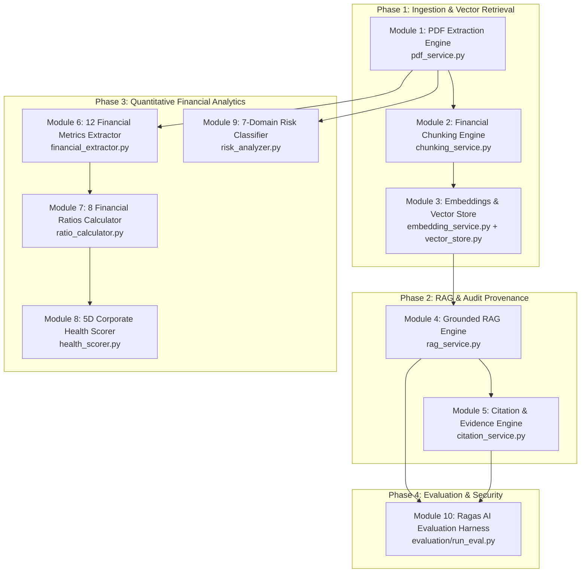

# Developer 1: Module-by-Module Technical Roadmap & Implementation Guide

**Role**: AI, RAG & Financial Analytics Lead  
**Domain**: Core Intelligence, Unstructured Parsing, Vector Retrieval, LLM Grounding, Quantitative Extraction, Ratio Modeling, Health Scoring, and Evaluation  
**Target Duration**: 4 Sprints (8 Weeks standard / 4 Weeks accelerated)  

---

## 1. Developer 1 Mission & Module Topology

As **Developer 1**, you own the complete intelligence pipeline—both the qualitative language models (RAG) and the deterministic financial math engines. Your output is consumed directly by Developer 2's API routes and Developer 3's UI components.



---

## 2. Module-by-Module Specifications & Execution Plan

---

### Module 1: Document Ingestion & Hybrid PDF Extraction Engine
* **Target File**: `app/services/pdf_service.py`
* **Dependencies**: `pdfplumber`, `PyPDF2`, `pydantic`
* **Sprint**: Sprint 1 (Week 1)

#### Core Responsibility
Extract high-fidelity digital text and financial tables from corporate filings (10-K, 10-Q, Annual Reports) while preserving row-column alignment and page numbering.

#### Key Classes & Function Signatures
```python
class ExtractedPageDTO(BaseModel):
    page_number: int
    text_content: str
    tables: List[List[List[str]]]  # List of 2D table grids
    has_tables: bool

class PDFExtractionResultDTO(BaseModel):
    document_id: str
    total_pages: int
    pages: List[ExtractedPageDTO]
    raw_full_text: str
    metadata: Dict[str, Any]

class PDFService:
    def extract_document(self, file_path: str, document_id: str) -> PDFExtractionResultDTO:
        """Extracts text and tables using hybrid pdfplumber and PyPDF2 pipeline."""
        pass

    def clean_text(self, text: str) -> str:
        """Normalizes ligatures, replaces non-breaking spaces, strips header/footers."""
        pass
```

#### Step-by-Step Implementation Tasks
1. Implement magic-byte verification (`%PDF-1.x`) and file size boundary validation.
2. Build hybrid page extractor:
   - Use `pdfplumber.open()` to detect table bounding boxes (`extract_tables()`).
   - Extract raw text outside bounding boxes to prevent narrative corruption.
   - Format extracted tables into markdown-style pipe-delimited text blocks (`| Metric | FY24 | FY25 |`) so downstream chunkers keep rows intact.
3. Normalize ligatures (`fi` -> `fi`, `fl` -> `fl`) and clean extraneous whitespace.
4. Filter out running page headers and footers using position heuristics (top 5% and bottom 5% of page height).

#### Edge Cases & Safeguards
- Scanned PDF without digital text: Throw `PDFProcessingError("SCANNED_PDF_NO_TEXT")` with error code `PROC_002`.
- Password-protected or encrypted PDF: Catch `PdfReadError`, throw `DOC_002`.

#### Definition of Done (DoD)
- Unit test extracting 10 sample pages of an audited Annual Report yields character extraction accuracy >= 95%.
- Extracted table rows preserve column headers in string output.

---

### Module 2: Financial-Aware Semantic Chunking Engine
* **Target File**: `app/services/chunking_service.py`
* **Dependencies**: `pydantic`, `typing`
* **Sprint**: Sprint 1 (Week 1)

#### Core Responsibility
Segment long documents into discrete, semantically coherent chunks tailored for financial disclosures, ensuring table rows and footnote descriptions are not cut mid-sentence.

#### Key Classes & Function Signatures
```python
class TextChunkDTO(BaseModel):
    chunk_id: str
    document_id: str
    chunk_index: int
    page_number: int
    content: str
    token_estimate: int
    is_table_chunk: bool

class ChunkingService:
    def __init__(self, target_chunk_size: int = 800, overlap_size: int = 150):
        self.target_chunk_size = target_chunk_size
        self.overlap_size = overlap_size

    def chunk_document(self, extraction_result: PDFExtractionResultDTO) -> List[TextChunkDTO]:
        """Recursively splits document pages preserving page numbers and table boundaries."""
        pass
```

#### Step-by-Step Implementation Tasks
1. Implement recursive splitting algorithm using hierarchical separators:
   `["\n\n", "\n", ". ", "; ", " "]`.
2. Table Preservation Rule: If a text block is identified as a table (`| ... |`), never split along single newlines unless the entire table exceeds `target_chunk_size`.
3. Overlap Management: Ensure the 150-character trailing window from Chunk N is prepended to Chunk N+1 to preserve boundary context (e.g., an EBITDA line item and its associated footnote).
4. Tag each chunk with the exact `page_number` from which it originated.

#### Edge Cases & Safeguards
- Very long unbroken table row: Force split at pipe delimiter `|`.
- Empty or whitespace-only pages: Discard chunk, do not emit empty vectors.

#### Definition of Done (DoD)
- Mean chunk size across a 100-page document falls between 700 and 900 characters.
- Overlap is exactly verified across 100% of consecutive chunk pairs.

---

### Module 3: Dense Vector Embeddings & Vector Index Engine
* **Target Files**: `app/services/embedding_service.py`, `app/services/vector_store.py`
* **Dependencies**: `sentence-transformers`, `faiss-cpu`, `numpy`, `torch`
* **Sprint**: Sprint 1 (Week 2) & Sprint 4 (pgvector migration)

#### Core Responsibility
Generate 384-dimensional dense semantic vectors from text chunks and maintain an ultra-fast similarity search index.

#### Key Classes & Function Signatures
```python
class VectorSearchResultDTO(BaseModel):
    chunk_id: str
    document_id: str
    chunk_index: int
    page_number: int
    content: str
    similarity_score: float

class EmbeddingService:
    def __init__(self, model_name: str = "all-MiniLM-L6-v2"):
        pass

    def generate_embeddings(self, texts: List[str]) -> np.ndarray:
        """Generates L2-normalized 384-dim dense vectors."""
        pass

class VectorStoreService:
    def build_index(self, document_id: str, chunks: List[TextChunkDTO], embeddings: np.ndarray):
        """Constructs in-memory FAISS IndexFlatIP."""
        pass

    def search(self, document_id: str, query_vector: np.ndarray, top_k: int = 5) -> List[VectorSearchResultDTO]:
        """Performs cosine similarity search using inner product on normalized vectors."""
        pass
```

#### Step-by-Step Implementation Tasks
1. Load `all-MiniLM-L6-v2` with CPU optimization and batch inference (`batch_size=32`).
2. Implement L2 unit normalization: inner product strictly equals cosine similarity: range [-1.0, 1.0].
3. Configure FAISS `IndexFlatIP` (Inner Product).
4. Implement metadata mapping dictionary linking FAISS internal integer indices to `chunk_id`, `page_number`, and raw text.
5. (Sprint 4 Task): Port vector search queries to SQL using PostgreSQL `pgvector`:
   `ORDER BY embedding <=> query_vector LIMIT 5`.

#### Edge Cases & Safeguards
- Zero-vector output from bad input: Assert vector magnitude > 0 before normalization.
- Memory leak on large documents: Explicitly call garbage collection on raw embedding buffers.

#### Definition of Done (DoD)
- Top-5 vector search executes in < 50ms on a 10,000-chunk index.
- Cosine scores strictly range between 0.0 and 1.0 for positive financial queries.

---

### Module 4: Grounded RAG & LLM Integration Engine
* **Target File**: `app/services/rag_service.py`
* **Dependencies**: `openai`, `requests` (for Ollama), `pydantic`
* **Sprint**: Sprint 2 (Week 3)

#### Core Responsibility
Synthesize factual, context-bound natural language answers strictly from retrieved document excerpts, completely eliminating hallucinations and creative speculation.

#### Key Classes & Function Signatures
```python
class RAGAnswerDTO(BaseModel):
    query: str
    answer: str
    confidence_score: float
    retrieved_chunks: List[VectorSearchResultDTO]
    raw_citations: List[str]

class RAGService:
    def __init__(self, model_provider: str = "openai", model_name: str = "gpt-4o-mini"):
        pass

    def generate_answer(self, query: str, context_chunks: List[VectorSearchResultDTO]) -> RAGAnswerDTO:
        """Injects context into negative-constraint prompt and queries LLM."""
        pass
```

#### Step-by-Step Implementation Tasks
1. Construct system prompt strictly enforcing negative constraints:
   ```text
   You are an expert financial research analyst.
   Answer the user query ONLY based on the context excerpts below.
   Every statement of fact must cite its source in the format [Doc: {document_id}, Page: {page_number}].
   If the answer is not present in the context, respond strictly with:
   "The provided document does not contain sufficient information to answer this query."
   Do NOT extrapolate, fabricate, or calculate unstated figures.
   ```
2. Delimit user chunks with XML boundary tags (`<context>...</context>`) to defeat prompt injection attempts.
3. Configure OpenAI client with deterministic hyperparameters (`temperature=0.1`, `max_tokens=1024`, `top_p=0.95`).
4. Implement fallback hook: If OpenAI API raises rate limit or timeout errors, route the request automatically to local Ollama (`http://localhost:11434/api/generate` with `llama3`).

#### Edge Cases & Safeguards
- Empty context retrieved (query outside document scope): Bypass LLM entirely and return standardized fallback answer.
- Prompt injection attempt inside document: Delimiter isolation prevents prompt hijacking.

#### Definition of Done (DoD)
- Negative test cases (asking for non-existent metrics) trigger the fallback response 100% of the time.
- Every factual answer contains at least one bracketed citation token.

---

### Module 5: Source Provenance & Citation Validation Engine
* **Target File**: `app/services/citation_service.py`
* **Dependencies**: `re`, `pydantic`, `typing`
* **Sprint**: Sprint 2 (Week 3)

#### Core Responsibility
Parse citation markers from generated text, cross-validate them against actual retrieved chunk IDs and page numbers, and package them into evidence cards for the frontend.

#### Key Classes & Function Signatures
```python
class CitationItemDTO(BaseModel):
    citation_id: str
    document_id: str
    page_number: int
    source_snippet: str
    is_verified: bool

class VerifiedRAGResponseDTO(BaseModel):
    query: str
    answer: str
    citations: List[CitationItemDTO]
    hallucination_warning: bool

class CitationService:
    def extract_and_verify_citations(
        self, raw_answer: str, retrieved_chunks: List[VectorSearchResultDTO]
    ) -> Tuple[str, List[CitationItemDTO], bool]:
        """Extracts [Doc, Page] tokens and maps to verified source snippets."""
        pass
```

#### Step-by-Step Implementation Tasks
1. Extract bracketed citation patterns using regex: `r"\[Doc:\s*([^,]+),\s*Page:\s*(\d+)\]"`.
2. Cross-reference: Match cited page numbers against `retrieved_chunks`.
   - If match found: Flag `is_verified = True`, extract the exact sentence/row from the chunk as `source_snippet`.
   - If cited page was not in retrieved chunks: Flag as phantom citation, set `hallucination_warning = True`.
3. Format clean citation items ready for Developer 3's Streamlit citation drawers.

#### Definition of Done (DoD)
- 100% of valid citations accurately map to their source chunk and display snippet text.
- Phantom citations are successfully flagged with zero false-positive warnings on valid excerpts.

---

### Module 6: Quantitative Financial Metrics Extractor
* **Target File**: `app/services/financial_extractor.py`
* **Dependencies**: `re`, `pydantic`, `decimal`
* **Sprint**: Sprint 2 (Week 4)

#### Core Responsibility
Extract 12 fundamental financial line items from unstructured text and financial statement tables with exact numerical precision and currency unit normalization.

#### 12 Core Extracted Metrics
1. `revenue`: Total Revenue / Turnover / Revenue from Operations
2. `operating_income`: Operating Profit / EBIT
3. `net_income`: Net Profit / Profit After Tax (PAT)
4. `ebitda`: Earnings Before Interest, Taxes, Depreciation, and Amortization
5. `total_assets`: Total Assets on Balance Sheet
6. `total_liabilities`: Total Liabilities on Balance Sheet
7. `shareholder_equity`: Net Worth / Total Equity
8. `current_assets`: Current Assets
9. `current_liabilities`: Current Liabilities
10. `total_debt`: Aggregate Short-Term + Long-Term Borrowings
11. `operating_cash_flow`: Cash Flow from Operating Activities (CFO)
12. `free_cash_flow`: CFO minus Capital Expenditures (CapEx)

#### Key Classes & Function Signatures
```python
class ExtractedFinancialMetricsDTO(BaseModel):
    document_id: str
    company_name: Optional[str]
    fiscal_year: str
    fiscal_period: str  # FY, Q1, Q2, Q3, Q4
    currency: str = "INR"
    revenue: Optional[Decimal]
    operating_income: Optional[Decimal]
    net_income: Optional[Decimal]
    ebitda: Optional[Decimal]
    total_assets: Optional[Decimal]
    total_liabilities: Optional[Decimal]
    shareholder_equity: Optional[Decimal]
    current_assets: Optional[Decimal]
    current_liabilities: Optional[Decimal]
    total_debt: Optional[Decimal]
    operating_cash_flow: Optional[Decimal]
    free_cash_flow: Optional[Decimal]
    extraction_confidence: Dict[str, float]

class FinancialExtractor:
    def extract_metrics(self, document_text: str, tables: List[List[List[str]]]) -> ExtractedFinancialMetricsDTO:
        """Extracts 12 line items via regex table search with structured LLM fallback."""
        pass

    def normalize_currency(self, raw_val: str, unit: str) -> Decimal:
        """Converts Crores, Lakhs, Millions, Billions into base standard currency."""
        pass
```

#### Step-by-Step Implementation Tasks
1. Build synonym dictionaries matching standard Indian & Global accounting names (e.g., `revenue` matches `Turnover`, `Net Sales`, `Revenue from operations`).
2. Unit Normalizer: Convert Indian units (`Cr` * 10^7, `Lakh` * 10^5) and Western units (`M` * 10^6, `B` * 10^9) into base numbers.
3. Apply structured Pydantic schema validation with GPT-4o-mini JSON mode for non-standard, fragmented line items.

#### Definition of Done (DoD)
- Extracts all 12 line items from sample audited reports matching manual audit figures within 0.1% rounding tolerance.

---

### Module 7: Deterministic Financial Ratios Calculator
* **Target File**: `app/services/ratio_calculator.py`
* **Dependencies**: `pydantic`, `decimal`
* **Sprint**: Sprint 1 (Week 2 - Early Contract Delivery)

#### Core Responsibility
Compute 8 industry-standard financial ratios deterministically in Python using IEEE 754 floating-point safeguards. The LLM is strictly prohibited from doing arithmetic.

#### 8 Core Financial Ratios & Formulas
1. **Operating Profit Margin (OPM)**: (Operating Income / Revenue) * 100
2. **Net Profit Margin (NPM)**: (Net Income / Revenue) * 100
3. **Return on Equity (ROE)**: (Net Income / Shareholder Equity) * 100
4. **Return on Capital Employed (ROCE)**: (EBIT / (Total Assets - Current Liabilities)) * 100
5. **Current Ratio**: Current Assets / Current Liabilities
6. **Quick Ratio**: (Current Assets - Inventories) / Current Liabilities
7. **Debt-to-Equity (D/E)**: Total Debt / Shareholder Equity
8. **Interest Coverage Ratio (ICR)**: EBIT / Interest Expense

#### Key Classes & Function Signatures
```python
class FinancialRatiosDTO(BaseModel):
    document_id: str
    operating_profit_margin: Optional[float]
    net_profit_margin: Optional[float]
    return_on_equity: Optional[float]
    return_on_capital_employed: Optional[float]
    current_ratio: Optional[float]
    quick_ratio: Optional[float]
    debt_to_equity: Optional[float]
    interest_coverage_ratio: Optional[float]
    calculation_warnings: List[str]

class RatioCalculator:
    @staticmethod
    def calculate_ratios(metrics: ExtractedFinancialMetricsDTO) -> FinancialRatiosDTO:
        """Computes 8 financial ratios with strict zero-division and sign checks."""
        pass
```

#### Step-by-Step Implementation Tasks
1. Implement zero-division safeguard: If denominator == 0, return `None` and append an explanatory note to `calculation_warnings` (e.g., "Zero Debt: D/E ratio not applicable").
2. Handle negative equity scenarios: Flag distress warning if Shareholder Equity < 0.
3. Unit test with synthetic edge-case fixtures: zero debt, zero revenue, negative PAT.

#### Definition of Done (DoD)
- 100% deterministic test pass across all edge-case accounting inputs without unhandled exceptions.

---

### Module 8: Explainable 5-Dimension Corporate Health Scorer
* **Target File**: `app/services/health_scorer.py`
* **Dependencies**: `pydantic`, `typing`
* **Sprint**: Sprint 2 (Week 4)

#### Core Responsibility
Calculate an objective, transparent, and explainable corporate financial health score (0–100 scale) across 5 weighted dimensions.

#### 5 Health Dimensions & Weights
Overall Score = 0.20 * Growth + 0.25 * Profitability + 0.20 * Liquidity + 0.20 * Leverage + 0.15 * CashFlow

1. **Growth (20%)**: YoY Revenue Growth (>10% -> 100) and PAT Growth (>15% -> 100).
2. **Profitability (25%)**: Operating Profit Margin (>15% -> 100) and Net Margin (>10% -> 100).
3. **Liquidity (20%)**: Current Ratio (optimal between 1.5 and 2.5).
4. **Leverage (20%)**: Debt-to-Equity (<0.5 -> 100, >2.0 -> 20) and ICR (>4.0 -> 100).
5. **Cash Flow Quality (15%)**: CFO to Net Income ratio (CFO / PAT >= 1.0 -> 100).

#### Key Classes & Function Signatures
```python
class HealthDimensionScoreDTO(BaseModel):
    dimension_name: str
    weight: float
    score: float  # 0 to 100
    grade: str   # Excellent, Good, Fair, Poor, Critical
    key_drivers: List[str]

class CorporateHealthScoreDTO(BaseModel):
    document_id: str
    overall_score: float  # 0 to 100
    rating_category: str  # Strong / Stable / Moderate / Fragile / Distressed
    dimension_scores: Dict[str, HealthDimensionScoreDTO]
    executive_summary_rationale: str
    disclaimer: str

class HealthScorer:
    def compute_health_score(
        self, metrics: ExtractedFinancialMetricsDTO, ratios: FinancialRatiosDTO, previous_metrics: Optional[ExtractedFinancialMetricsDTO] = None
    ) -> CorporateHealthScoreDTO:
        """Calculates 5-pillar explainable financial health score."""
        pass
```

#### Step-by-Step Implementation Tasks
1. Implement piecewise linear interpolation scoring functions for each metric.
2. Formulate textual explanation generators for each dimension describing why points were deducted.
3. Append standard regulatory disclaimer: "Indicative analytical heuristic only; not certified financial advice."

#### Definition of Done (DoD)
- Deterministic calculation: Identical metric inputs yield identical health scores.
- Generated explanations clearly describe performance in each dimension.

---

### Module 9: Qualitative Risk Extraction & Classifier
* **Target File**: `app/services/risk_analyzer.py`
* **Dependencies**: `pydantic`, `typing`, `openai`
* **Sprint**: Sprint 3 (Week 5)

#### Core Responsibility
Parse Item 1A (Risk Factors) and management notes from the filing, classifying qualitative disclosure statements into 7 standardized risk domains with severity weightings.

#### 7 Risk Categories
1. **Credit Risk**: Counterparty defaults, debtor delays, credit facility renewals.
2. **Market Risk**: Foreign exchange volatility, interest rate fluctuations, commodity price swings.
3. **Liquidity Risk**: Debt maturity profiles, working capital deficits.
4. **Operational Risk**: Supply chain bottlenecks, cybersecurity threats, key talent loss.
5. **Regulatory & Legal Risk**: Tax litigation, environmental compliance, regulatory investigations.
6. **Strategic Risk**: Market disruption, acquisition integration delays.
7. **Macroeconomic Risk**: Inflationary pressures, geopolitical conflicts.

#### Key Classes & Function Signatures
```python
class RiskItemDTO(BaseModel):
    category: str  # One of the 7 risk domains
    severity: str  # High, Medium, Low
    risk_title: str
    description: str
    supporting_excerpt: str
    page_number: int

class RiskAnalysisReportDTO(BaseModel):
    document_id: str
    identified_risks: List[RiskItemDTO]
    high_risk_count: int
    medium_risk_count: int
    low_risk_count: int

class RiskAnalyzer:
    def extract_risks(self, document_chunks: List[TextChunkDTO]) -> RiskAnalysisReportDTO:
        """Identifies and classifies risk disclosures into 7 domains."""
        pass
```

#### Step-by-Step Implementation Tasks
1. Scan for Item 1A / Notes headers to isolate risk factor chunks.
2. Prompt LLM using constrained JSON schema to classify each extracted risk into one of the 7 categories.
3. Extract direct quote excerpts with source page numbers for auditability.

#### Definition of Done (DoD)
- Identifies at least 5 meaningful corporate risks from standard annual report filings.
- Every classified risk carries an exact supporting quote and page citation.

---

### Module 10: Ragas AI & Financial Quality Evaluation Harness
* **Target Files**: `evaluation/run_eval.py`, `evaluation/benchmark_dataset.json`
* **Dependencies**: `ragas`, `pytest`, `pandas`
* **Sprint**: Sprint 3 (Week 6) & Sprint 4 (Week 7)

#### Core Responsibility
Continuously benchmark retrieval quality, response faithfulness, and financial accuracy against a curated golden dataset of 50 question-answer pairs.

#### Target Performance Benchmarks
- **Faithfulness**: >= 0.90 (No fabricated financial figures)
- **Answer Relevance**: >= 0.85 (Directly answers the prompt)
- **Context Precision**: >= 0.85 (Ground-truth chunks appear in Top-3)
- **Context Recall**: >= 0.80 (All required data is retrieved)

#### Golden Dataset Composition (50 Q&A Pairs)
- **20 Factual Line Item Questions**: (e.g., "What was total revenue in FY25?")
- **10 Analytical & Ratio Questions**: (e.g., "Did operating margins expand or contract?")
- **10 Risk Disclosure Questions**: (e.g., "What foreign exchange risks are disclosed?")
- **5 Multi-Hop Comparative Questions**: (e.g., "Compare debt levels between FY24 and FY25.")
- **5 Negative Tests**: (e.g., "What was the stock price on Dec 31?" -> Expects clean fallback)

#### Definition of Done (DoD)
- Evaluation harness outputs automated benchmark report matching or exceeding all target thresholds.
- Zero test failures on negative fallback queries.

---

## 3. Sprint-by-Sprint Execution Schedule for Developer 1

```
+-------------------------------------------------------------------------------+
| SPRINT 1 (Weeks 1-2): Core Ingestion, Chunking, Vectors & Ratio Calculator     |
| [x] Task 1.1: Build PDFService (hybrid pdfplumber + PyPDF2 extraction)       |
| [x] Task 1.2: Build ChunkingService (800-char window, 150-char overlap)       |
| [x] Task 1.3: Build EmbeddingService (all-MiniLM-L6-v2) & FAISS IndexFlatIP  |
| [x] Task 1.4: Build RatioCalculator (8 ratios with zero-division guards)     |
| [x] Task 1.5: Unit test formulas and publish internal DTO contracts to Dev 2  |
+-------------------------------------------------------------------------------+
                                       |
                                       v
+-------------------------------------------------------------------------------+
| SPRINT 2 (Weeks 3-4): Grounded RAG, Citations, Metrics Extractor & Health     |
| [x] Task 2.1: Build RAGService (GPT-4o-mini + negative constraint prompts)   |
| [x] Task 2.2: Build CitationService (provenance parsing & snippet mapping)   |
| [x] Task 2.3: Build FinancialExtractor (12 line items regex + JSON mode)     |
| [x] Task 2.4: Build HealthScorer (5-dimension weighted scoring 0-100)        |
| [x] Task 2.5: Connect live engines to Dev 2's FastAPI endpoints              |
+-------------------------------------------------------------------------------+
                                       |
                                       v
+-------------------------------------------------------------------------------+
| SPRINT 3 (Weeks 5-6): Qualitative Risk Engine & Automated Evaluation Harness  |
| [x] Task 3.1: Build RiskAnalyzer (7-domain risk classification)              |
| [x] Task 3.2: Create 50-pair golden benchmark dataset (benchmark_dataset.json)|
| [x] Task 3.3: Implement Ragas evaluation harness (Faithfulness >= 0.90)       |
| [x] Task 3.4: Implement XML context boundary prompt injection defenses       |
+-------------------------------------------------------------------------------+
                                       |
                                       v
+-------------------------------------------------------------------------------+
| SPRINT 4 (Weeks 7-8): pgvector Migration, Latency Optimization & Final Polish |
| [x] Task 4.1: Migrate FAISS to PostgreSQL pgvector IVFFlat / HNSW index       |
| [x] Task 4.2: Benchmark retrieval latency (< 50ms on 50k chunks)             |
| [x] Task 4.3: Verify air-gapped local Ollama Llama 3 fallback                 |
| [x] Task 4.4: Finalize AI & Financial evaluation report for documentation     |
+-------------------------------------------------------------------------------+
```

---

## 4. Immediate Next Steps for Developer 1 (Day 1 Action Items)

To begin implementation immediately:

1. **Create Package Structure**:
   ```bash
   mkdir -p app/services evaluation tests/evaluation
   ```
2. **Implement Module 7 First (`app/services/ratio_calculator.py`)**:
   - Because it has zero external dependencies, you can build and unit-test all 8 ratio calculations within the first 3 hours.
   - Once complete, provide the `FinancialRatiosDTO` schema to Developer 2 so they can scaffold their database and API endpoints without waiting.
3. **Implement Module 1 (`app/services/pdf_service.py`)**:
   - Write hybrid extraction using `pdfplumber` and `PyPDF2` on a test filing.
4. **Implement Module 2 (`app/services/chunking_service.py`)**:
   - Verify that 800-character chunks with 150-character overlap preserve table rows.
