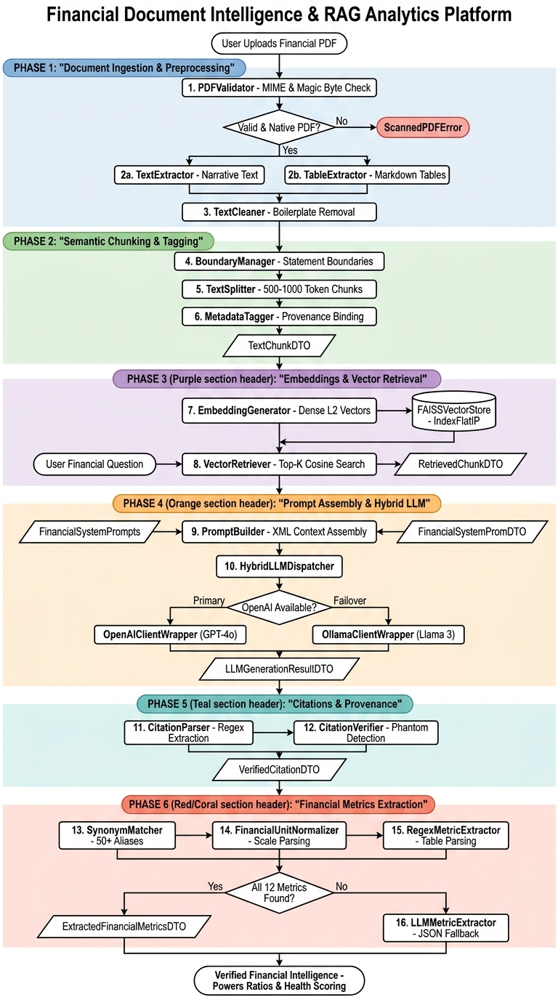
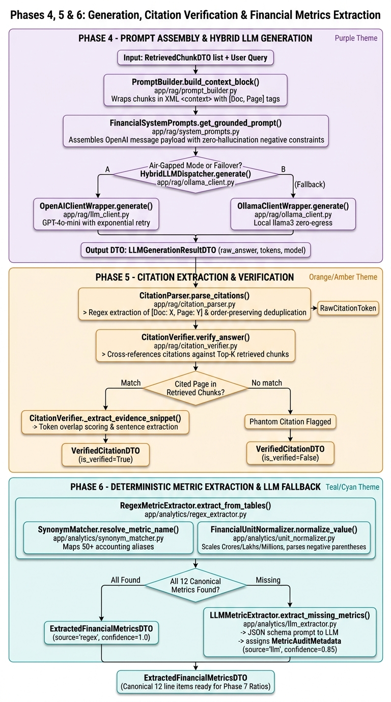
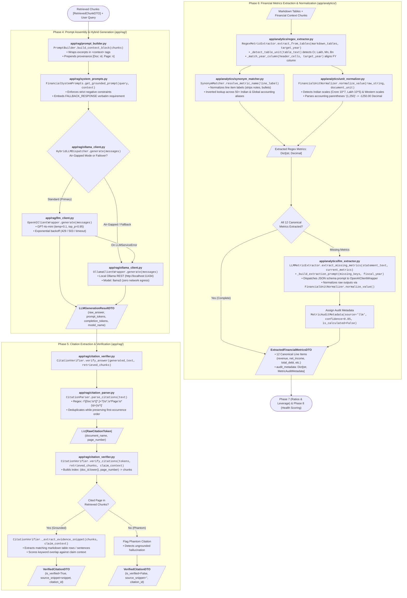

# Financial Document Intelligence & RAG Analytics Platform
## System Architecture & End-to-End Workflows (Phase 1 to Phase 6)

This document provides a comprehensive technical walkthrough of how the platform operates from raw financial document ingestion up through retrieval-augmented generation and deterministic financial metric extraction.

---

### 1. High-Level Architectural Flow

---

### 2. Phase-by-Phase Component & Module Catalog

#### Phase 1: Document Ingestion & Text Preprocessing
- **Goal**: Ingest PDF reports (annual reports, 10-K, quarterly earnings), validate integrity, extract text/tables, and clean boilerplate.
- **Components & Files**:
  - `app/document_processing/validator.py`:
    - `PDFValidator`: Inspects magic bytes (`%PDF-`), validates MIME type, page count, and file size (<100MB).
    - `ValidationResultDTO`: Returns boolean `is_valid`, error details, and extracted basic file metadata.
  - `app/document_processing/text_extractor.py`:
    - `TextExtractor`: Extracts digital text page-by-page using PyMuPDF (`fitz`), computing character density to reject scanned/image-only PDFs (`ScannedPDFError`).
    - `ExtractedPageTextDTO`: Encapsulates page-level text, character counts, and extraction confidence.
  - `app/document_processing/table_extractor.py`:
    - `TableExtractor`: Detects grid structures with `pdfplumber`, converts financial tables into aligned Markdown tables preserving header hierarchies.
    - `ExtractedTableDTO`: Stores page number, table index, Markdown representation, and bounding box.
  - `app/document_processing/cleaner.py`:
    - `TextCleaner`: Removes recurring running headers/footers, page numbers, line-break hyphenations, and normalizes unicode whitespace.

#### Phase 2: Semantic Document Chunking & Provenance Tagging
- **Goal**: Chunk documents respecting financial section boundaries and attach granular provenance metadata.
- **Components & Files**:
  - `app/document_processing/chunk_boundary.py`:
    - `BoundaryManager`: Recognizes major accounting statement headers (Balance Sheet, P&L, Cash Flows, Auditor's Report, Notes) to prevent splitting across critical financial tables.
  - `app/document_processing/chunker.py`:
    - `TextSplitter`: Splits clean text into ~500–1000 token semantic segments with a configurable sliding-window overlap (e.g., 100 tokens).
  - `app/document_processing/metadata_tagger.py`:
    - `MetadataTagger`: Enriches every chunk with document ID, page number, chunk index, section title, and table flag.
    - `TextChunkDTO`: Canonical chunk contract containing `chunk_id`, `document_id`, `page_number`, `content`, `section_title`, and `is_table`.

#### Phase 3: Dense Embeddings & Vector Retrieval
- **Goal**: Vectorize chunks, index them in FAISS, and retrieve top-K relevant chunks for any natural language query.
- **Components & Files**:
  - `app/rag/embeddings.py`:
    - `EmbeddingGenerator`: Generates dense L2-normalized vectors (384d / 1536d) via `sentence-transformers` or OpenAI `text-embedding-3-small` with batch processing.
  - `app/rag/faiss_store.py`:
    - `FAISSVectorStore`: High-performance in-memory vector index (`IndexFlatIP` for inner product / cosine similarity) with disk serialization (`save`/`load`), chunk ID mapping, and document-level chunk purging.
  - `app/rag/retriever.py`:
    - `VectorRetriever`: Embeds incoming query, searches FAISS index for top-K candidates, applies similarity threshold filtering (e.g. >0.65), and ranks results.
    - `RetrievedChunkDTO`: Holds chunk content, similarity score, document ID, and page number.

#### Phase 4: Prompt Assembly & Hybrid LLM Generation
- **Goal**: Assemble context-grounded prompts and generate answers with automatic failover between cloud and air-gapped local LLMs.
- **Components & Files**:
  - `app/rag/prompt_builder.py`:
    - `PromptBuilder`: Wraps retrieved chunks into XML-delimited `<context>` blocks, stamping each chunk with provenance markers `[Doc: <id>, Page: <n>]`.
  - `app/rag/system_prompts.py`:
    - `FinancialSystemPrompts`: Domain-tuned system instructions enforcing zero hallucination, strict factual grounding in provided context, and mandatory inline citations.
  - `app/rag/llm_client.py`:
    - `OpenAIClientWrapper`: Manages chat completions using OpenAI models (GPT-4o / GPT-4o-mini) with structured response parsing and error handling.
    - `LLMGenerationResultDTO`: Standard response DTO with `content`, `model_name`, `prompt_tokens`, `completion_tokens`, and latency.
  - `app/rag/ollama_client.py`:
    - `OllamaClientWrapper`: Air-gapped, zero-network-egress inference client using local Ollama (`llama3`).
    - `HybridLLMDispatcher`: Intelligent routing gateway that calls OpenAI primarily and automatically fails over to Ollama if an API timeout, rate limit, or network drop occurs.

#### Phase 5: Citation Extraction & Provenance Verification
- **Goal**: Audit LLM answers, detect hallucinations ("phantom citations"), and verify claims with exact sentence/table-row evidence.
- **Components & Files**:
  - `app/rag/citation_parser.py`:
    - `CitationParser`: Extracts all bracketed citations matching `r"\[Doc:\s*([^,]+),\s*Page:\s*(\d+)\]"`, deduplicating tokens while preserving their first occurrence order in the narrative.
    - `RawCitationToken`: Model representing document name and integer page number.
  - `app/rag/citation_verifier.py`:
    - `CitationVerifier`: Cross-references parsed citations against the Top-K chunks provided in the LLM context. Marks any cited page not in context as a phantom citation (`is_verified=False`).
    - Extracts the exact evidence sentence or table row from matching chunks using token overlap scoring to supply verifiable proof for UI citation cards.
    - `VerifiedCitationDTO`: Contains `citation_id`, `document_name`, `page_number`, `source_snippet`, `is_verified`, and `evidence_rank`.

#### Phase 6: Financial Metrics Extraction & Normalization
- **Goal**: Extract 12 canonical financial metrics deterministically from markdown tables, normalizing currencies and scales, with structured LLM JSON fallback.
- **Components & Files**:
  - `app/analytics/synonym_matcher.py`:
    - `SynonymMatcher`: Maps 50+ Indian and global accounting aliases (e.g. "Revenue from Operations", "Net Turnover", "Total Sales" $\rightarrow$ `total_revenue`) and classifies statement domains (`INCOME_STATEMENT`, `BALANCE_SHEET`, `CASH_FLOW`).
  - `app/analytics/unit_normalizer.py`:
    - `FinancialUnitNormalizer`: Parses raw string amounts, handles accounting negative parentheses `(1,234.50)`, strips currency symbols (₹, $, €, £), and scales Indian units (Crores, Lakhs) and Western units (Billion, Million, Thousands) into exact `Decimal` values.
  - `app/analytics/regex_extractor.py`:
    - `RegexMetricExtractor`: Parses extracted markdown tables, aligns multi-year columns (e.g. FY24 vs FY25), detects table-wide scaling units (e.g., "in ₹ Crores"), and extracts line-items deterministically.
  - `app/analytics/llm_extractor.py`:
    - `LLMMetricExtractor`: Constrained JSON schema extractor that queries the LLM specifically for line-items missing from table extraction (e.g., in footnotes or narrative disclosures).
    - `MetricAuditMetadata`: Tracks extraction provenance (`source`: regex/llm, `confidence`, `is_calculated`).
    - `ExtractedFinancialMetricsDTO`: Unified canonical DTO containing 12 key financial line items:
      - `total_revenue`
      - `operating_income` (`ebit`)
      - `net_income` (`pat`)
      - `total_assets`
      - `current_assets`
      - `total_liabilities`
      - `current_liabilities`
      - `total_debt`
      - `shareholder_equity`
      - `cash_and_equivalents`
      - `operating_cash_flow` (`cfo`)
      - `interest_expense`

---

### 3. End-to-End Data Transformation Walkthrough

1. **Upload & Ingestion**:
   - Financial report PDF is uploaded.
   - `PDFValidator` confirms it is a genuine, uncorrupted PDF under 100MB.
   - `TextExtractor` extracts narrative paragraphs page by page.
   - `TableExtractor` isolates balance sheets and income statements as clean Markdown tables.
   - `TextCleaner` removes repetitive disclaimers and running headers.

2. **Chunking & Indexing**:
   - `BoundaryManager` ensures table chunks and statement sections remain intact.
   - `TextSplitter` creates overlapping semantic chunks.
   - `MetadataTagger` stamps each chunk with `[Doc: annual_report.pdf, Page: 45]`.
   - `EmbeddingGenerator` vectorizes chunks; `FAISSVectorStore` indexes them.

3. **Query & Retrieval**:
   - User asks: *"What was the total revenue and operating profit for FY24?"*
   - `VectorRetriever` searches FAISS index and returns top matching chunks above score threshold.

4. **Prompting & Generation**:
   - `PromptBuilder` formats chunks into an XML context block with explicit provenance tags.
   - `HybridLLMDispatcher` sends prompt to OpenAI (or fails over to Ollama).
   - LLM responds with grounded figures and cites `[Doc: annual_report.pdf, Page: 45]`.

5. **Citation Verification**:
   - `CitationParser` extracts the cited tokens.
   - `CitationVerifier` checks that Page 45 was present in the retrieved context and extracts the exact evidence sentence for UI citation tooltips.

6. **Deterministic Analytics**:
   - `RegexMetricExtractor` scans table chunks for "Revenue from Operations: 240,893 Cr".
   - `FinancialUnitNormalizer` converts this to `Decimal('2408930000000.00')`.
   - `LLMMetricExtractor` provides fallback for any missing figures.
   - The resulting `ExtractedFinancialMetricsDTO` directly powers Phase 7 (Ratios: OPM, NPM, ROE, Current Ratio, Debt-to-Equity) and Phase 8 (5-Dimension Corporate Health Scoring).

---

### 4. Detailed Execution Flow & Function Call Hierarchy (Phases 4, 5 & 6)

Below is the dedicated technical flow diagram for **Phase 4 (Prompt Assembly & Hybrid LLM Generation)**, **Phase 5 (Citation Extraction & Provenance Verification)**, and **Phase 6 (Financial Metrics Extraction & Normalization)** detailing the exact file paths, classes, and functions invoked during query execution and analytics extraction.

#### Function-Level Sequence & Dataflow Diagram

---

#### Detailed Component & Function Specification Table

| Phase | File Path | Class / Module | Function / Method Name | Signature & Key Responsibilities |
| :--- | :--- | :--- | :--- | :--- |
| **4** | `app/rag/prompt_builder.py` | `PromptBuilder` | `build_context_block(chunks)` | `(chunks: List[RetrievedChunkDTO]) -> str` Sandboxes retrieved text inside `<context>...</context>` XML tags and prefixes every chunk with `[Doc: {doc_id}, Page: {page_number}]`. |
| **4** | `app/rag/system_prompts.py` | `FinancialSystemPrompts` | `get_grounded_prompt(user_query, context_block)` | `(user_query: str, context_block: str) -> List[Dict[str, str]]` Creates OpenAI messages payload binding system instructions, strict anti-hallucination rules, and mandatory fallback response string with the user query and context block. |
| **4** | `app/rag/ollama_client.py` | `HybridLLMDispatcher` | `generate(messages)` | `(messages: List[Dict[str, str]]) -> LLMGenerationResultDTO` Routes request to `OpenAIClientWrapper` by default. If `air_gapped_mode=True` or if OpenAI throws `LLMServiceError`, transparently fails over to `OllamaClientWrapper`. |
| **4** | `app/rag/llm_client.py` | `OpenAIClientWrapper` | `generate(messages)` | `(messages: List[Dict[str, str]]) -> LLMGenerationResultDTO` Executes OpenAI chat completion (`gpt-4o-mini`, `temp=0.1`, `top_p=0.95`, `max_tokens=1024`). Retries up to 3 times on HTTP 429/503 with exponential backoff (`0.5s -> 1.0s -> 2.0s`). |
| **4** | `app/rag/ollama_client.py` | `OllamaClientWrapper` | `generate(messages)` | `(messages: List[Dict[str, str]]) -> LLMGenerationResultDTO` Sends zero-network-egress REST request to `http://localhost:11434/api/chat` with `model='llama3'`. |
| **5** | `app/rag/citation_parser.py` | `CitationParser` | `parse_citations(text)` | `(text: str) -> List[RawCitationToken]` Scans LLM output using `r"\[Doc:\s*([^,]+?)\s*,\s*Page:\s*(\d+)\s*\]"`. Deduplicates tokens while strictly preserving first-occurrence order. |
| **5** | `app/rag/citation_parser.py` | `CitationParser` | `strip_citations(text)` | `(text: str) -> str` Removes all bracketed citation markers from narrative text for clean UI rendering. |
| **5** | `app/rag/citation_verifier.py` | `CitationVerifier` | `verify_answer(generated_text, retrieved_chunks)` | `(generated_text: str, retrieved_chunks: List[RetrievedChunkDTO]) -> List[VerifiedCitationDTO]` High-level convenience orchestrator: parses citations from generated text and validates them against retrieved chunks. |
| **5** | `app/rag/citation_verifier.py` | `CitationVerifier` | `verify_citations(tokens, retrieved_chunks, claim_context)` | `(tokens: List[RawCitationToken], retrieved_chunks: List[RetrievedChunkDTO], claim_context: Optional[str]) -> List[VerifiedCitationDTO]` Builds `(document_id.lower(), page_number)` index. Flags non-existent pages as phantom citations (`is_verified=False`). |
| **5** | `app/rag/citation_verifier.py` | `CitationVerifier` | `_extract_evidence_snippet(chunks, claim_context)` | `(chunks: List[RetrievedChunkDTO], claim_context: Optional[str]) -> str` Extracts matching markdown table rows or sentences; ranks candidates by keyword token overlap against claim context to generate UI citation proof. |
| **6** | `app/analytics/synonym_matcher.py` | `SynonymMatcher` | `resolve_metric_name(line_label)` | `(line_label: str) -> Optional[str]` Normalizes line labels (stripping list indices, footnotes, punctuation) and matches them against an inverted index of 50+ accounting synonyms across P&L, Balance Sheet, and Cash Flow. |
| **6** | `app/analytics/synonym_matcher.py` | `SynonymMatcher` | `get_statement_domain(metric_or_label)` | `(metric_or_label: str) -> Optional[str]` Returns statement domain (`"P&L"`, `"Balance Sheet"`, `"Cash Flow"`). |
| **6** | `app/analytics/unit_normalizer.py` | `FinancialUnitNormalizer` | `normalize_value(raw_string, document_unit)` | `(raw_string: str, document_unit: str = "base") -> Decimal` Parses raw numerical strings, detects Indian scale multipliers (Crore $10^7$, Lakh $10^5$) and Western multipliers (Billion $10^9$, Million $10^6$), converts negative parentheses `(1,250)` to negative values, and quantizes to `Decimal("0.01")`. |
| **6** | `app/analytics/regex_extractor.py` | `RegexMetricExtractor` | `extract_from_tables(markdown_tables, target_year)` | `(markdown_tables: List[str], target_year: str) -> Dict[str, Decimal]` Scans markdown tables, calls `_detect_table_unit()` and `_match_year_column()` to pinpoint the target fiscal year column, resolves line items via `SynonymMatcher`, and normalizes values with `FinancialUnitNormalizer`. |
| **6** | `app/analytics/llm_extractor.py` | `LLMMetricExtractor` | `extract_missing_metrics(statement_text, current_metrics, ...)` | `(statement_text: str, current_metrics: Dict[str, Decimal], ...) -> ExtractedFinancialMetricsDTO` Identifies canonical metrics missing from regex extraction, constructs a constrained JSON schema prompt, invokes `OpenAIClientWrapper`, normalizes results, and attaches `MetricAuditMetadata` (`source="llm"`, `confidence=0.85`). |

